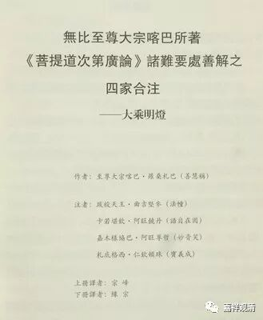
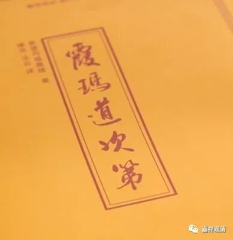
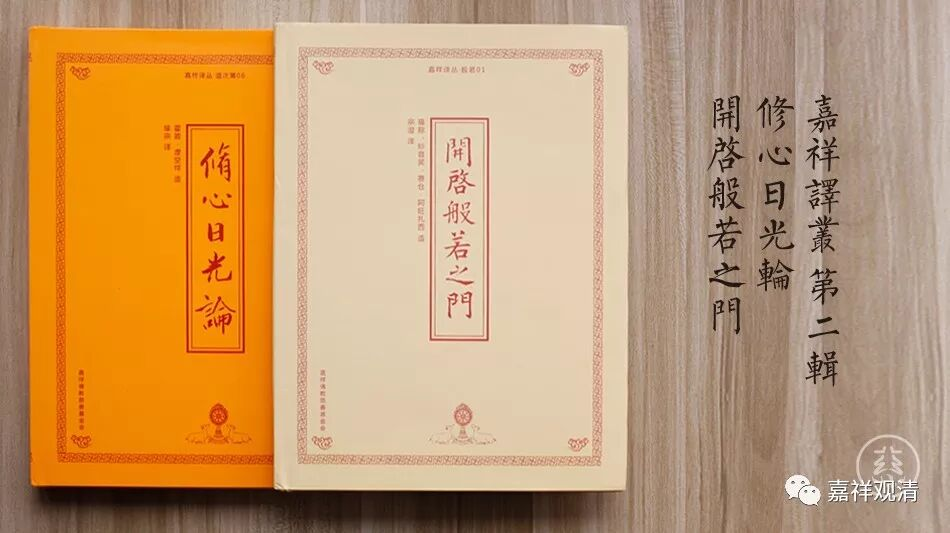

##  《善说精髓》讲记012（上） 

很可惜啊，汉地没有把它继续发扬下来。其实当时玄奘法师这一系是整理了不少的，他们至少是有自己的想法的，应该算是非常完善的，因为他们也是基于《瑜伽师地论》和唯识派那么多典籍进行整理的。但是很可惜啊，后来没有传承下来，到明末几乎没人动了。 

那么，宗喀巴大师整理完以后呢，大家就说： “这个《菩提道次第广论》呢，是太广了，能不能简单一点？”宗喀巴大师就把很多辩论方面的内容删掉了，因为辩论当中的内容实在太多了。删掉以后呢，又用新的方法，甚至也可以说是更加进步的方法，解释了后面的止观部分。所以，在格鲁系统的学习当中关于中观的教证，《广论》和《略论》的《止观章》都是比较重要的，不仅仅是《广论》的止观部分重要，《略论》的止观部分也是比较重要的。之后，宗喀巴大师又写了《菩提道次第摄颂》，实际上《摄颂》就是更简短的道次第。 

宗喀巴大师在著作的时候也曾经说过，如果我们觉得内容比较广的话，我们可以在自己学习的时候做笔记，整理 出来自己的内容。按照今天的话来说，这些整理出来的内容就是之后的各类道次第著作。 

我们这里就有缘宗师翻译的《霞玛道次第》，可以说是近一两百年来比较重要的道 次第著作。有一位尼师在看到这部《霞玛道次第》以后说： “我看到的这部道次第 ， 真的是非常好， 现在 我觉得我自己修行的话，有把握了！ ”所以大家平时有时间的话可以多读一读我们这些道次第的著作。目前我们翻译和印刷的作品好像是以道次第为主的，道次第方面是印得最多的。 

从时间上来看，《掌中解脱》是离我们最近的 一部 流传比较广的 道次第 著作 ，所以大家都比较看得懂，《霞玛道次第》也是比较看得懂的。我的一位老师也是这么说的，为什么呢？如果著作的时间离我们近的，也就是说，他 的所化机 —— 教化的根器 、针对的人群， 差不多就是我们这样的人。而宗喀巴大师那个年代所教化的根器显然要比我们好得多（时间上来说，离我们也有六百多年了），据说当时主要还是对出家人讲的，他们也是一些修行人嘛，所以宗喀巴大师所讲的内容相对来说还是稍微难一点。 

今天呢，特别像我们的大译师仁钦曲札翻译的 《掌中解脱》 ， 文字 还是比较 贴近大家的 ——大家比较容易看得懂的，很白话的，建议大家学、修。 

还有一部著作就是《略论释》，也不错的，就是昂旺堪布 讲 的对《略论》的解释，里面有很多内容他都讲到了，甚至一些格鲁派内部的细节也讲到了，相对不错的。很可惜，目前它的口传已经没有了，不然可以求一个传承。 

