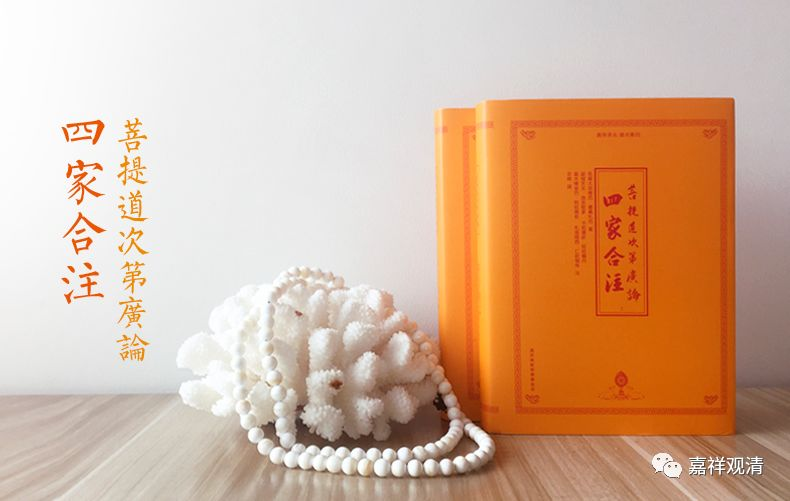

##  《善说精髓》013（中） 

那么，法的殊胜当中分四个。这一点几乎每部道次第的论著都是这么写的，科判都一样。 

**“（甲二）法殊胜。**

**分四：（乙一）通达一切圣教无违殊胜者；（乙二）一切圣言现为教授殊胜；（乙三）易获胜者密意殊胜；（乙四）极大恶行自趣消灭殊胜。 ”**

“**极大恶行自趣消灭**”， 这 里是用 “ 消灭 ”这个词 ，我们嘉祥版的《广论四家 合注》当中， 已经恢复为 “损 灭 ” 了 ，最初的《菩提道次第广论》的版本是 “损灭”，“消灭”是后来的版本，应该是讹误了 。其实 “损灭” 、 “ 消灭 ”的意思 也差不多， 但是 好像 “损灭” 的意思稍微好一点。 

**“（乙一）通达一切圣教无违殊胜者： ”**

意思就是 ， 整个佛教的内容是互不相违的。 

不相违在什么地方呢？最简单 地 讲，佛教有些地方在讲 “ 空 ” ，有些地方又会讲 “ 有 ” ，很多人就会觉得 ： “ 哎 ， 佛教很明显 地 是前后矛盾的啊 ！这不是 自己打自己耳光吗？ ”他们 会觉得佛教所讲的是相违的。 

那么 ， 通常对这个的解释呢，我们会说是 “ 不相违 ” 的，为什么呢？佛教在讲 “ 有 ” 的时候，是讲缘起有，在讲 “ 空 ” 的时候，是讲胜义空，或者是自性空。 

其实不仅仅是 单单 “空有” 这一点，在 佛说的 很多地方都会有 文字 前后不 一致 的地方。比如说 ， 有些 方面 在声闻乘的戒律当中是 禁戒 ，而在大乘的戒律当中它反而是要去做的。还有些呢 ， 在声闻乘和大乘的戒律 当中都是 要求 禁止 的，是不能做的事情，但在更高的一些戒律当中，又是要求应该要去做的。 

这 些 经典里 出现 的似乎互相有 矛盾的地方 ， 我们从表面上来看是 文句 “ 相违 ” 的，但是如果把它们放到整个道次第当中来看，或者是看它们背后的密意，你 如果有足够的智慧，就 会发现其实这样表面的 “ 相违 ” 是有原因的 ，背后是有 “密意”的，有其文字背后的意思，有文字背后的逻辑 。 

