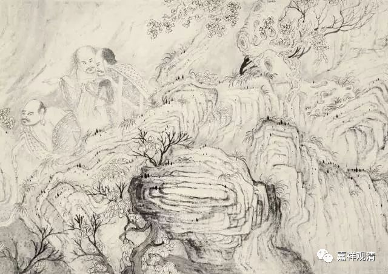

##  《善說精髓》讲记014（上） 

如果我们有一定的智慧，再有一定的信心的话，就能够找到佛陀或者师父的教法的特殊意义。当然，这还是要看具体情况的啊，找到的师父一定要是有比较正确的观点，一定要是正面的善知识，否则呢，他本身已经错了，你还要去帮他维护，那就有问题了。昨天晚上我们也聊到的，那个居士 拜错的师父 ，在美国就被人家扇耳光了。 

**“（乙一）通达一切圣教无违殊胜者：”**

《法华经》也是这个情况。在我们汉地讲，《法华经》出现以前，经典里面都是说声闻乘是不可能趋向于大乘的。如果已经证得声闻果的话，那就没有办法再回向于大乘的。但是在《法华经》里面就讲，即使证得声闻果以后，还是有机会重新趋向大乘，在若干劫以后还是可以成佛的。那么，从表面上看起来似乎是前后相违的，但是如果你能够真正理解佛陀的密意，以《法华经》的背景为总纲的话，就会知道前面所讲的是 “ 先以欲 勾 牵 ， 后令入佛 智 ” 。 

**“三乘所有断证类，”**

三乘，是指哪三乘呢？一个很有趣的现象，我们昨天也聊到了，如果你到江湖上去问佛教徒甚至一些法师们，问他们什么是三乘，或者什么是五蕴，他们很有可能回答不出来。 

我们来讲讲三乘。佛教首先分两个 ——大乘和小乘，是吧？现在 中国 台湾是念大乘（ sh è ng ）和小乘（ sh è ng）的 ，是吧？然后，在小乘当中，又分为声闻乘和缘觉乘。后面会说到 “ 独声 ” 这个词 ，这个 “ 独声 ” 不是指我们哪个人独身，而是指独觉和声闻，也就是 指向的 独觉乘和声闻乘。 

声闻乘，是听了佛法以后按照佛陀的教导以自我解脱为主的这样一类人。当然，这只是在一个阶段当中。缘觉乘呢，至少在最后一生没有遇到佛陀本人，一般经典里面都是这么说的，这里面还会有其他的区别。大乘呢，就是最后能趋向于究竟的佛果，和佛的断证趋同的大乘的行者。声闻乘，加上缘觉乘 （ 或者 叫 独觉乘 ） ，再加上大乘或者是佛乘，这就是三乘。 

