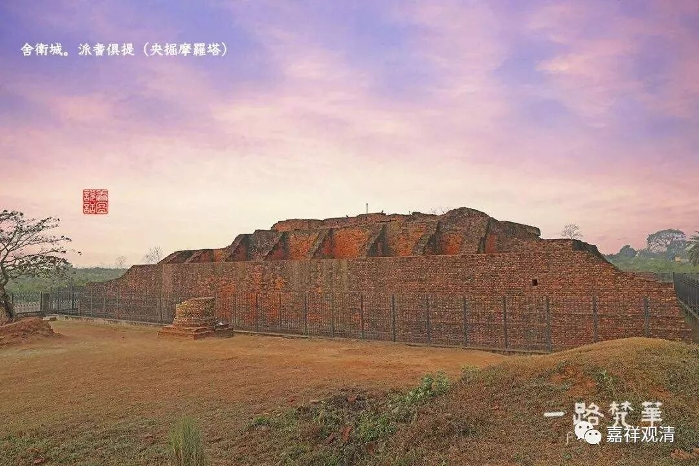
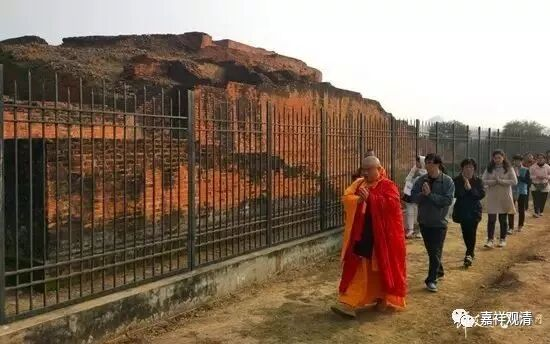

##  《善说精髓》016（中） 

**“（丙二）于法及法师发起承事：**

**专信恭敬而闻法，离慢不轻法法师，**

**发起承事恭敬者，谓于师起如佛想。 ”**

我们先把这个故事讲完吧。那个罗刹王 不是 把月王子抓住了 吗 ？后来王子 被放回国，又 回来了 ——这中间的故事 我 就不讲了，罗刹王就说： “哎，既然你说用自肉买亦应理，那么用你的肉去换他讲的法也合算。那你来给我讲讲看，你听到的这个偈子——你听到的佛教的内容，到底是什么？正好现在我锅里要煮你的水还没有烧开，那就不妨听听你到底学了些什么东西过来。”

然后这个时候呢，月王子居然摆谱了。他是被罗刹王抓住 ，并且 马上 就要 被要吃掉的， 可是他说： “这不行！ 既然你要听法 ，那 你必须要尊重法 的规矩 才 行。 ” 哎呀 ！要是 我被抓住的 话，我 恐怕没有这么镇定 。 

月王子接着 说 ： “ 如果你要听闻法的话，应该是**‘专信恭敬而闻法’**， 你应该要至诚地相信，听法应该要恭敬。**‘离慢’**， 你应该要离开你的傲慢心，**‘不轻法法师’**， 你不要轻慢法和法师，就是不要轻慢我所讲的法和我。**‘发起承事’**， 你要对我发起承事 ——最简单 的 就是服侍，要恭敬法和法师。 ”

然后他说 ： “ 你应该 坐 在比较低的地方，应该让我 坐 在比较高的地方，然后向我顶礼，再听法 ， 那才是比较正常的 。 ” 这个时候，那个罗刹王 ——苏达 萨 子居然听从他的话了。 （ 哇！这个恐怕就是善根深厚啊！不过，有时候确实也发现 ， 一些黑社会老大还挺讲道理的，好像基本上 是 很讲道理的 。 ） 罗刹王 居然就听从了 ， 铺设了一个高座让月王子坐在上面讲，然后自己很认真地 蹲在下面 去听。听完以后他就说 ： “ 你讲的真有道理，我把你们都放了吧！ ”

本生故事里说，这个罗刹王，就是央掘摩罗的前身；月王子，就是释迦佛的前世。 

##  央掘摩罗塔遗址 

**“谓于师起如佛想。”**

这句话的意思是什么呢？既然这些话是佛说的，那么现在我现在讲法，就等于在复述佛的教法，也就相当于佛在讲嘛，所以要对师长起**“如佛想”**。 

这个就叫**“于法及法师发起承事”**，就是对法和法师都要恭敬。藏地 有时候 也 会出现 一些不 是很 符合规矩 的情况，所以 这里 这个内容也是有一定的针对性。比如， 有些活佛听法的时候， 一些师父坐 得比较低，而 活佛 弟子坐 得比较高，这 就 有点问题啦。尊重法和法师的话，不管法和法师有其他什么样的低劣条件，既然是在讲法 ， 那就应该让法师 坐 得高一点。 

当然，也会有特殊情况。如果你的膝盖有问题或者是打了石膏的，那 你就 没法这样盘腿 ，没法 坐在下面 的，需要坐得高一点 ，那 也 没有问题的。 你们的 腿 现在 怎么样呢？ 

