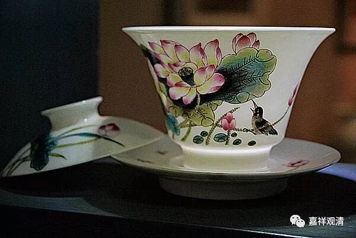

##  《善说精髓》讲记018（上） 

一直到我过去的时候，他们跟我讲还是有这样的事情 （把药方当护身符） 发生 ， 那些师兄弟们 讲 的时候 ，并不是 把这个 当作 批判的对象， 而 是把这个事情当作灵异来讲的 。 我的内心其实是很鄙夷的。这种事情不知道以后会不会在我们圈内发生 呢？ 这个很难说的哦，徒弟收多了， 很多事情都很 难说 的 。不过 ， 这 和 我没关系 —— 我先声明免责哦。这个药方是让你去配药的，然后吃药了才对你的病 有用 。 

所以这个就是六种想：第一，**“自如病者”**，第二**“师如医”**，第三是**“教诫为药”**，第四是**“修为疗”**，第五**“于如来起善士想”**，第六是**“正法久住”**。 

如果你自己讲经的话，那就只有五种想， “自如病者”就没有了，而是“自作医师”，“修为疗”变成“视听者如病人”，其他的不变。 

**“（丁二）断器三过：”**

这个内容 我们一直在讲的 ： 不能是一个倒扣的杯子，不能是一个脏的杯子，也不能是一个漏的杯子 。 当然 ，你 首先要知道给你倒的这个水不是污水哦 ，那就是 你一定要找一个好的老师哦。如果你找到了一个好的老师，那你听闻佛法的时候， 就 要 “ 谛听 ” 、 “ 善思 ”、“念之”， 是吧？ 

第一， “ 谛听 ”，就是 你要听，你不能是个倒扣的杯子 。 倒扣的杯子，讲 得 再多，水倒 得 再多， 也进不去啊 。 

第二个呢，不能是个脏的杯子，要 “ 善思 ” 。你在 下 面光找师父的缺点 ， 光找老师的错误 ： “嗯 ？ 师父的这个口音有问题 ！拼音 z 、 c不分，普通话不好，奉化方言……”真的是有点累哦 。 现在 很多 弟子更像是学术委员会的，你在上面 讲课，他在下面找你的错。 

第三呢，不能是一个漏的杯子，一边听一边忘，这也是问题。所以呢，在道次第的教授当中有一个叫作经验引导，它的方式就是在引导当中要讲三次。第一遍讲完以后，还要重复一遍，晚上回去再把前面的这些内容想一想，至少科判要想一遍，第二天讲的时候再重复一遍。这个方式呢，确实有道理。你学完了以后，自己要消化一下的，否则也不入心，是吧？否则就这样过去了。要复习一下，消化一下。当然，消化也存在问题的，就是你消化的东西到底是什么，这也是一个问题。所以呢，在消化之前要先学因明，得确保你理解正确。 

