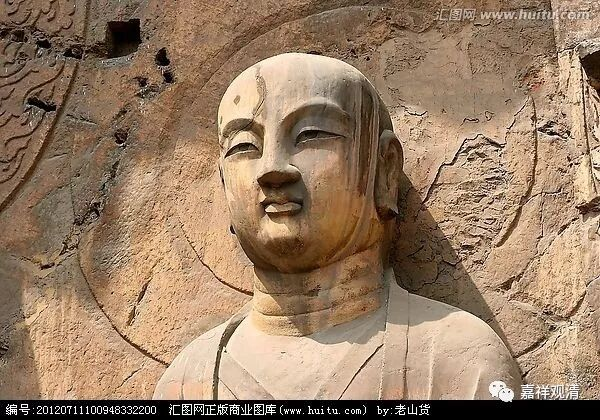
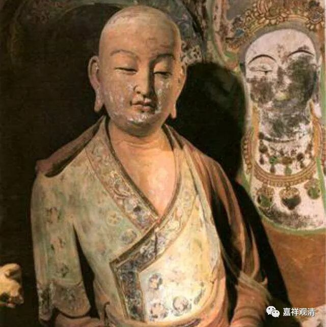

##  《善说精髓》020（下） 

**“（甲四）如何正以教授引导弟子之次第。”**

师父应该说 什么 ，弟子应该 学哪些 。 也就是学修的核心内容了。 

**“分二：（乙一）道之根本依止知识之理；（乙二）既依止已如何修心之次第。”**

分两个部分。我们可以发现，这里前面几个内容都是按照两个部分来分的，后来就是三士道，就分三个部分。 两分法的好处就是简单明了。 

**“（乙一）道之根本依止知识之理；”**

也可以说，最初重要的就是依止善知识，有一个好的老师，那你基本上成功了。 

我本来很想说 “ 成功了一半 ” ，后来一想，阿难曾经说过这句话，还被释迦牟尼佛批评了，是吧？从某种角度来说，真的有点像阿难讲的，依止了善知识，就成功了一半 —— 如果把自己的努力放进去的话。 

阿难有一天晚上就是这样想的，他到树林边上去打坐，第二天就跑到释迦牟尼佛那里去说： “佛陀，我想通了一个道理。”释迦牟尼佛问：“嗯？你想通了什么道理啊？”阿难说：“有了好的老师，成功了一半。”释迦牟尼佛说：“不对。有了好的老师，成功了全部。” （ 这个故事 记得 在《三法经》当中说的，这个《三法经》好像是正量部的经典，在《大藏经》里面有的， 阿难的这个故事 在其他地方也有。 ） 

**“分二：（丙一）令发定解故稍开广说；（丙二）略示修习法。”**

**“（丙一）令发定解故稍开广说。”**

这个**“令发定解”**是 什么意思呢？就是依止善知识到底有什么好处呢？不妨多讲一讲。 

依止善知识呢，如果真正要做到视师如佛，我们今天真的是做不到的。你对初学的人说 ， 要视师如佛 ， 这是做不到的。其实很有趣哦，初学的人 的思想是 完全不一样的， 他们 当中即使有的人能把师父当佛，但他们实际上是把佛当成神的。在他们的想 象 当中 ， 佛就是神通广大的一个神，所以他们把师父当佛，也不是真正的把师父当 （正统的、佛教里的） 佛的意思 。 所以 在这个方面还是需要慢慢地进步的。 （甚至有好几个居士认识我很久，都以为我应该不上厕所的。所以一般初学的信仰不靠谱，需要不断学习，不断纠正 ……） 

**“分六：（丁一）所依善知识之相；”**

老师应该具备哪些特征。 这里的 “相”，就是特征、表现。 

你光知道拜师父，但不知道 应该 拜什么样的师父 ，这 是不行的，首先就要知道什么样的 师父才 是善知识，怎么样的师父 可以拜。 名气大？职务高？字写得好？对我很慈悲（迎合我）？能带我出国？这些恐怕都不是必要条件！ 

很奇怪哦，我们现在介绍善知识的时候， 说 我们这个师父是好师父的时候，不是讲师父有哪些功德，不是讲戒定慧做得有多好，讲的就是 “ 我们师父很帅 ” 、 “那个庙是苦庙” ， 然后就把 人家 拉进来 。 是靠 “ 师父很帅 ”、“功德要做到苦庙离去” ， 才把弟子拉进来的 。 但是在善知识的 德行 当中 ， 没有 一个条件是 “ 帅的 ”、“庙是残破的” 。 （ 当然，长得帅比较 愿意 亲近，是吧？但好像也有危险嘛。 ） 

