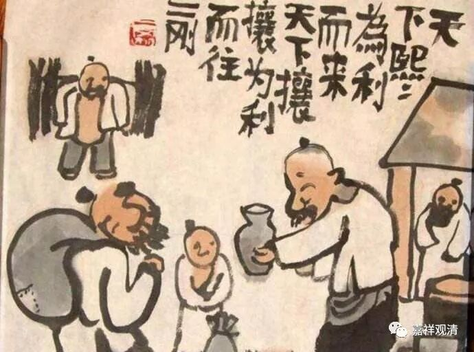

##  《善说精髓》讲记022（上） 

**“（丁二）能依弟子之相；”**

就是 弟子应该具备哪些功德或者哪些特征 ，也就是 我们应该知道 ， 要把 自己 锤炼成什么样的弟子 。 

**“（丁三）彼应如何依师之理；”**

弟子应该怎么去依止师父。 

**“（丁四）依止胜利； ”**

依止师父有什么好处，就是跟着师父学习有什么好处，对吧？你们一定要知道好处，只要知道了好处的话，就一定是想皈依的。 一般人都是功利的，所谓无利不起早，那么，你要知道好处在哪里，就有劲儿干了。 

比如说，很多居士去某个寺院皈依，他就知道： “哦，在这个寺院皈依了以后，去公园是不要门票的。”因为这个寺院就在某个公园里面，所以去这个寺院皈依的人非常多。一到每年皈依的时节，寺院都被挤破了。只要知道好处—— 着里说的 “ 胜利 ” ，他就一定会去做的，对吧？因为他认为公园门票也是要花钱的，而皈依反正是一次性交费，交个 200元，以后去这个公园游玩都没问题了。 “大爷大姐们，冲啊！”

其实 对我们来说也是一样，如果你知道了依止善知识的胜利 ——好处 ，你一定会去做的。 问题就在你，你不知道好处，不相信有哪些好处。 

**“（丁五）未依过患；”**

未依者的过患。 不这么做有哪些负面的问题。拿上面那个例子来说， 如果你不在这里皈依，以后进公园就是要花门票钱的 ，长期下来，那可是比不小的支出 …… 那你就知道要去皈依了。 

**“（丁六）摄彼等义。 ”**

简短地再说一遍。 

所以对于一般的人来说，还是以功利的形式来皈依的，虽然我们是要从更高的道德层面来讲，但是对一般的人还是要讲比较现实的利益，就是现实上有什么好处，因为一般人都是趋利避害的。 功利虽然不是最好的境界，但要是能继续在智慧和慈悲上进阶，功利就也不坏，修行路上慢慢调整动机呗。 

