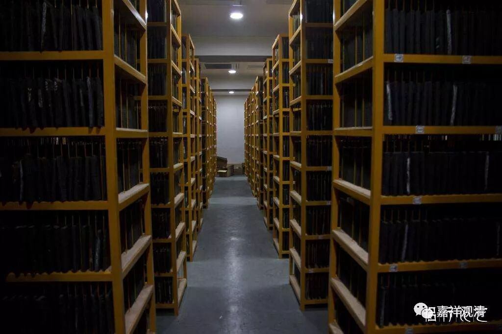

##  《善说精髓》024（中） 

**“具慧分辨道非道，”**

这个**“具慧”**是什么意思呢 ？ 我们要具备能够分辨善恶的智慧 。 就像昨天我们讲的那个意思一样 ，如果你的师父对你说： “明天我们可以一起上床了。”你千万要离开啊！这个绝对是有问题的！ 

我们一定要具备这样的分辨善恶的智慧，就是世间一般的智慧在这个时候也还是要用的。很多人就认为自己学了佛以后就可以不用脑子了，这是不对的 ！ 我碰到过很多这样的知识分子，他们认为自己平时的工作已经够累了，脑子已经用得够多了，来学佛就是想来轻松轻松的，就是想泡个茶啊、放松一坐啊、有点禅意啊 ……“ 我们就是来逍遥了，你还要我们学习？烦都烦死了！我不是想学的。 ”这个时候自己的脑子就不用了，师父说什么就是什么了。 

这么做 是很有问题的， 这样 就很容易被忽悠。因为你自己已经解除武装了，你分辨 “是道 、 非道 ”的能力已经没有了，这是通向解脱的路还是通向 轮回 的路，你都不知道了。实际上我们平时 还 是有 点 分辨的能力的，千万不要 一学佛了就马上 自己解除武装。 

很可惜啊，我看到大量的本来并不笨的人在学佛以后变笨了，在学佛的这件事情上变笨了，主要的原因就是他们想要轻松一点。所以我们经常看到教授被文盲骗的情况很多 （ 另一个原因是文盲的确有胆子，他们真有胆量骗 ） 。 

**“听时于法善属意，”**

这个**“属意”**就是听 得进去、愿意听的意思。 

**“此等具足弟子相。”**弟子相如果说要具备四条的话，就是这四条 ——不堕党类、广希求、具慧、善属意。 （ 如果说是五条的话，那么前面三条 ——不堕党类、广希求、具慧， 就是《四百论》里的 “质直、慧、求义”， 再加上 尊重 法和法师。 ）**“此等具足弟子相”**就是说学生应该具有哪些功德。 

我们看阿底侠尊者，他是中观派的，对吧？而他最主要的学修道次第的师父是金洲大师，却是唯识派的。阿底侠尊者在这位唯识派的师父面前也待了很长时间了，有十一年了吧，在苏门答腊学习（唉，今天的苏门答腊都是伊斯兰教的天下了）。这个就是**“具足弟子相”**。我们就应该要具足这样的弟子相，要具足能够分辨 “道非道”的智慧等等。 

