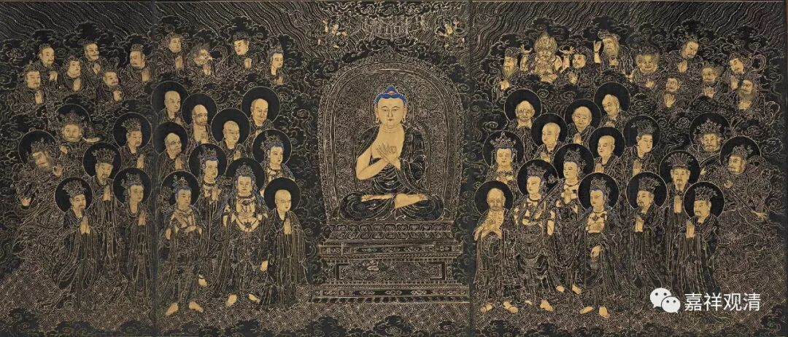
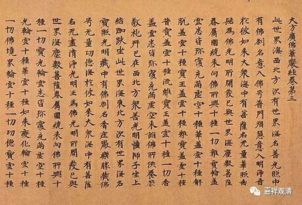

##  《善说精髓》讲记025（上） 

**“当如《十法》《华严经》，”**

**“《十法》”**就是《十法经》。《华严经 ·入法界品 》当中也提到了 善知识 有若干若干的功德，要多念念。 还有一点就是， 因为你多念了以后呢，就能够找到师父身上那么多好的地方了，是吧？ 平时该想的，你却想不到，师父到底有哪些好处，你都看不到。而《华严经》当中讲了有两百多条师父的功德，是吧？ 我记得是 两百二十多条，好好地去看吧。 

**“所说吟诵且思惟， ”**

这些经典呢，多念念， 顺着经文 多想想，师父有哪些好处 blablabla……

**“此乃意乐依止理。 ”**

这个就是意乐依止的好处。 

比如说我们学习《百法》也是一样，看看这些善法当中我们自己具备了哪些，再倒过来把烦恼和随烦恼也想一想，是不是有哪些在自己身上。顺过来看的话，应该思维善法、六度四摄我们具备哪些比较好。 

我们应该这样多想想，多念念。这里说的《华严经》实际上是指《华严经》的《入法界品》，这是哪一段呢？是 善 财童子去向弥勒菩萨的那一段当中，前面有一长段讲了善知识有怎样的好处，这一段可以多念。善知识有哪些好处，像什么、像什么 …… 比喻非常多。 

说到比喻，《现观庄严论》当中有二十二个比喻，是吧？《经庄严论》也是二十二个比喻 ——菩提心二十二喻。大家能背吗？这二十二个比喻，我们以前是当作功课念的，所以还能记住。哎呀！现在当功课念的少了，就记不住了。我们以前念的是能海上师的译本，是吧？ 

“ 如地金月火 ， 大藏宝源瀛 ， 

金刚山药善 ， 如意日韻音 ， 

王库藏大路 ， 乘骑流无尽 ， 

乐闻声河云 ， 二十二种等 。 ”

看样子 还行，还能背。 

我们现在是背的东西太少了吧！今年要给大家准备点功课背背，讨论哈。 

