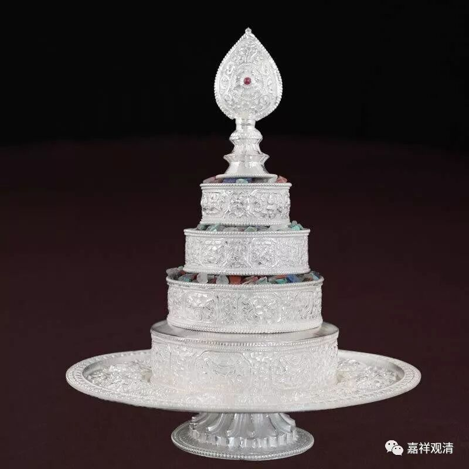

##  《善說精髓》讲记027（上） 

**“礼供劝请随喜五，”**

1、 “**礼**” 拜 ； 2 、 “**供**” 养 ； 3 、 “**劝**” 请转法轮 ； 和 ， 4、 “**请**” 住世 ； 5 、 “**随喜**” 功德这五个。 

**“集福忏净喜令增，”**

**“集福”，**就是 积累福德 ； “**忏净**”，就是忏悔、净 除业障 ； “**喜令增**”，就是 令欢喜增长。我们先这样 简单讲 讲吧。 

**“为令集净增诸善，”**

为了 1、 积累资粮 ； 2、 净除障碍 ； 3、 增长这些善法。那么， 七支就分这三大类： 一个是积累资粮，一个是净除障碍 ，一个是增长无尽 。 前面讲的**“礼、供、劝、请、随喜 ”**这五个 属于 “ 积累资粮 ” ， “ 忏悔 ” 是净除障碍， “ 回向 ” 是令增长无尽。 

**“终无穷尽故回向，”**

这一句是讲回向 —— 为了让前面的这些积累资粮的功德终无穷尽呢，就要回向大菩提。就是，要集资 、 净障，然后增长无尽。前面五个是集资，忏悔是净除障碍，回向是令增长无尽。就是**“礼、供、劝、请、随喜五 ”**这些都是积累福德，忏悔呢，是净除障碍， 回向 令善根增长无尽 —— 是这个意思哦。 

**“摄集净增无尽三。”**

这里的**“摄”**就是包含的意思。普贤的七支当中包含 在 三个内容 里 ：第一个是**“集”**——积累资粮；第二个是**“净”**——净除障碍；第三个是**“增”**——**“增无尽”**。 普贤七支， 摄为三个，哪三个呢？集资、净障和增长无尽。 

**“供曼陀罗作祈求：”（**这个 “陀”其实是它， da，古音不分清浊音，t就是d…… 好爽啊！刚学了一节梵文课就可以装叉了。 ） 在这以后呢，可以再专门供曼陀罗。在格鲁系统当中 （ 当然其他系统也会有 ） ，在供七支积累资粮、净除障碍的时候呢，有些是在前面 供养部分 ，有些是在中间 忏悔部分 ，还有些是在 做完整个七支供以后 ，加入供曼扎，可以 是 长的（三十七堆），也可以短的（七堆）。有些在前面的时候就直接加在供养 支 里面了，也有些单独放在 最 后面，再加一个供曼陀罗 结束 “七支供”部分 。 本文的做法是放在最后。 

