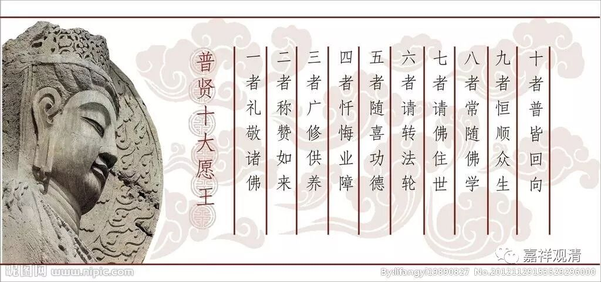
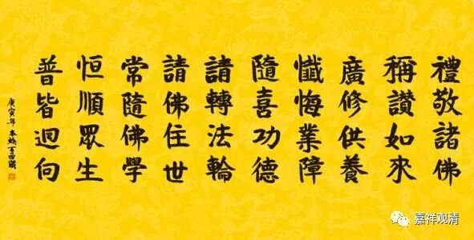
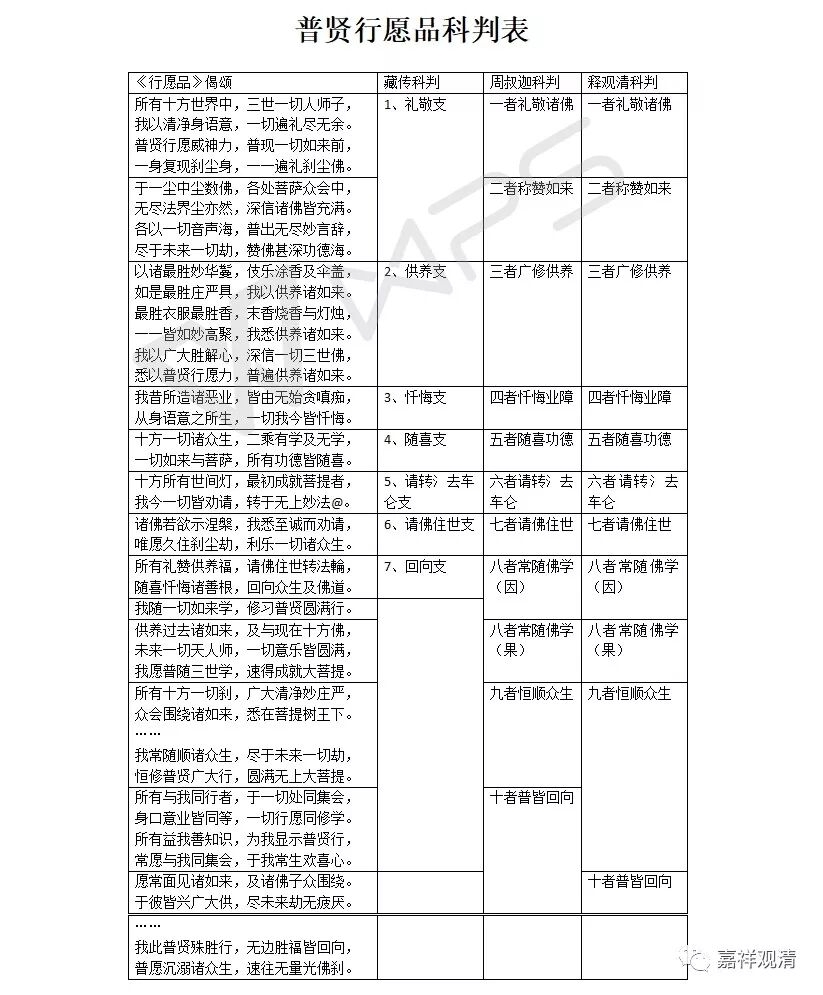

##  《善说精髓》讲记028（上） 

好，我们先念《兜率百尊》 ……

昨天， 《 法尊法师全集 》 到了。终于看到了，在江湖上传说很久，现在终于出现了，真好啊！ 

好，我们继续《善说精髓》，第 10页。后面讲的是供养七支，是吧？《普贤行愿品》当中也有七支，我们刚才念的《兜率上师瑜伽》也是以七支来安排的，只不过它的次第稍微有点不同。 

《普贤行愿品》， 汉地一般都是按照《普贤十大愿王》来讲的，是吧？ “ 一者礼敬诸佛。二者称赞如来。三者广修供养。四者忏悔业障。五者随喜功德。六者请转法轮。七者请佛住世。八者常随佛学。九者恒顺众生。十者普皆回向 ”，按这个次序来解读并科判的。 

大家可以去 对照 看一下， 《普贤行愿品》 按照《普贤十大愿王》的次序肯定是没错了。如果从整个科判以及前后文来看的话，的确是《普贤十大愿王》 来解读《行愿品》 更准确一点，更圆 满一点。 “七支”呢，上下文看起来其实并没有解读完——比如回向支，七支的最后就是回向支，单上下文来看，即使是单论《行愿品》的 偈颂，都可以看出 其实这里还没到正式回向的时候。大家有兴趣的话，可以把那段科判重新看一下：到底是七支好，还是《十大愿王》 好？ 大家可以分析看看 ……（ 好像还是《十大愿王》稍微 完整 一点吧。 ） 

这里附上一个表格大家可以看一下 ……

