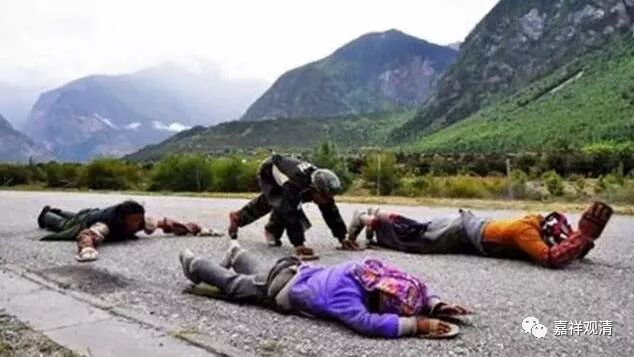

##  《善说精髓》讲记029（上） 

不过，好像我自己也没有做完全部的加行 ——供曼扎还在做着，大头倒是磕完了。还好大头磕完了，现在我的腰已经不行了，如果再要磕十万个大头，那就麻烦了。有些人居然准备买个机器人，在它身上贴一个自己的名字，然后让它 磕头 …… 大家千万不要跟这些人学啊！他们是恨不得能设计一个游戏来把大头磕完。 

很多人以为一开始学习就要求要完成几加行的，其实一开始并不要求的。老实说，你要完成几加行的话，还不如先把戒律先学学好，那可能更重要。你一边在集资净障，一边却在犯戒，那你集资净障也没啥用啊。这就像我们小时候做过的数学题目，一边在开几个水龙头，一边在放水，结果反而是放的更厉害。 

我咨询过这个问题，在格鲁系统当中，以前并不要求加行的原因是，你把戒律持好了，基本上你的 “ 集资净障 ” 就已经做完一大半了。 那么，在密宗的大闭关之前，格鲁派也是要求完成加行的，这个时候差不多要花半年到一年的时间去完成加行。 

西藏人完成加行的时候，比如磕大头，他们是比较猛的，西藏人本来就比较猛，是吧？哪怕开始之前他根本就没怎么磕过，他要去完成十万磕大头的时候也会一天磕 3700个——所以，一个月完成！哪怕之前没磕过，他一开始就是死磕也要磕完3700个，第二天肚子上的肌肉都拉伤了，就是腹肌已经撕裂了，照样磕！就这样，磕一个月就完成了。我碰到过好几个这样的人，他们就说：“这件事情做完了，这辈子再也不要做了。”

藏地还有些人，甚至磕几十万个大头的也有。我就碰到过有些人，已经是老太太了，哦，也不算老太太，五十岁左右吧。 （ 不过，现在三十多岁就已经被叫老阿姨了。 ） 有一个 老太太 ，手都已经类风关 了 ，变形了，照样还在那里磕大头。他们是这样的：自己磕完十万个，然后帮妈妈磕十万个，然后再帮婆婆磕十万个 ——就这样的。那 谁 帮我 再 磕十万？ 

我那时候磕十万大头，就一心一意想在地板上磕出两条槽来，结果是 十万个 磕完了，地板上 一点 “消息” 都没有 ……我 估计要磕出两条槽的话，不知道要几百万个大头呢。还有个兄弟，他磕大头非要跑到西藏去，我劝他说： “你要磕大头的话，在我庙里磕就行了。”他不听，结果跑到大藏寺的高原上去磕大头——不累吗？终于有一天，他一天磕到了一千个大头，当天晚上和西藏人喝茶的时候就显摆：“啊呀！今天我磕大头，磕了一千个。”结果被人家嘲笑：“一千个？我们一般都三千七。”他当时就崩溃了：“我不磕了。我这好不容易才磕到一千啊！”我们在平原上还是比较容易点哦。还有，我们趁年轻先磕完十万大头吧，别再等腰不行的时候，想磕也不容易了。 

