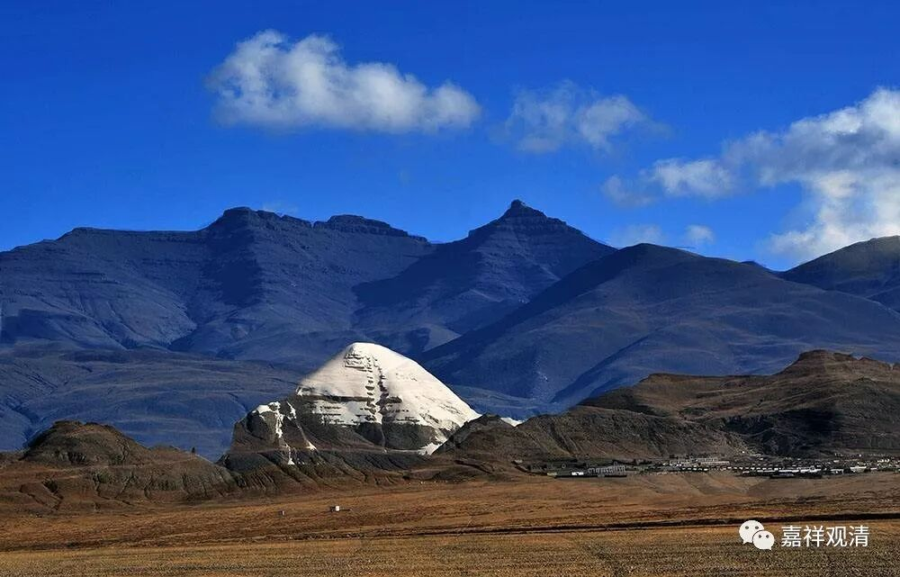

##  《善说精髓》030（下） 

以前只是听到 快念的 传说，不了解 是怎么个原理 。后来格西就和我聊过这个事情，他说，在《普贤行愿品》当中就有 “一 一口有无量舌，一一舌出众音声 ” 这样的意思。说是一个舌头里面有很多个舌根，是 同时 念的。当然后来看到真实的现象不是这样的，就是念得快 ，并不是一下子分别念几行 。 （后来发现《华严经》里还有这样说： “ 此不可说中一头，示现于舌不可说；此不可说中一舌，示现于声不可说 ” ，这个比较接近。） 

这 种事情 一定要见过才会相信的。用今天的话来说，就是你一定要见过高山。我自己比较幸运，我还是 有机会 见过高山的，然后就知道，我们以前是自己 见识 太差，觉得三个月念完《大般若经》已经不错了，直到后来 见过 才相信了 ，康萨仁波切 左脚跨进马镫、右脚跨进马镫之间，白文殊已经修完一遍 ——这是可能的 了。 

关于康萨仁波切还有一个说法， 说 有人去他那里求传承，他还在求着呢，康藏仁波切就说： “好，传！”然后，他在那里磕头，刚一磕完，就传完了。就是磕 三个 头刚刚磕完，传法也传完了。后来，据说当时最大的活佛不允许他这么做，他才不做了。 

康萨仁波切这一辈子，好像闭关了五十多年吧。他好像是十几岁开始闭关的，出关以后弘法的时间不长，然后六、七十岁就圆寂了。当时他弘法的这一个黄金时段，给了很多弟子特别殊胜的传承，但是他闭关的时间特别长。 大家有兴趣可以看一下康萨喇嘛的传记。 

我们很幸运啊，我们这一代还见过高山，有些 你们也见过，还有些你们没有见过，以后有机会的话还可以见见。我见过的这几个，年纪都很轻，都还没到 50岁呢。 

**“获暖相已随宜行。”**

如果是已经修得差不多了 ，或者 已经有点意思了 ， 那你 “随宜行”—— 时间长一点或者短一点都可以 。而 我们呢 ， 不是长一点 、 短一点都可以 ， 我们总是想能不能更短一点 。 假如闭关需要 三个月的话，我们总是问师父： “三天行不行？”

我想起来一个故事 ，有一次 我也在场的 ， 祈竹仁波切给大家传 “米字玛”——就是宗喀巴大师赞：“无缘大悲宝藏观自在 …… ”。祈竹仁波切先传了九句版的，又传了六句版的，又传了五句版的，再传了四句版的。传完以后，下面就有人 法 问： “师父，还有更短的 版本 吗？ ”祈竹仁波切 抿着嘴笑了， 说： “嗡阿吽。”

