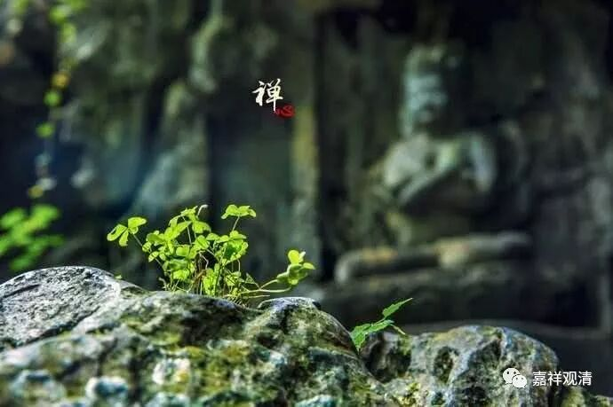

##  《善说精髓》033（下） 

**“（己二）他圆满：**

**佛降、说法、圣教住，随转、有他具悲悯。 ”**

**“他圆满”**或者说**“外圆满”**呢，就是在环境方面圆满的部分。这个在《瑜伽师地论》当中前后讲的稍微有点不一样， 有些地方讲四个，有些地方讲五个， 大致上没什么大 的差异 ，就是大致上的意思是差不多的。 

**“佛降”**，佛出世的时候。 

**“说法”**，佛也在说法。 据 有些经典说， 有些佛出世 因为没有相应度众生的因缘就 没有讲法 ——当然 按大乘后来的 “理论”说佛都要讲法的。 

**“圣教住”**，有教法住世。比如说，我们现在有佛教图书馆，有人在讲经 。 

**“随转”**， 《 广论 》里说 “随教转”，就是还有人按教法去实践成功的，有证正法住世。比如今天， 山里面也 还是 有住山的 、也有闭关的，趋向于实践、修正的 ，他们 里面 也有修行成功的 —— 这就是有 “证正 法 ” 住世。 

这两条是说有教正法和证正法住世。《俱舍论》说：“佛正法有二，谓教证为体”，说的就是这里的“教正法”和“证正法”。 

**“有他具悲悯”**， 

这一点也很重要，就是 有施主、 有人给你送饭吃。不过现在好像问题不大，只要上个美团，啥都有。但是在山里面就比较困难，你叫个美团，让人家怎么送呢？ “我在半山腰的那一棵歪脖树下，左边第三棵树后面的一个山洞里面。你到那颗歪脖子树下就叫一声，我会出来拿的。钱我已经埋在树下了，你到树下取吧。” 哈哈 ……还是得有人护持啊！ 

这里 “他圆满”一共五条：1、有佛在世；2、佛说教法；3、教正法住世；4、证正法住世；5、有施主供养你。 

今天，释迦佛圆寂了，也不再说法了，所以有些地方就说我们现在缺 “他圆满”中的前两条。还有一种理解，说我们现在属于释迦佛出世教化的年代，所以“佛出、说正法”这两条依旧圆满。 

