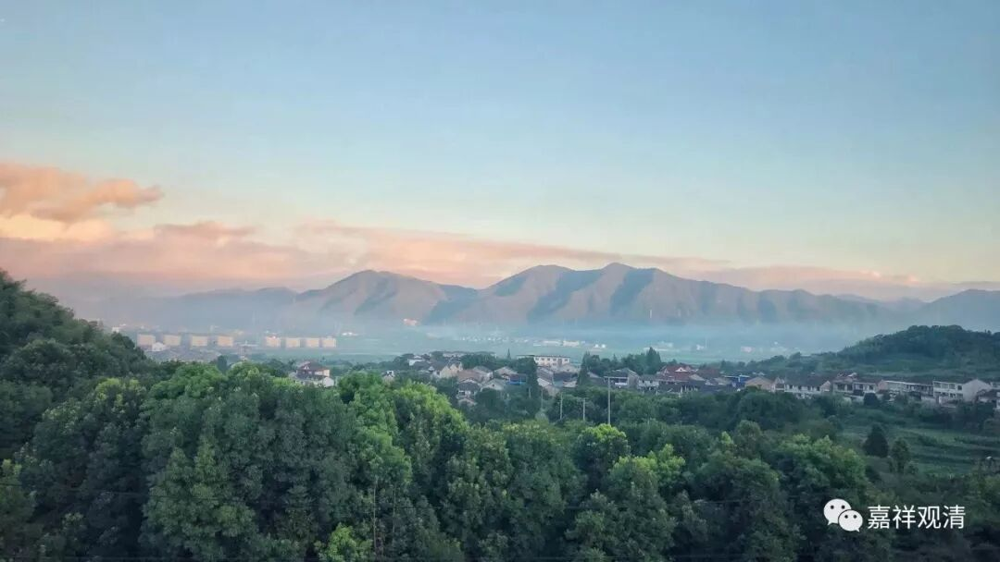

##  《善说精髓》034（中） 

**“俱卢不堪为戒身，”**

**“俱卢”**就是北俱芦洲。在北俱芦洲是没有别解脱戒 （五戒、沙弥戒、比丘戒等等） 的，也没有出家人游行的。 说起来， 一个很特别的情况，就是有一个罗汉带着他的弟子在那边，十八罗汉之一的，好像是宾头卢尊者吧。 （ 咦？好像印顺法师说的有道理啊，他说北俱芦洲就是中国。西藏不是说宾头卢尊者在他们西藏的吗？北俱芦洲的日子很好过的，比他们印度好得多了。西藏还说博多瓦大师就是宾头卢尊者，是吧？有这个说法。不过，这种八卦别太认真啊，听听过去就可以了。 ） 

但是，西藏人是很认真的，他们觉得博多瓦大师就是 宾头卢 尊者 ，但实际上 谁知道 。西藏人学习辩论已经到达一种境界了，是什么境界呢？就是他们把诗一样的文字，也当作是事实。比如说，我在赞叹博多瓦大师的时候说： “他就像宾头卢尊者一样。”结果呢，我那些不成器的弟子就 会 认为： “哦哟？这个意思就是，博多瓦大师就是宾头卢尊者喽！”然后他的弟子再继续传下去，直接说：“博多瓦大师就是宾头卢尊者。”然后，就这样一代代地传下去了。 

会有 这种情况，因为他们长期辩论这些堪为正量的教典，所以会觉得你讲的每一句话都是正确的。他们恰恰忘记了一件事情：诗歌有时候会有相应地夸张或者比喻，而且并不一定就是那个意思。 

假如说，你认为所有的话都是真实的，然后按照这些话去找那些实体，是不一定找得到的。他们搞文学的人把这个叫什么？不一定都是现实主义的，对吧？其中还有浪漫主义的，是吧？ 大师们 写诗也会浪漫一点的 手法嘛 ，结果 后 人就 纯 从现实主义的角度来解释了。 

那么，北俱芦洲**“不堪为戒身”**，就是在北俱芦洲你受别解脱戒是没有的。所以我们现在南瞻部洲能够受戒，很幸运啊！当然，对于大部分人来说，他们不觉得受戒是幸运的事情，反而觉得是束缚。 

**“多数欲天上界天，其身无新得圣道，”**

“**多数**” 绝大部分的 ， “**欲天**” 欲界天 ， 和 “**上界天**” 色界、无色界的天道，是没有**“新得圣道”**的，就是他们不可能在这一生 （**其身**） 证悟圣果 （**无新得圣道**） 。只有很少部分的欲界天 人 才可以在这一生最初证悟圣果。最初证悟圣果 （ 在这里主要指的是初果 ） 。 

