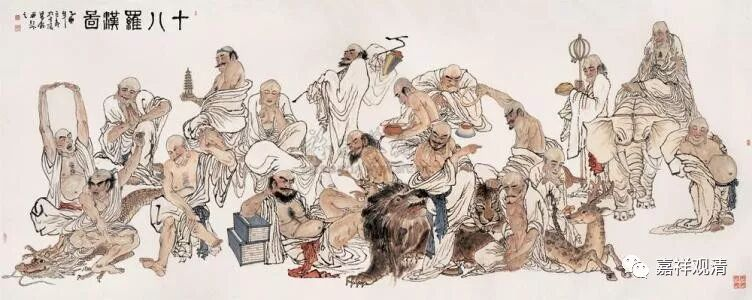

##  《善说精髓》034（下） 

**“其身无新得圣道”**，解释的意思是这样的：在上界天实在太快乐了，没法体会下界的苦，所以对下界苦的出离的证得就不会有。没感觉嘛， 没有切身体会， 所以他不会 感受到 下界苦 ，感受不到，就无法断除相应的烦恼 。 （脑子里的小明说：那地狱呢？人们现在也不知道地狱的苦啊。） 

**“三洲男身除女性，”**

除了北俱芦洲以外的 “三洲” 。 男性的身份 ……

**“是心力大妙人身，”**

**“心力大”**就是想做什么，就能够去做到，比较勇悍 。 “**妙人身**”， 是比较好的人身。因为 古代 印度的女性就相当于附属品，我觉得 几乎 和器世间的意思差不多了。至少在以前的印度认为女性是财产，是附属品。那么，现在社会的女性就有点不一样了，现在已经女权主义了，是吧？当年印度也有女罗汉，不过不多。当时也不太认同女 性 出家的，确实在印度 单独的女众团体 比较困难 、有点危险 。 

**“若无利似为咒惑。”**

**“若无利”**是说，如果你把这个人身白白地浪费，不用它去换取利益的话，那你真的是不会做生意啊！你就好像被 “ 咒惑 ” 了一样，你就好像是被附体了一样。你怎么好像是被别人下了咒一样呢？怎么好像没脑子一样呢？好不容易得到这个暇满人身，你居然就这么白白地浪费了 ……

**“不仅圣道须此身，人天身财眷属因，”**

**“不仅”**仅是最初获得 “**圣道”**等等， “**须 ”**以 “**此身”**为最方便 ——这样的“八暇十满”的人身最方便，而且，想要获得 “**人天身**” 、获得 “**财**” 物、获得 “**眷属**” 等等，这些都是要靠今天的这个 暇满 人身来修行。道教里面有句话叫 “借假修真”，这个“假”就是我们的身体嘛，借我们的身体来修。 

**“此身修施等非他，是故应常思利大。”**

包括**修**布**施**波罗蜜多**等**等，都是依托**此身**来修的。要靠别人的身体来修，不可能的。 

**“是故应常思利大”**，所以应该想到，我们这个暇满人身的利益很大，我们的现世和将来的所有的利益都要靠它去换来。 

