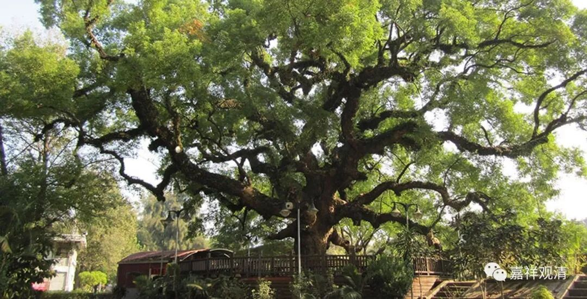
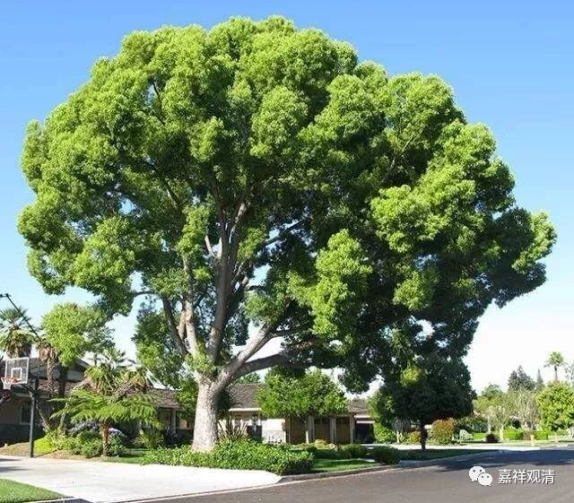

##  《善说精髓》讲记038（上） 

我们继续 讲学 《善说精髓》。 前面说了 三士道的总纲 。 

“三士道”， 包括 了 上士道和共下士、共中士的部分 —— 这 些 是道次第的核心部分。 

**“于共下士道次第修心**

**（丁二）正取心要之理。**

**分三：（戊一）于共下士道次第修心；（戊二）于共中士道次第修心；（戊三）于上士道次第修心。**

**（戊一）于共下士道次第修心。**

**分三：（己一）正修下士意乐；（己二）发此意乐之量；（己三）除遣此中邪执。”**

“共下士道”分三， 1、正修的内容；2、标准是什么；3、破除错误的理解。 后面 “共中士道”、“上士道” 基本上也是一样的 这三个大科 ，科判 大的框架 都差不多。 

**“（己一）正修下士意乐。**

**分二：（庚一）发起希求后世之心；（庚二）依止后世安乐方便。**

**（庚一）发起希求后世之心。 ”**

**发起希求后世之心，**不是说马上去下一世， 这个绝对不是让我们去跳楼啊。**“希求后世之心”**就是 看待 后世比现世重要的意思。我们不要为了这辈子，为了眼前的利益去做一件事情，要看得长远一点。如果你 能 看得 久 远一点，你这个人就是有水平的。如果 只能 看得 很 近的话，水平 、能力 就不是很高的，是吧？如果你看得近的话，那前面讲过，连畜生也能做得到 ——老鼠也会为了过冬储存 粮食嘛！ 

据说 做生意、做企业 好像也是这样，是吧？每年能够 赚数十亿 的，如过江之鲫 ——发财的人多得不得了。如果连续三十年， 生存一百年的老企业 ——哇！那 才 不得了。这个才是厉害，是吧？是要看时间长的，看更长远的。 那些暴发户一样的企业，往往成了我们眼前的流星，很多著名企业上一版教科书里还是成功案例，下一版书里面就成了失败典型 ……

你们看，我们现在门口有一棵香樟树，结了果子就掉下来，是吧？然后呢，这么小的果子，可以长成这么大一棵树。现在边上已经有一些小的香樟树长出来了，我准备捡一点回去，到莲花山上丢一丢，说不定哪天也会长成一大片香樟林。 （ 你们想自己种香樟树，或者搞个香樟树的小盆景也可以，自己去捡好了，每天门口都掉一大堆，扫都扫不完。 ） 

所以很小的种子，以后也会有很大的结果。那么，我们人也是一样，不管是善也好，是恶也好，很小的 善恶的 种子 种下去 ， 将来 也会有大的结果。 所以， “眼光要放远一点”，不要只看到眼前的一点点肉屑……

