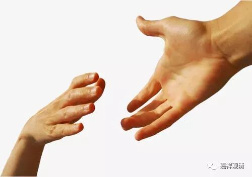

##  《善说精髓》042（下） 

**“（壬二）应归依此之因：”**

应该 归依 的理由 。 

**“自已解脱诸怖畏，”**

佛自己呢，已经解脱了 一切 怖畏。 

**“善方便救他人怖，”**

他也有能力，有各种善巧方便，救 度 众生 远离怖畏、解脱怖畏 。 

**“大悲遍转堪归依。”**

而且呢，他的大悲心对任何一个众生都能够生起。他不是只对某些人能够生起，比如只对中国人能够生起，或者只对印度人能够生起，如果这样的话就不是你归依的对象了。比如说，他的大悲心如果只对希伯来人能够生起，那就不应该是 可 归依的对象。 

**“外缘佛成虽不缺，”**

现在 ，关于归依的对象，佛爷他 那里早就准备好了， 该具备的条件一点都不缺少， 而我们自己的问题出现了。 

**“内缘归依当至诚。”**

我们这里 ，内因缘方面，能 归依的心还没有生起， 所归依的 那里已经准备好了。 

对于《掌中解脱》的解释是有两种说法的：一种说法是说，解脱在我们的手上，就是这本《掌中解脱》。另外一个说法，是益西旺秋格西说的，就是佛菩萨的手早就伸出来了，而你的手有没有伸出来呢？意思就是说，解脱的问题仅仅在于你的手有没有伸出来。 （但 当时有很多格西都笑着说这种说法是 不 对的，永嘉仁波切也是笑人之一。至少我听说过有这样两种说法。 ） 

跟格西们呆在一起是很有趣的，他们互相之间是不会随便投降的，死也要扛住的。至少在辩论、讨论某件事情的时候是这样的，绝对不投降的。格西们都是汉子啊！ 

**“（壬三）如何归依之理：**

**如何方成归依者： ”**

怎么样归依呢？ 

**“圆明相好庄严身，”**

佛呢，具备了圆明相 好 ——圆满、光明、三十二相、八十种好，作为他的身的庄严。 

**“由一音酬各各问，”**

意思就是，大家每个人都在说出自己的问题，而佛 一回答 ，大家就觉得： “哎，佛回答了我的问题。”就是说，“佛以一音演说法,众生随类各得解” —— 可能是神通吧。 

**“智悲遍转所知轮，”**

对一切法，佛 的意 都是能够通达的，智慧和慈悲在任何地方都能够生起。 

以上是赞叹佛的身语意功德圆满。 

**“事业任运不间断，”**

利益众生的事业从来没有间断的时候。 

**“此是略说佛功德；”**

这里 是简短地说一下佛的功德。 

佛的功德对我们来讲，最主要的就是讲经 ——“示法性谛令解脱” 。不过这也差不多 是大部分人的 “理解” 吧，对于很多人来说，如果佛真的出现在他面前，他也就是： “要不请佛念念经，回向一下？” ——人们需要的是保佑不是解脱！ 

