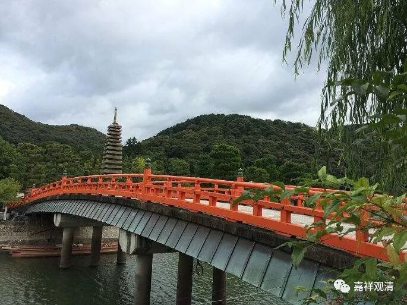

##  《善说精髓》讲记048（上） 

**“加行于所思发动，”**

现在说 “ 贪心 ”的加行。“**于所思发动”，**对于 所要的对象有引发身语的推动力量。 

想要有，这个时候心里就很煎熬： “要，还是不要呢？”然后开始想理由：“上次专卖店卖三万元，现在打折了，再也没有这样的机会了。 打折就 是 我 赚的 —— 买！ ”或者是：“这个颜色很少见，肯定要买。”“哎，正好我发了奖金——买！”“买一送一，这个就相当于白送的——买！” “哇，限量版！买！” 反正总有买的理由，是吧？ 但没有一个理由是成立的。 

总之，是别人的东西，却希望它属于我，自己希望拥有。有人说： “看过即拥有。”这种心态要看情况分析的，就是在看的时候，有没有想过自己要拥有。如果没有这种想法的话，可能还不算。 但是，一般所谓 “看过即拥有”是“银子”不够的假豁达吧……

我曾经去过上海一个土豪家的博物馆， 几层的大楼，藏品很多， 他还没来的时候，我就 “啪啪啪”拍了很多张照片。他一来，我马上把手机收起来，一张照片都不拍，表现得非常 “ 淡定 ”、“淡然” 。两千万的和田玉 ？ 关我啥事，看都不看！真的是他出现了以后，我再也没有拍过一张照片。你要是在那里拍，会被人看不起吧？说实话我也看不懂的，是吧？ （就是真的送给我块两千万的和田玉，我估计也是考虑马上折现 ……少个零都行啊！哈哈！） 

**“究竟谓念其财等，愿成我所有即成。”**

**“究竟”**是什么呢？就是 “**念其财等**”，看着 他人的这些财富啊、珍宝啊，都 “**愿成我所有**”，希望都 变成我的就好了。**“愿成我所有”**，希望成为我的。**“即成”**，就成就贪心了。 

哎呀！这个可麻烦了，还没买下来就已经有贪心 这个恶 业成就了，所以我没有淘宝也是好事啊。对了，如果买佛经的话，就算好事了，它属于善的嘛，**“愿成我所有”**也是好事了。 

所以共产主义 就 有好处 了 啊 ——反正按需分配 ，也没得贪了 。 

