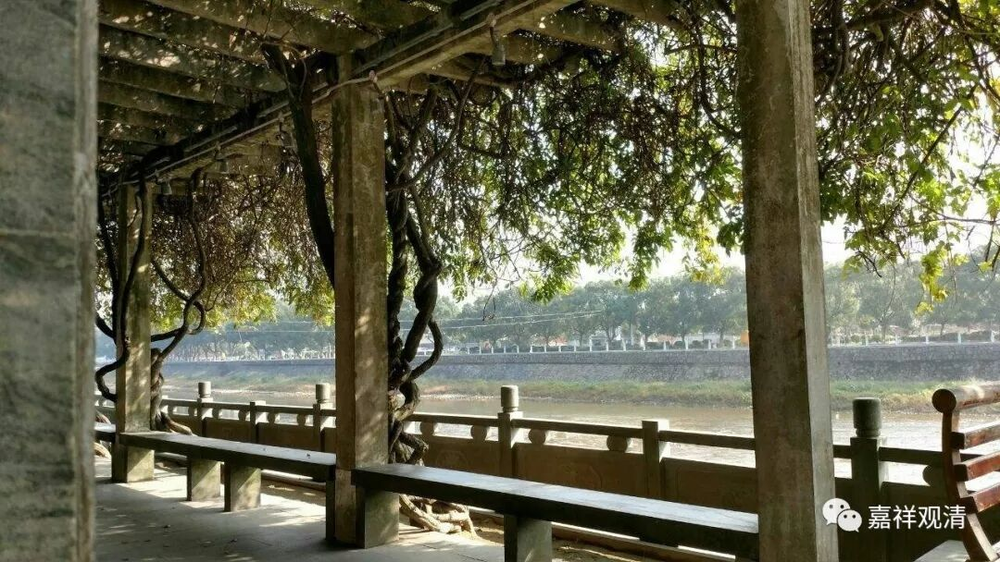

##  《缘起赞》009 

**佛许何时见，    空即缘起义，**

**性空与作用，    成立不相违。**

“**佛**”承认、承“**许**”如果这个人能够通达“**空 ”“即”**是**“缘起”**之**“义**”（自性空能成立缘起，缘起能成立性空）的话，那他就能“**成立**”“**性空与作用 ”“不相违”背**。 

龙树菩萨在《中论》 24 · 18 里说： “因缘所生法，我说即是空”——诸法的空（性），指的是他是缘起。这里虽然都说的是“空性”，实际应该理解为“自性空”。 如果 “缘起”就是“空性”的话，那么见缘起就是见空性（反之亦然），则，圣者见到的时候见空性，（如果空性就是缘起，）那么他此时也见缘起，那他同时见缘起和空性二者了，但这是只有佛才有的能力（同时见二谛）……所以，这里并不是说“空性”等于“缘起”，而是说“缘起”和“自性空”互相成立。 

“空性”和“自性空”也并不是一个意思，比如我们（中观派）可以说“诸法自性空”（“诸法缘起”），但我们不能说“诸法空性”——无为法是空性，有为法不是。 

中观说，诸法是 “无实体而有作用”，诸法是无有实体的。其它所有部派都认为这是不可接受的观点，他们认识，要有作用的话必须要有实体！比如有部认为眼根是由四大所造的，但眼根是象四大一样是实有的，有实体的，而且眼根的作用是原先的四大所没有的——他们认为， 眼根必须 有实体才能有作用，眼根有其特别的作用，也能证明他有实体。 

中观则不然，还是在龙树大师的《中论》里说： “以有空义故，一切法得成，若无空义者，一切则不成”！这里的《缘起赞》的这一颂也是表述了这个意思：性空与作用是不相违的，是符顺的！“**性空与作用，    成立不相违”！**如果你不承认性空，那么 “能作”“所作”等一切法都无法成立！“以有空义故，一切法得成，若无空义者，一切则不成”！ 

