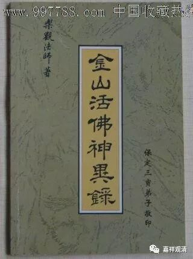
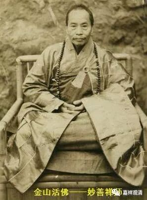

##  《善说精髓》055（中） 

所以呢，**“修空性时舍业果”**，如果是越 修 空性，对因果、黑白业果越不能把握的话，那你肯定是修错了，有问题了。 

很多人都 会 说像济公那样， “酒肉穿肠过，佛祖心中留”，是吧？其实是这样的 —— 前面半句话 “ 酒肉穿肠过 ” 我们是做得到的，后面半句 “ 佛祖心中留 ” 我们是做不到的。如果你后面半句话 平时 能够做得到的话，你再试试看前面半句话能不能做到，那还**算**是一种说法。 但 问题是我们只能做到前面半句，根本做不到后面半句 ，那把这句话拿出来，也就是一个借口 。 其实 电视 剧《济公》 里面也是这样 表演的 ， 住持 看到济公在吃鸡，是吧？回过头来， 其实 他在念书是吧？ 他在逗你玩呢！ 我们还是没有这个能力的。 

所以我奉劝大家，如果拜师父的话，要拜一个至少在表面上对因果比较当回事的师父。如果在 业果的抉择方面表现得 非常 “ 特殊 ” 的那种人， 奉劝大家，还是远离吧 ……你 hold不住。 

说实话， “疯行者”这样的人（在这里我们假设此“疯行者”就是“真大师”）通常 在佛教历史上是不做 正式 师父的。这样的人，在佛教历史上是一种点缀， 一般都不正式收徒弟 的 ，因为这套 行为方式可能会给大家带来误导，类似 “世人学我或成魔”， 基本上 就 是这个意思，他不是那种 适合 对大众进行教学普及的人 ——不是内证不行，是这类“非主流”的行为 不应该成为榜样 。 如果正统的教学面实在没人了，这类 “疯行者”大师也一定会以正统持教、持律师而出现的。 

做老师是有一种责任的。 

有一次上理论课的人比预计的多，我就开了个玩笑： “看样子门口（无意间）摆上的四大天王有点道理啊！”（意思是他们招了人来听课。）大家都“哈哈”地笑开了，师父也笑得很高兴， 都说 “有道理哦！” ……众人走了以后，师父马上就对我说：“你以后要注意，一般居士在场有些玩笑要注意点——他们会当真的！”

民国时期有一个 “金山活佛”，他是金山寺、高旻寺出 来 的 “疯癫和尚” 。 因为 他的神异事件很多，人家 都叫他 “ 活佛 ”（你们有兴趣的话，可以上网找来看看）。有人 要拜他做 师父 的时候， 他说： “我这样的人，是不做师父的。”意思就是，他实际上是来调剂周围严肃的气氛的。你要跟他学，你学不来，也没办法学。我也学不来。他洗完澡的水是香的，我洗完澡的水是臭的；他洗完澡的水，人家拿回去加持是可以的；我洗完澡的水，连我自己都要泼掉的。这不是一般人能够学得了的。 

善知识的 “十德”当中，从来也没有“具神通”、“怪诞行”、“名气响”，更没有说要把这些置于“十德”之上！而至少应具备的两条当中，一是“具悲悯”——视别人比自己重要；一是“具戒”，深信因果、严持戒律——看待下辈子比这辈子重要！ 

