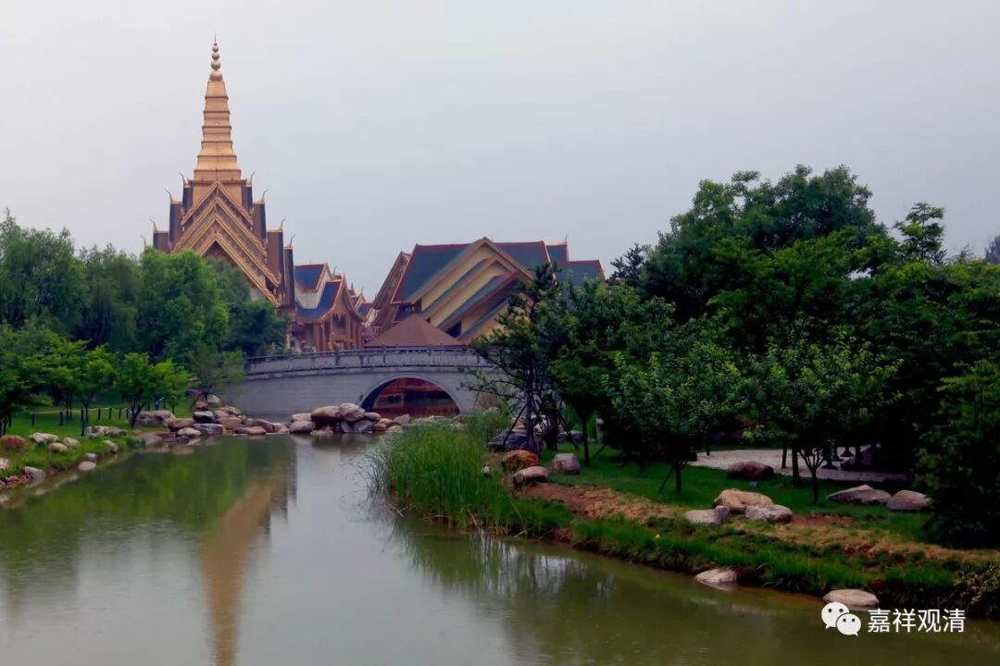

##  《善说精髓》063（四） 

**“（癸二）如何集业之理：**

**圣不新造能引业， ”**

**“圣”**， 见 道 （含） 以上 的圣者 ，**“不新造能引业”**，他不再以圣者的地位重新造能引轮回的业了。 

佛经里面讲的引业和满业好像还有人不知道，或者没听懂。引业和满业，首先这是两个名词，引就是把你趋向哪一报的，满就是把这一报填满的。引业和满业就有点像一个是在画图，另一个在把它填彩。引业呢，就像是端出一个大盆子，满业呢，就把里面的菜给盛满。那盆子可以有两毛钱的，也可以有几千万的，里面的菜也是一样的，也可以很差的，也可以很好的。所以引业和满业都是既有正面，又有负面的。 

**“造者大乘加行道，第一法以下异生。”**

能够 “**造**” 引业的都是在 “**大乘加行道**” 世 “**第一法**”“**以下**” 的 “**异生**” 。这个话读起来有点拗口，如果明白的话就能看懂。 

那么大乘呢，有五道 —— 资粮道、加行道、见道、修道、无学道 。 加行道当中又分四位 —— 暖 位 、顶 位 、忍 位 、世第一 位。从小乘来说，世第一位只有一刹那的时间，他 （ 在世间 ） 只有一个刹那，因为他在世间是最高的，所以称为 世第一 。 

**“异生”**就是凡夫，那些凡夫才能够造引业。那么，加行道的世第一法应该也不能造，因为他的时间只有一刹那，这是一般来说。如果按照小乘的说法来比方的话，只有一刹那，他应该没有再造引业的功能。 因为世第一法后面直接引出世道了，所以他也不引轮回的业了。 

