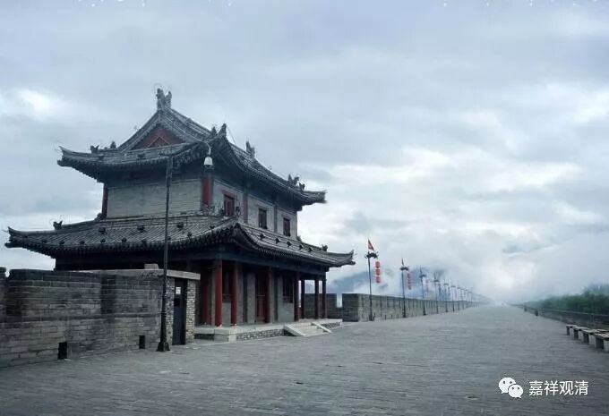

##  《善说精髓》065（下） 

**“天中有正人橫行，”**

如果是欲界天或者色界天的中有，是**“正”**的形状， 意思是 头朝上的。**“人横行”**，额？和蟹一样地横行吗？ 不是。其实意思是，人道的中有运动的方式大概像 ……超人！ 

**“作恶中有头倒行。”**

作恶的中有 ，意思是 三恶趣的中有 ， 是头往下的，有这个说法。 （呃，难道猫的中有是脑袋冲下的？） 

**“寿量至多七日住，”**

这里说**“寿量”**最多七天，那么最多最多是七七四十九天。 这里， “ 七天 ” 的意思是如果没有得到生缘的话，他会在这个中有当中 七天 重新变一次身，如同有一个小的生死。 

**“若得生缘无决定，未得易身住七七。”**

这个**“无决定”**不是说时间，它的意思是你不能确定是一秒钟后去投生还是七天里的最后一秒钟去投生 ——**“无决定”**是这个意思。 如果有了 “生缘”就不一定要满足七天。 

然后在七天当中没有得到生缘的，还没有投生的话，那么每过七天他要换一次身体。 “**未得易身 ”**，没有得到投生的地方的话， 每七天 他会换一次身， 中有的时限， 最多住七个七 天 。 

**“中有种子能转故，”**

在中有当中呢，能够转的话。 

**“天中有或转成余，”**

比如 天 的中有 ， 在没有投生之前， 也可以从天 的中有**“转成余”**，这个就要看你的本事了。如果有谁有本事帮你超度的话，你加的分比较厉害，那就可以去很好的学校。打个比喻就是，我们这一辈子相当于一直在学习，在死的时候 相当于 就交考卷了。这个时候呢，还没有正式入学，那爹妈有钱的就赶快去赞助，或者认识教育局局长的就赶快去打招呼。所以在这个时候你是可以 有 加分 机会 的，即使考得一塌糊涂，也可以进一个比较好的学校，如果家长是校董。 

那也有一种情况就是，你考得倒是比较好，却被别人顶替了。比如说，家里人帮你做坏事，帮你大开杀戒，这个也要算在你头上的。他帮你做好事可以算，凭什么帮你做坏事不算的？如果这样的话，超度的业务就不要接了。 

如果帮他超度的人本身没有能力超度的，那事情就办不成的。就好比你儿子刚刚考了学校，你去找 个毫无关系的 隔壁老王给他 1万块钱，让他帮你儿子加50分，这就是给了钱也加不了分。 所以要找清净的僧团念经是吧 ……

