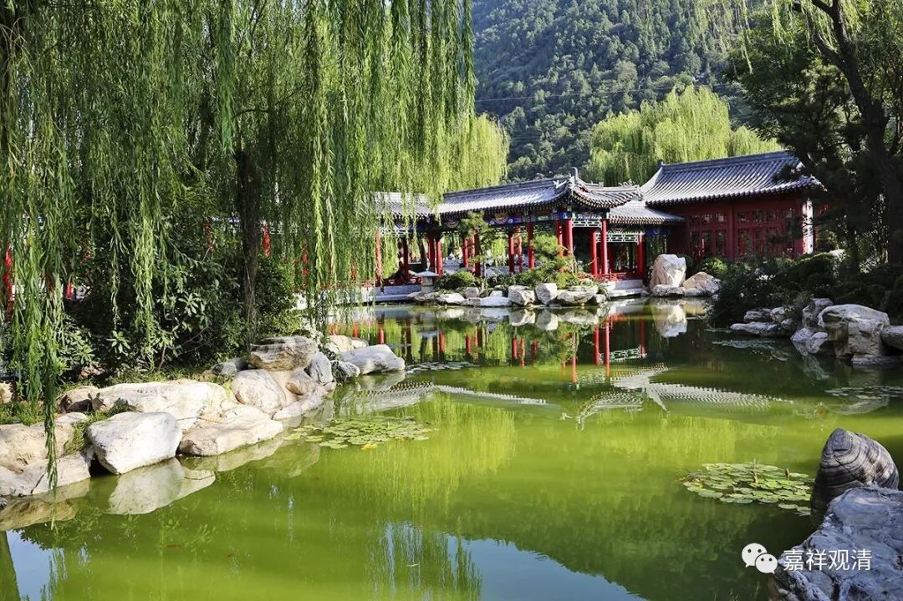

##  《善说精髓》067（中） 

**“（己三）除遣此中邪执：”**

除去**“邪执”**——错误的认识。 

**“由惑业力漂三有，”**

因为烦恼和业的力量，我们在三有当中漂泊 ——**“漂三有”**。我有一个师侄，漂泊于横店，给黄晓明当过替身。要说帅不帅的，我倒没觉得他帅。他们是练武的，通常就是给那些名演员当替身。但是他们挣的钱呢，基本上今天挣的，明天就花掉了，而且基本上都是在横店街上就全部花掉了。 

他本来是在那里做 “横漂”的——飘泊于横店，后来被我一师兄给忽悠进来当和尚了。哎呀，我不会开车呀，不然的话，我倒想过两天有空，就去我师兄弟那里看看，他们在横店有个寺院。当时我师兄就跟一帮“横漂”说：“哎呀！你们看看，你们也挺辛苦的吧。索性，你们都把头剃了，到我这里来吧！你们每天去拍戏呢，我也不拦着你们，你们也可以挣一份钱，对吧？然后你们到我这里的话，也有地方住，也有晚饭吃， 把吃住的钱也省了； 再做点超度念个经的， 庙里 还能发一点工资，多好啊！ ”

然后这帮人就这样被我师兄给忽悠了，都把头给剃了，跑到横店的寺院里。横店确实会有很多戏里面有寺院的场景，也会老是过去他们寺院。他们每天早上一般四点半左右就开始做早课了，做得再慢七点半也结束了。早课结束以后，他们把早饭一吃，就去拍戏了。每天可以拿两份工资， 省了吃住， 觉得挺爽的。 

一段时间以后，那位师侄就觉得： “ 艾， 做和尚也不错啊！ ”干脆不拍戏了，专业做和尚了。但是他不想修行的 。 他在这里打坐的时候就打瞌睡，我 想指点一下他，跟他 说 ” 打坐不是这样的，应该怎么样怎么样 ……“ 还没说完呢，他就说： “师兄（当然，他是不会叫我师叔的），你别说了。观清师，你别说了。我没有想要打坐，我中午 就想 睡一会儿。 ”

他武功还可以，肯定比我好，什么后空翻、前空翻的统统都行，好像还有一次给黄晓明做替身，从城楼上摔下来。他拍过很多片子的，以前有段时间很多古装片里都有他。你们想见他吗？要签名吗？ 

而我的那位师兄，就是在横店有寺院的那位，他跟大明星的关系都很好。他好像是和 LLW 的关系最好， LLW 老是往他那里去。前一段时间， GZL 也去了。还有那个谁？ ZZD 。 以前 有个流行的词叫什么？哦，对了，是 “走穴”！ LLW 是 “穴头”，带着这帮明星到处跑 ——他们是漂泊于影视城 。 

我们就是在轮回当中，漂泊于三有，漂泊于轮回。 

