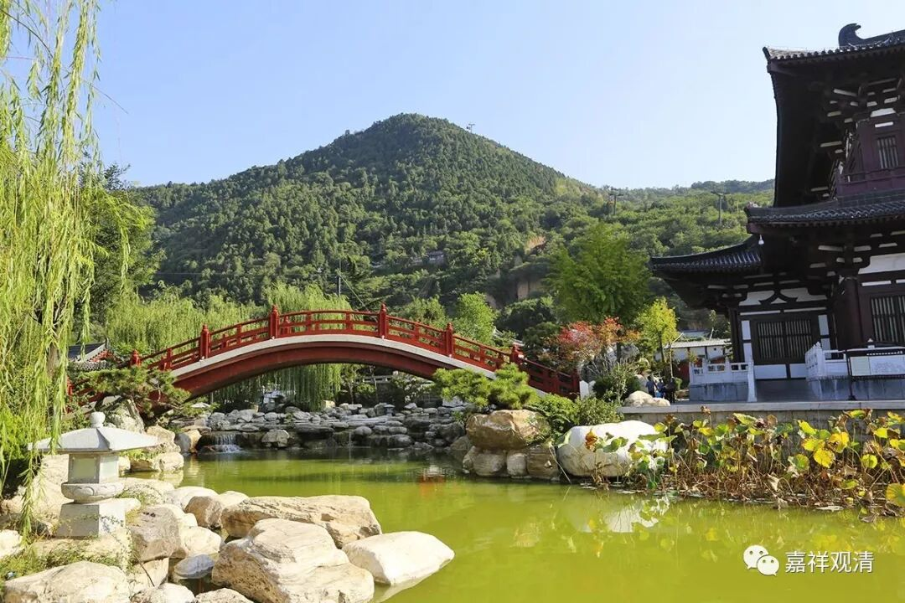

##  《善说精髓》讲记068（上） 

**“抉择趣解脱道体**

**（己四）抉择趣解脱道体。**

**分二：（庚一）以何等身灭除轮回；（庚二）修何等道而为灭除。**

**（庚一）以何等身灭除轮回：**

**在家勤修虽能灭，诸佛菩萨多赞叹，**

**除轮回过出家身。 ”**

出家身就是最好的功德身，因为戒律比较多一点嘛。另外就是专业的和业余的确是不一样，而且我们是职业的。我当时出家的时候，也是 心里 很明显想要上一个 “ 层次 ”——既然要学，那就来个狠的呗 。 

其实大学毕业的时候，我也想了很久，自己的前途应该怎么样 ——当然以我的心态，得抑郁症是不太可能的。那个时候也喜欢看清儒的一些东西，就总是想：“像我们这种人到底有没有为社会作贡献呢？感觉我们知识分子就是废物啊！只有工人和农民才能直接为社会造福利。那我以后干嘛呢？”

那个时候我到一个朋友那里去，那个朋友跟我讲了很多中医的事情。当时我的心里很烦，说： “你这个业余的还敢跟我这个专业的来谈中医！”后来我骑自行车 回学校 的时候就突然想到了： “不对呀！我学佛也是业余的 ！ 嗯 ？ 让我业余学佛 ？这 是不行的 ！ ”

在那个年代，我们看上海申花足球的队技术还不错，自己也挺喜欢足球的。就发现，足球有业余、专业和职业的差别。所以关于学佛，我就想业余还是不行的，但是要做职业的太难了， 当时 也没想到要出家，那就做专业的吧！那么，要专业学佛该怎么办呢？于是准备去考 FD 宗教 专业 WLQ 的研究生，想专业地学佛 ，那年五一还专门去拜访了人家，现在 W老师都退休了 。后来又过了半年呢，就觉得算了，直接转职业吧 …… 就这样从业余走向了专业，最后又从专业走向了职业。现在 在 我们这个职业中 应该 还 算 是不错的 吧 。 

我们世间大部分的行当，业余、专业和职业之间的距离还是很大的，不过现在汉地佛教界却并不这样，是个文盲拿到话筒都敢跟你说几句， 更别说那些看过两本书的了，所以有时候碰到这些人真是懒得正眼瞧他们，关键人家还没有自知之明，我们还非得装得有涵养，你先脸红你先输！ ——反正我不惯着，常常当面就搂头一刀，砍了算了，落个自他清净……

