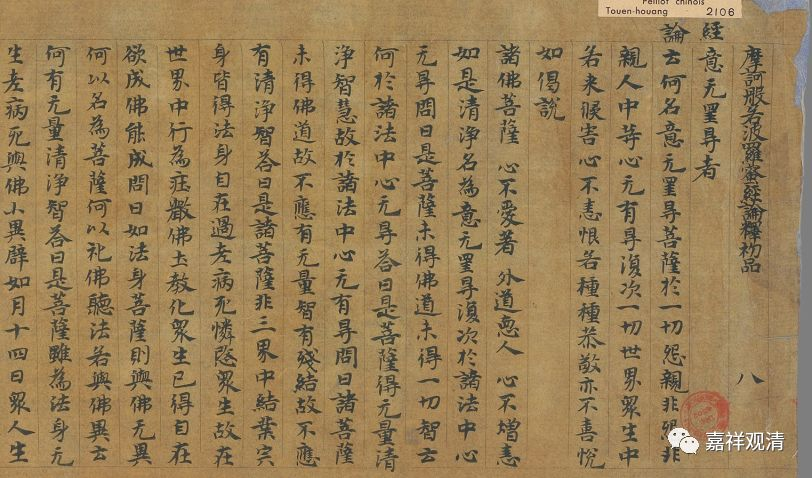
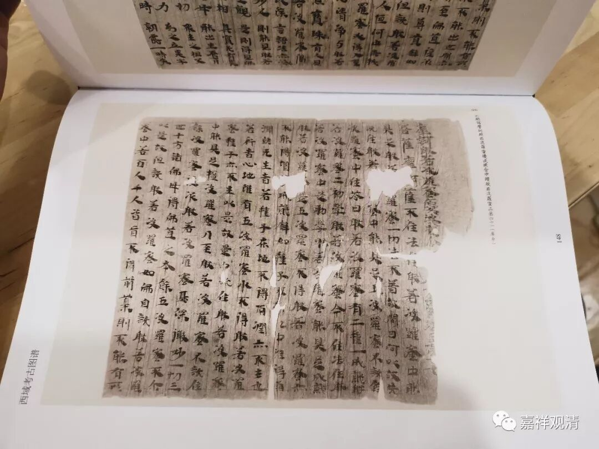
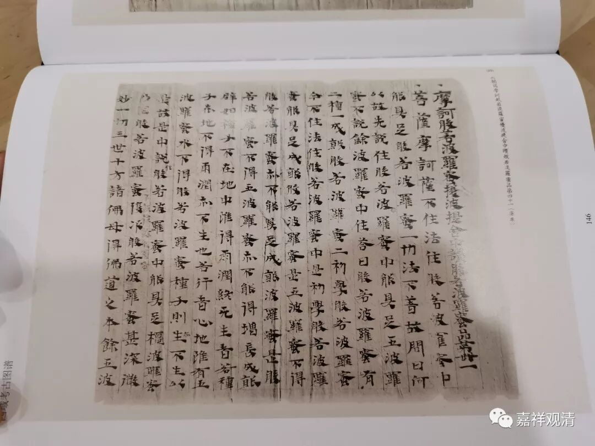
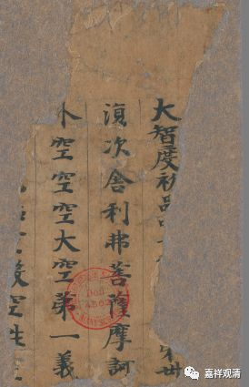
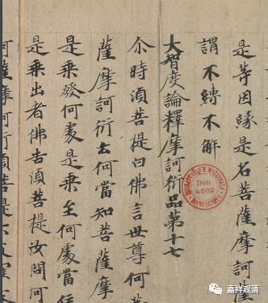
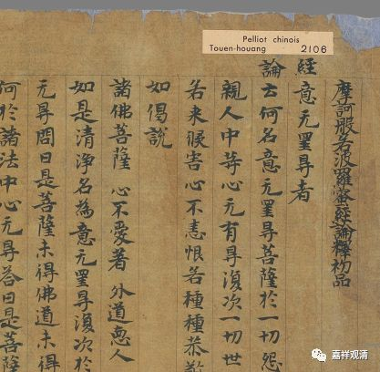

##  《大智度论》的名字 

《大智度论》的名字，《二十二种大藏经通检》单收了“大智度论”条目，回译为“ Mah ā prajñ ā p ā ramit ā -s ū tra-śastra ”，意为“摩诃般若波罗蜜经论”。 

今天略略翻检，发现此“论”名称颇不统一。 

1 、最早僧睿有《摩诃般若波罗蜜经释序》，房山石经本《大智度论》也作《摩诃般若波罗蜜经释》，则此论当作《 <**摩诃般若波罗蜜经>释**》 ; 

2、《大正藏》二十五册 P57 脚注十：“首題前行宋、元、宮、聖、石五本俱有“摩訶般若波羅蜜經釋論”十字……”，则当作《**摩訶般若波羅蜜經釋論**》； 

3 、《西域考古图谱》库车本《大智度论》名为“**摩诃般若波罗蜜优波提舍**”，若依此，当回译为Mah ā prajñ ā p ā ramit ā \- upade ś a ： 

4 、法国国家图书馆藏《大智度论写本》 Pelliot Chinois 6017 做“**大智度初品 ……第卅”，**法国国家图书馆藏《大智度论》写本 Pelliot Chinois 2082 则直接作**“《大智度论》**”； 

5 、法国国家图书馆藏《大智度论》写本 Pelliot Chinois 2106 作 《**摩訶般若波羅蜜經論釋**》 

6、《大正藏》地二十五册目录云：“又**名《大智度经》、《大智度经论》、《摩诃衍经》、《摩訶般若波羅蜜經》、《摩訶般若波羅蜜多經》**”……

看样子可以继续搜寻一下《大智度论》的各种名字哦 

