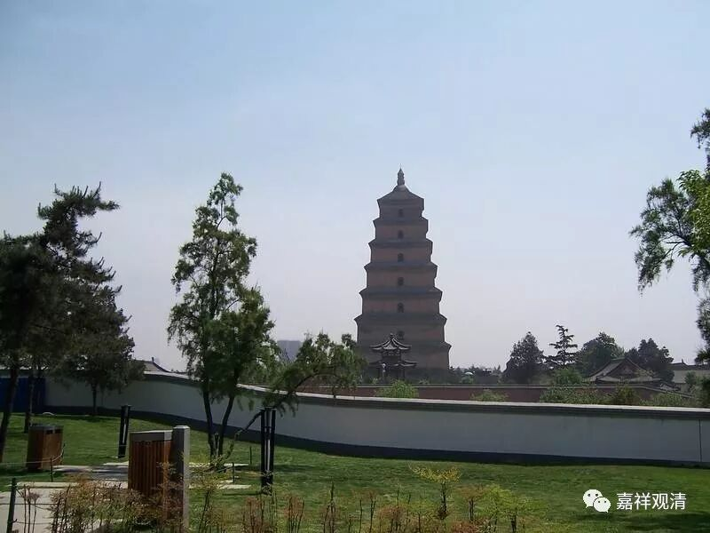

##  《善说精髓》068（四） 

**“决定共中士道修持之门说讫。”**

好，我们继续。 

中士道部分到这里结束了。 现在我们来到了上士道，这个就有点像旅游，对伐？李敖讲的 “卧游”，是吧？宅男就是这样的：我不要出去旅游，我只要在家里搜集一些资料，就等于旅游了。宅女 也 表示深感心有戚戚焉。 

应该说，中士道还有大量的内容没讲，就是关于定学和慧学的部分。但 “道次第”后面专门会谈奢摩他和毗婆舍那，那里面包含了定学和慧学，所以先讲到这里暂告一段落。 

**“于上士道次第修心**

**（戊三）于上士道次第修心。 ”**

下士道呢，是恶趣的苦要脱离； 中士道呢 ，是 轮回的苦要脱离 ； 上士道 ， 则是要圆满一切应该圆满的功德 。 

**“分三：（己一）显示入大乘门唯是发心；”**

有 大乘**“发心”**就是**“大乘”**，没有**“发心”**就不是**“大乘”**。这个抉择很简单。 这是从人上来分的，从补特迦罗上来分的，有了大乘的发心，你就是大乘的人（ 补特迦罗 ），不论神通解脱。 

宗义书里面还会谈到 “说宗义者”，或者会谈到从教法的角度来分。从教法的角度，宗义书里面抉择说，佛教内部，承认法无我的是大乘的教法，不承认法无我的是声闻教法。不过说起来，这个应该只算宗义类教科书的答案，难说是事实的答案了，现实当中，“法无我的抉择”未必是 大小乘教法的分水岭。 

就人和法合说，那就有四种了（我们文字模糊一点）：一、小乘人 +小乘法；二、小乘人+大乘法；三、大乘人+小乘法；四、大乘人+大乘法。宗义书里面说的是“说宗义者”。 

**“（己二）如何发生此心之理；**

怎么发心？在正式发起菩提心以前，什么样的因缘具足了才能生起菩提心。 

**（己三）既发心已学行之理。 ”**

发起大乘菩提心以后应该继续做些什么？ 

