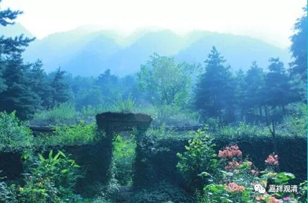

##  《善说精髓》073（四） 

**“若谓彼如擐甲修，灵妙一法具一切。**

**具牛粪水即是施，云云以此即应足。”**

对方说： “**彼如擐甲修**”，我们说的“ 单独修无分别住可以成佛 ”， 就像 “ 披甲精进 ” 等等，敬重经常说每一个波罗蜜多当中都摄了其余的波罗蜜多 ——《般若经》当中也说“一个波罗蜜多里具足六度”， 那对方接着说： “**灵妙一法具一切**”， 一个无分别住当中就已经摄了所有的波罗蜜多，所以单纯地行一个波罗蜜多、单纯修无分别住就可以了。 ”

自宗反驳：自宗在这里就举了一个例子来说：我们在供养的曼扎 的时候在中间先点上一点**“牛粪水”**，这是布**“施”**，是吧？我们要念诵的嘛 ——“ 具牛糞水即施等 ”，那点牛粪水就是布施度，而布施度当中也包含了所有六度，那这杨六 度也算修完了，这样就可以了吗？就是说，按你的道理 “**灵妙一法具一切**”，那么 我只要修 “在曼扎里面沾点牛粪水”这样就也能具足一些修行，根本就不需要什么“无分别住”啊！ 

这里的 “ 牛粪水 ” 不是脏的意思，其实是干净的意思。印度人认为，特别的牛粪水（奶牛喂的奶牛喂的奶牛喂的奶牛 ……最后那个奶牛的牛粪水） 是最干净的（画外音：这些奶牛是过滤器吗？哦，懂了 ——是印度神牛！） ，所以在曼扎当中先要点一点来清净。按照对方的说法，单纯用这个 “牛粪水 布施 ” 就**“应”**该具**“足”“施等”**圆满的修行了！怎么可以呢？！ 

**“若彼是文非实意，汝语为实何能立？”**

对方说： “**彼是文，非实意”**——用 牛粪水灾曼扎里点一下而的后念诵 “ 具牛糞水即施等 ”，这仅仅是 文字修饰而不是 “实”际意思 。 

自宗说： “沾点牛粪水就是布施等 波罗蜜多 ”（“ 具牛糞水即施等 ”）你说“那是修饰此不是实际的意思”， 那 “**汝语为实何能立”？**为什么你的 “只要无分别住就能具足六度修行”就能成立“这是 究竟的意思 ”呢 ？！为什么你的话就不是 “**是文非实意**”呢？！大家都符合你说的“**灵妙一法具一切**”，大家都有教证， 凭什么你的就对而 “牛粪水”就不对呢？要对都对，要错都错啊！呵呵， 恐怕你的 “**灵妙一法具一切**”这个理由有问题吧！ 

