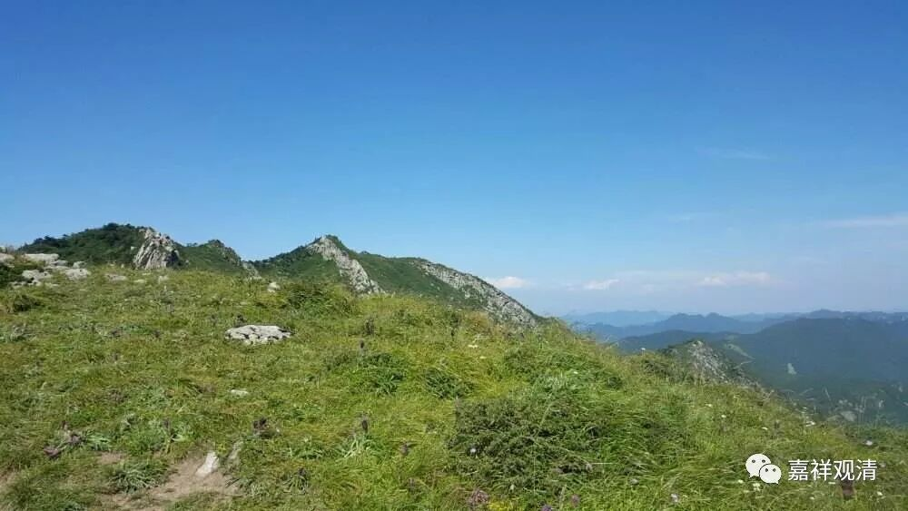

##  《善说精髓》讲记075（一） 

日本人曾经被几个这种类型的中国人搞得很惨。曾经日本人的围棋水平很厉害，想跟中国进行擂台赛，结果，那几年不是被中国给虐惨了吗？主要就是被几位这样大打大杀的中国棋手给虐了。因为日本人 下棋讲究 “本格派”，认为围棋是艺术， 是讲分寸的，你拿一点我拿一点可以的，可是碰到这几个中国人 ——“全是我的！” ，中国人认为围棋是竞技体育。 “运动员”遇到“艺术家”，还互为对手，这就好玩了，“艺术家们” 都不知道怎么下棋了。 “没风度的棋，不下！不美的棋，能赢也不下！！下胡搅蛮缠的棋？丢不起这个人！”但是竞技场上人家不讲分寸……老输老输， 于是心态就失衡了，而且一输要输好几个人，输起来也是溃不成军。今天日本最强整容组团到中国下围乙都被降级了。 

世间人要的是占便宜，佛教大乘教你“吃亏是福”，哈哈，太违背人性了！（哈哈哈哈！） 

《瑜伽师地论》说：“云何菩萨自性施？谓诸菩萨于自身财无所顾惜，能施一切所应施物，无贪俱生思，及因此所发。能施一切无罪施物，身语二业安住律仪阿笈摩见、定有果见，随所希求，即以此物而行惠施——当知是名菩萨自性施！”

**“（卯三）相续中生起之理：**

**一切财物施他心，至心发起最殊胜，**

**但除悭吝非施度， ”**

有些人认为只要把**“悭吝”**的心**“除”**去就是布**“施度”**，这个不是。如果单单悭吝心除去的话，那么阿罗汉也已经除去悭吝心了，阿罗汉是肯定没有吝啬这类负面的心，但你不能说 “阿罗汉圆满布施度”，是吧 。所以，这个**“施度”**不仅仅是**“除”**去吝啬就可以了。所以《广论》说： “故非唯除悭执施障，须由至心发心施他一切所有”，不是仅仅破除悭吝就是布施，遥遥真心发心把自己一切所有布施给“他者”。 

**“舍心究竟施圆满。”**

就像前面说的，有东西就要给别人，有的，乃至布施而来的果报 —— 善根也给别人 ……这样一学习， 结果发觉 “ 我离初地菩萨还很远啊！ ”呵呵，所以呢，不学，觉得自己明天被鞋底抽一下就能成佛的，学了呢，就会知道哪怕被抽成猪脑袋，脑袋里也没办法蹦出来一个新的知识点，只有——疼。 

