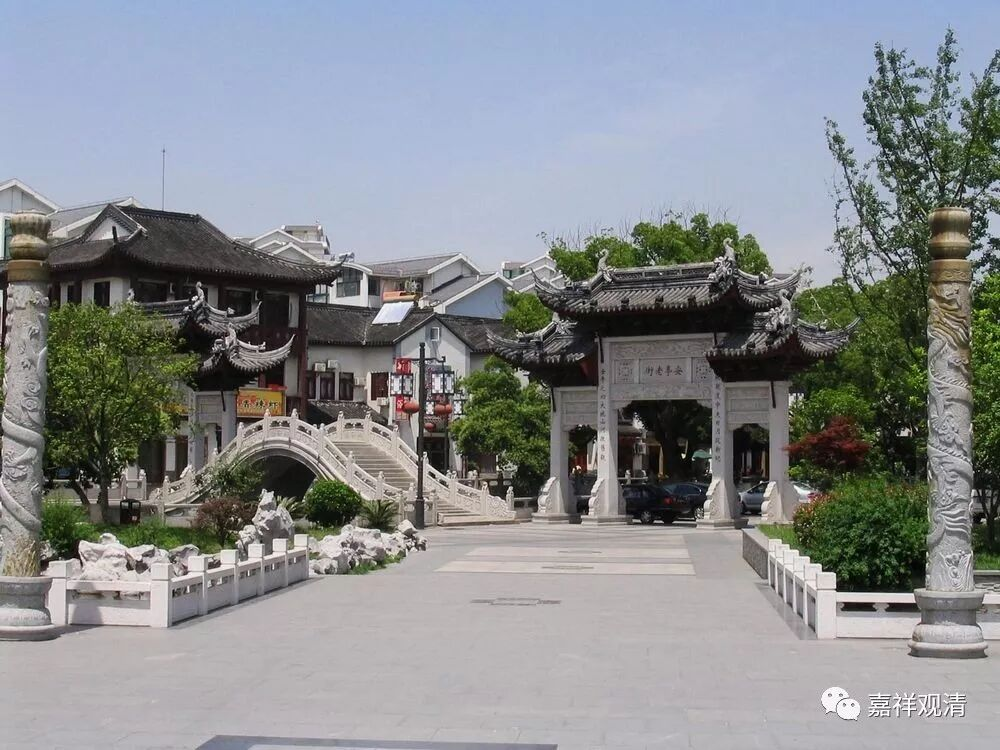
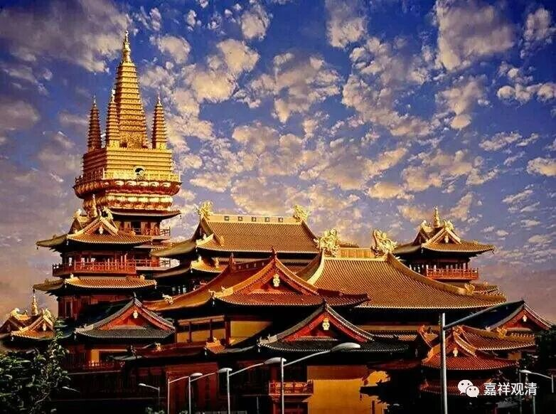
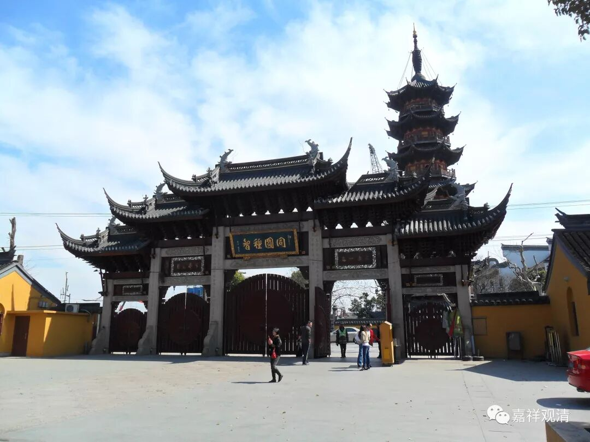
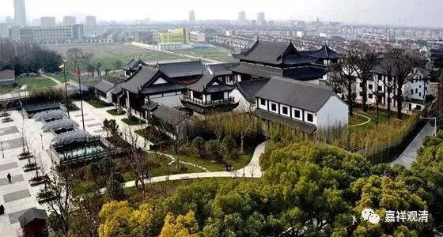
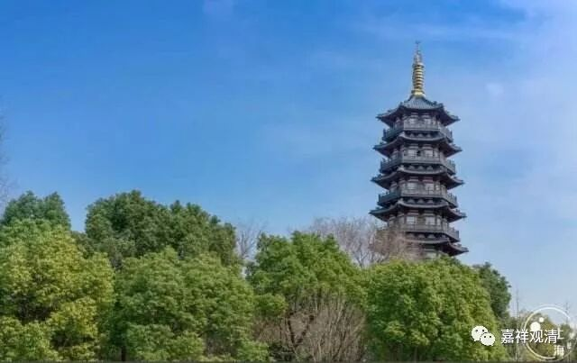
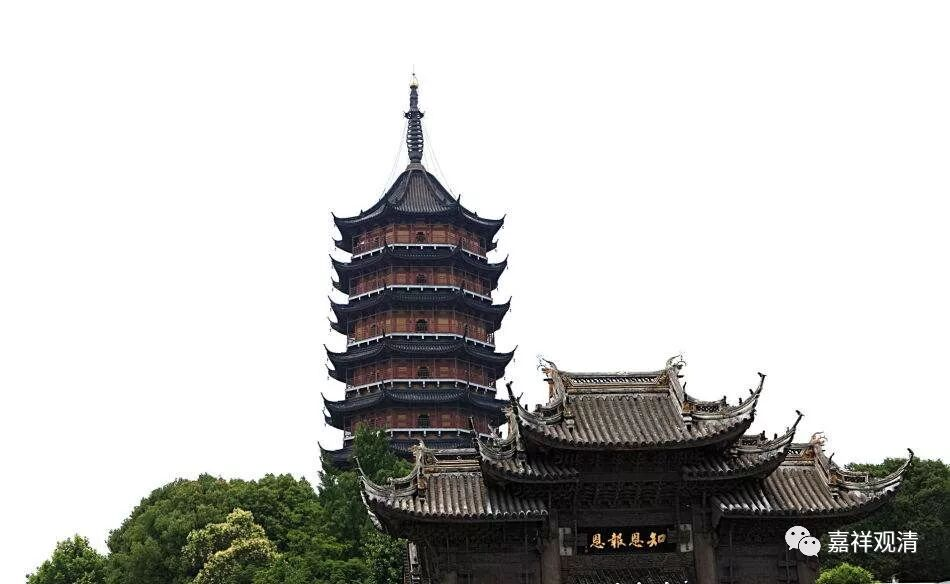
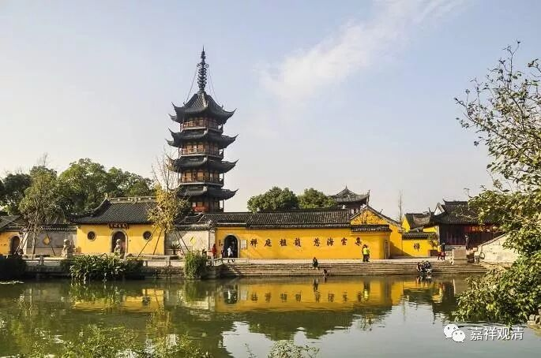
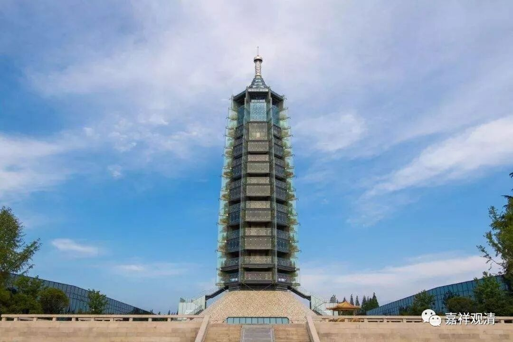
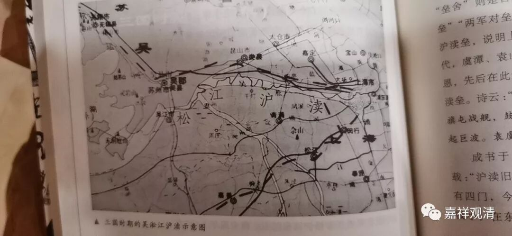

##  赤乌年间，孙权建了多少寺院？ 

在整理上海寺院文献的时候，发现一个有趣的年号“赤乌”，说他有趣，是因为实在看到他出现得太频繁了……

赤乌（238年八月 -251 年四月），是吴大帝孙权的年号，共计有 14 年，至赤乌十四年四月改元太元元年。  

我们先看上海静安寺，“静安寺”说： 

“ 静安寺，又称静安古寺，位于上海市静安区，其历史相传最早可追溯至三国孙吴**赤乌十年**（ 247 年），初名沪渎重玄寺。宋大中祥符元年（ 1008 年），更名静安寺 ……”

说静安寺是上海市内最早的寺院，由康僧会在孙权的支持下为母亲所建，建于**赤乌十年（ 247 年）……**

但是，“龙华寺”又发话了： 

“ 据传龙华寺是三国时期孙权为其母所建，始建于**赤乌三年**（公元 240 年），龙华塔建于**赤乌十年 ……”**

上海龙华寺始建于**赤乌三年**，静安寺始建于**赤乌十年**，而这一年龙华寺在建塔 ——这意思是龙华寺建得更早……

但是……且慢，第一可不是那么好争的！ 

上海嘉定区安亭镇有个菩提寺，人家说“我还早一年”！呃……

“ 菩提禅寺，位于上海市嘉定区安亭镇，始建于三国东吴**赤乌二年**（公元 239 年），孙权为其母吴国太所敕建，原址位于今安亭中学内，为上海市最早的寺院之一。 ”

这个介绍里面明显是 “客气”了，“**赤乌二年**”，如果确实，那无疑是最早的，没有“之一”。 

可是，且慢，还有……

苏州北塔寺： 

“北塔报恩寺，是苏州历史最悠久的寺院，距今已有 1700 多年。始建于三国**赤乌年间**（ 238 — 251 年），据史志记载，乃孙权为乳母陈氏所建，始称通玄寺……”

又是一个赤乌年间建的最悠久……但是还有……

  

苏州市震泽镇有一个慈云寺： 

“ 慈云塔建在江苏省苏州市吴江区震泽镇镇中心偏东，古镇一瑰宝，其历史追溯久远：**赤乌三年**（公元 240 年 ) ，在震泽镇东建五级浮屠 —— 慈云塔。 ”

这个**赤乌三年**都建塔了！（上海龙华寺龙华塔说是**赤乌十年。**） 

等等，还没完，南京“大报恩寺”，又赶来报名了： 

  

“大报恩寺位于南京市秦淮区中华门外，是中国历史上最为悠久的佛教寺庙，其前身是东吴**赤乌年间**（ 238 ─ 250 年）建造的建初寺及阿育王塔，是继洛阳白马寺之后中国的第二座寺庙，也是中国南方建立的第一座佛寺……”

呃……

还有报名的吗？ 

 （有知道其他寺院也是赤乌年间建的请在下面留言……另外，不要跟我谈康僧会变出十几枚舍利的事情……） 

另外，吐个槽： 

据这份地图，三国时期，今天的静安寺和龙华寺，根本还没有成陆地呢。静安寺迁址还好说，龙华寺赤乌十年“建塔”准备怎么说，海里的灯塔吗？  

