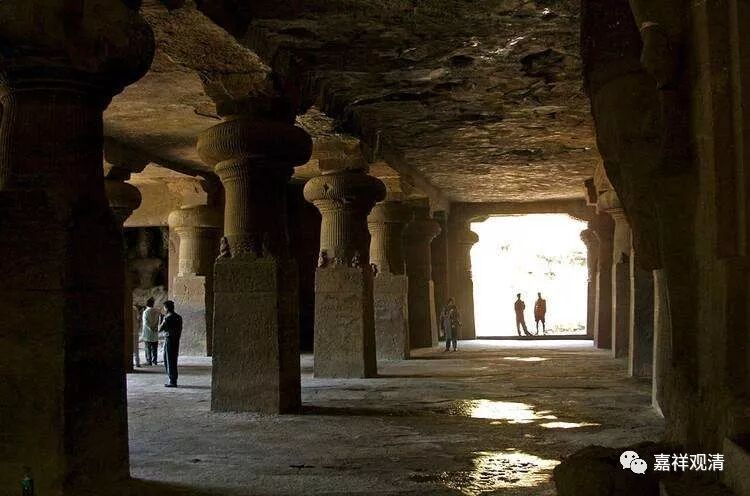

##  《善说精髓》084（59） 

下面（依《广论》和本论）把“九住心”、“六力”、“四种作意”放在一起列一个表格： 

九住心  |  六力  |  四作意   
---|---|---  
1  |  内住  |  听闻力  |  力励运转作意   
2  |  续住  |  思维力   
3  |  安住  |  正念力  |  有间缺运转作意   
4  |  近住   
5  |  调伏  |  正知力   
6  |  寂静   
7  |  最极寂静  |  精进力   
8  |  专注一趣  |  无间缺运转作意   
9  |  平等住  |  串习力  |  无功用运转作意   
  
**“虽第八住无沉掉，须无间依念知故，**

**称作行或有功用。第九不须名无功，”**

对这里的科判我还是有点想法。我们这个本子里面，这一颂是算在后面 “**午一、示由获未获圆满轻安之门获未获奢摩他**”这里的。但我看这一颂仍旧单纯属于九住心这部分的内容。我们还是把它提上来讲吧。 

**“虽第八住无沉掉”，**虽然在第八住心的时候已经没有了沉没、掉举，并且已经是 “无间缺运转作意”，但仍旧“**须无间依念知 ”，“**无间 ”，就是“精进”，“念”、“知”，就是“正念”、“正知”，就是说第八住心仍旧要依赖精进、正念、正知，所以相对于第九住心得“ 无功用运转作意 ”而被“**称 ”为“作行或有功用”行。**

若到**“第九”**住心，则**“不须”**依赖这些而被称为 “ 无功 ” 用运转作意 。 

**“卯三、修已成就奢摩他之量**

**分三：辰一、示奢摩他成与未成之界限，辰二、总示依奢摩他趣道之理，辰三、别说趣世间道之理。”**

下面接着讲什么时候才算获得禅定，以及世间修禅定的这些内容。 

**“辰一、示奢摩他成与未成之界限”**

获得禅定的界限在哪里？ 

**“分二：巳一、示正义，巳二、有作意相及断疑。**

**巳一、示正义**

**分二：午一、示由获未获圆满轻安之门获未获奢摩他，午二、示获圆满轻安已成就奢摩他之理。”**

有没有“轻安”是获没获得禅定的界限。北传就一个“轻安”或者“安”，南传“轻安”要分出很多个。 

**“午一、示由获未获圆满轻安之门获未获奢摩他**

**乃至未获轻安间，欲界地摄非作意。”**

**“乃至未获轻安间”，**哪怕到了第九住心已经无功用运转作意了，但只要还没获得最初的 “心**轻安 ”**，都不算真正获得禅定，不算获得最初的奢摩他。这里的 “**欲界地摄非作意**”就不展开讲了，意思就是没有获得最初的禅定、最初的奢摩他。 

这一句就是说，有没有获得轻安，是一道红线，有了，就有了最初的奢摩他；没有，就是 “**欲界地摄非作意**”

