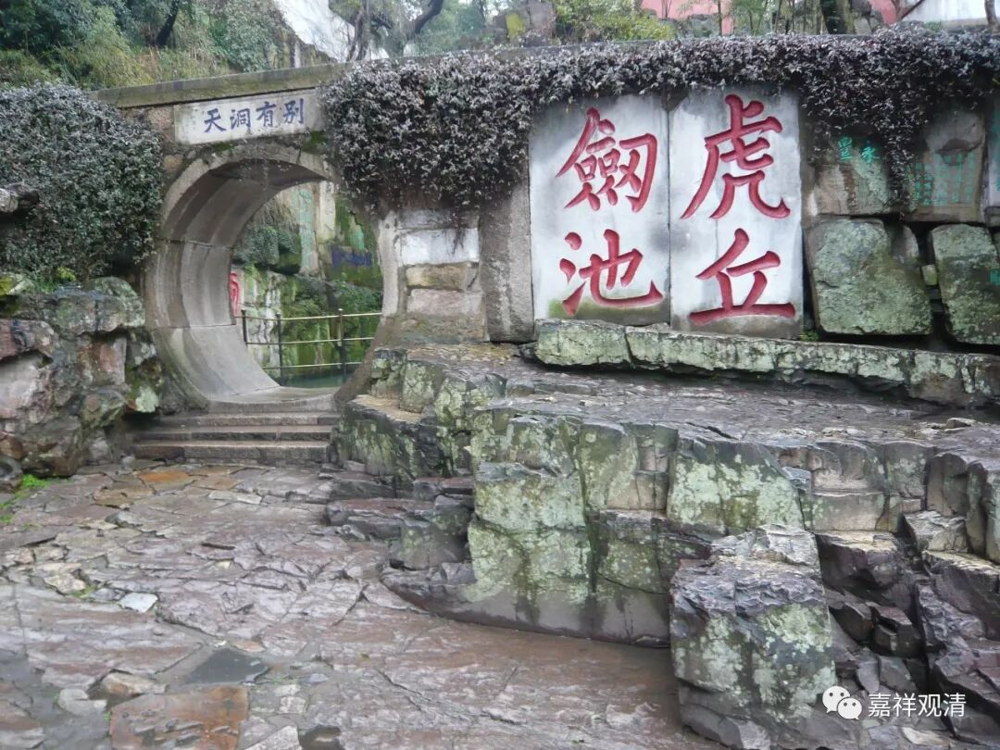

##  《微课中观史》039·2 

道生法师在当时也被人尊称为 “涅槃圣”，其实除了对《涅槃经》有特别的理解以外，他还有很多很多在当时可以说是惊世骇俗之作 ，有《善不受报论》、《佛无净土论》等等 ……

我发现，在我们今天这个学习佛法的圈子里，就我们周围这些人来讲，好像大家对中国的佛教史不是很熟，连道生法师这个名字大家都觉得听起来很陌生。要知道，道生法师这个名字在中国佛教史上是响当当的。在那个时代，如果僧肇法师在那个时候是排第一的话，从学问上来看，道生法师真的能排第二，而且时间上也差不多。 

我真的遇到过佛教圈的社会精英，对师父是崇拜的很，但这种“花边佛教”（我的强项）则完全空白，甚至在说起“弘一法师”的时候也是一脸懵，然后喃喃地说：“我只要知道我的师父……”呃，我还能说什么……

当然我也遇到过社会精英出家的，在某著名“学神寺院”做知客。我们聊了差不多有半天，谈话的时候提到“了义”、“二谛”，也很认真的问：“什么是了义？”“什么是二谛？”……后来送我出门的时候，也是在我后面喃喃地以我能听到的音量幽幽地说：“我们只要知道师父伟大就行了……”呃，好吧。 

我个人建议佛教的相关知识还是应该知道点，就像学中医要学《中医史》是吧。中国古人讲“经史合参”，我记得冯友兰先生还是陈寅恪先生说过，好的哲学家都是好的哲学史家。让大家了解一点佛教史，这也是我们在这里“微课”聊天的目的。 

南北朝时期的佛教，在中国思想史上是一个介于“魏晋玄学”和“隋唐佛学”之间的过渡时期，这个过渡期完全不逊色于前后两个重要的时期。这个时期僧人的著作，是受到魏晋玄学的影响的——他不能独立于那个时代。其实包括僧肇大师的《般若无知论》、《涅槃无名论》、《物不迁论》，道生法师的《善不受报论》、《佛无净土论》，发现没有，从作品的篇幅、行文的格式、文字的运用，到流传的背景，其实都和魏晋的清谈文章有关，你看看，对照一下嵇康的《声无哀乐论》、《养生论》，魏晋时期三论系的文章是不是很像。王导到江左时常立“声无哀乐论”，谢灵运、刘虬也常立《善不受报论》——像不像。玄学清谈，立意要突出，要反复往还辩论，三论系早期的文章其实就顺着当时的学风走的，要到隋代和初唐的嘉祥吉藏大师，才开始转向章疏治学，才回到更印度一点的路子上去。当然，这也是一个大的环境的转变、学风的转变，从魏晋的，走向隋唐的；从得意忘象、得意忘言、得鱼忘筌，到字斟句酌、厚重踏实。 

