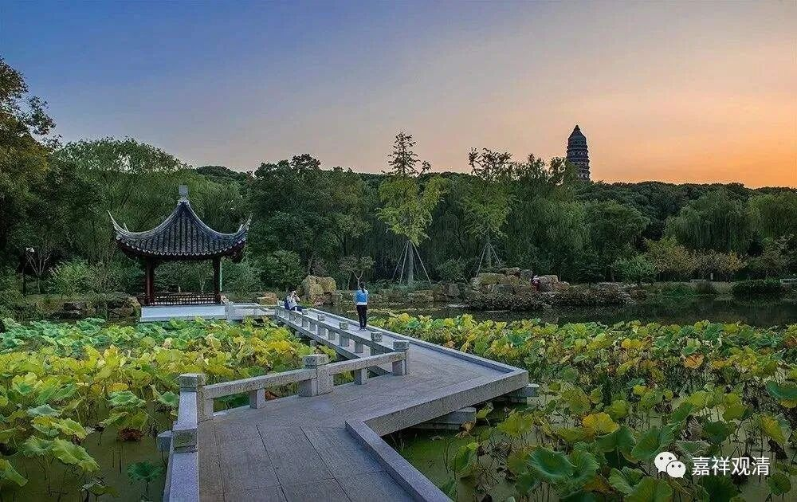

##  《微课中观史》44·2 

我们接下去要讲的三论宗或者中观的系统，其实是既不是从僧肇法师延续下来的，也不是从道生法师这一脉下来的，甚至不是僧睿法师这一系下来的。但是它确实传承有序，是有传承的，包括三论宗的很多说法都能明显地看出非常清晰的中观派的痕迹。在吉藏大师的《三论玄义》当中也谈到了这样的说法，说 “ 某某人的说法虽然正确，但是没有传承 ” ，相当于说， “我们的说法正确而且有传承” 这种性质。 

从长安僧团到摄山诸师之间，三论师的传承实际上是有的，可以往前推到河西道朗法师，再往前好像有点推不下去了，只知道他曾经在西安一带学习。我们现在知道他曾经在关河，实际上这个地方属于西安，就是以前的长安，也就是当年鸠摩罗什法师主要活动的地方。虽然他在那里学过，但是《高僧传》中没有具体指出他是跟随哪位法师学习的。再后来呢，他来到了摄山 ——也就是现在南京东边的栖霞山，住进了一个寺院。这个寺院里有一个比他年纪大的和尚叫法度，后来很多人就把这位法度法师作为三论师承里的一个人物，实际上应该算不上，这位法师除了道朗法师有点 同乡关系之外，好像没有三论宗或者中观的背景。 

在那个时候，整个佛学界比较流行的还是经，要知道中国一直有这个经比论更流行的传统。这是有原因的，因为中国人是按照自己的思路，以前的主要学问就是儒家或者称为儒学。儒学当中有经、论、疏、注这些经典，而且是有次序或者说高下的。比如说，汉代规定经的用纸、用简必须是二尺四（如《易经》），而下经一等的则是一尺二（如《孝经》），再次之的则为六寸（如《左传》）。儒家是这样，那么佛家也是这样。既然在知识界有这样的流行，其实就会在大家的心中形成这样一种认知 ——“ 经比论更重要！ ” 这个问题到现在仍然存在（虽然经书之间长度的差异早已不存在），中国的佛教界还在流行，认为经比论重要。因为从一开始大家拿到手中的书的 “版式”、长度 都不一样，对吧？这个重经而不重注疏的背景，实际上是中国儒家形成的社会 “ 传统 ” 的延续造成的。 

