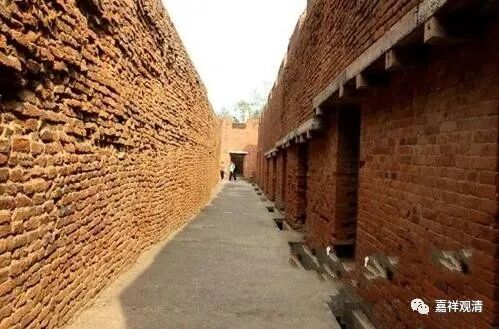

##  微课堂佛教史103·1 

从玄奘法师的记载来看，那烂陀寺真的是非常了不起，可以说是当时的文化中心。当时寺院里有多少人呢？说是**“僧徒主客常有万人”**，就是出家人和到访的客人，包括客座、留学生等等差不多有一万人左右。 

其中的学习内容包括哪些呢？大乘、小乘都学习，而且大、小乘的各个部派的内容都学习，甚至不仅仅是佛教的内容，还包括了印度的传统文化。以我们今天来看，就是相对于中国传统文化的印度传统文化当中的重要部分，也是那烂陀寺的学习内容。譬如说吠陀 ——婆罗门教的四吠陀，他们也学习。还学习什么呢？还学习因明（逻辑学）、医方明（医学）、声明、术数、…… 类似于这些方面的。 

这当然是印度的传统，在玄奘法师的传记当中也提到过，他在回国之前还专门请了一个外道给他算命，说是裸形外道 ——就是我们今天讲的耆那教，或者叫“裸形外道”…… 就说耆那教吧。玄奘法师找了个耆那教的人来给他算命，还算得挺准的。 

玄奘法师在那烂陀寺当中算是学得好的，非常厉害的那种。你们想想看，一万个人的寺院里面，通达经论二十部的有多少人呢？一千多人。十分之一啊！我们听得汗都下来了。一万多个高僧不得了，通达二十部的有一千多人！通达经论三十部的有多少人呢？有五百余人。这个实在是大型的学术机构啊！通达经论五十部的人有多少呢？包括玄奘法师，总共有十个，就是有个通达五十部经论的！其中最最厉害的，据说是全都通达的呢，就是玄奘法师的老师 ——戒贤论师或者 说戒贤法师 —— 他是所有都行！学界泰斗！ 

你们大家再听一遍哦：通达经论二十部的有一千多人，十分之一；通达经论三十部的有五百多人；通达经论五十部的有十人。这个不得了！我觉得哪怕是有百分之一，比如通达经论二十部的有十个人，那这个寺院在中国的话，已经是不得了了，哪怕有一个通达经论二十部的，也是不得了啊。太感慨了！ 

另外一方面呢，当时玄奘法师在那烂陀寺的时候，这个寺院的供给非常充分。后来就不见得这么充分，但当时的供给真的是非常充分。什么情况呢？差不多有一百多个村子的税赋就专门拨给它的，就是等于有一百多个村子的赋税是送给那烂陀寺的。一百多个村子有多少人呢？算起来好像还不够多哦。一百多个村子的话，我们一个村子算二百户，一百乘以二百就是二万户。那么一户算多少人呢？如果一家五个人的话，那就是二万户有十万个人，那差不多十个人供给一个人。每天送来的米、牛奶（乳制品）等等有多少呢？有几百担，相当于几万斤、几吨，保证他们的供给。（唉，要是做个资产信托多好 ……） 

