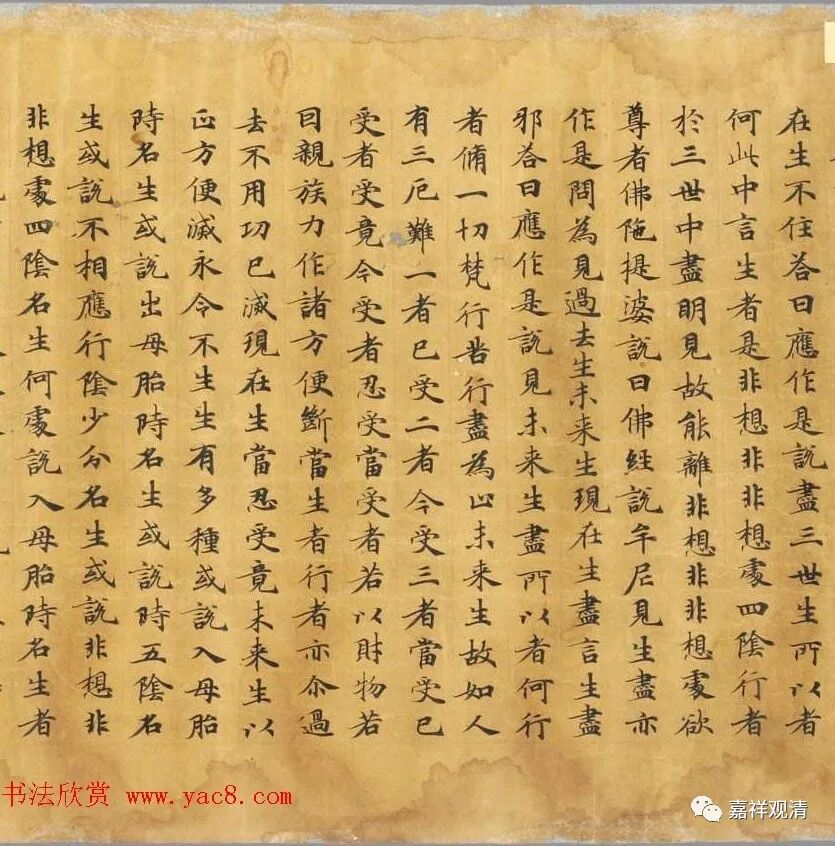
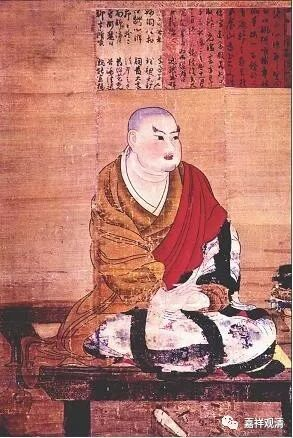
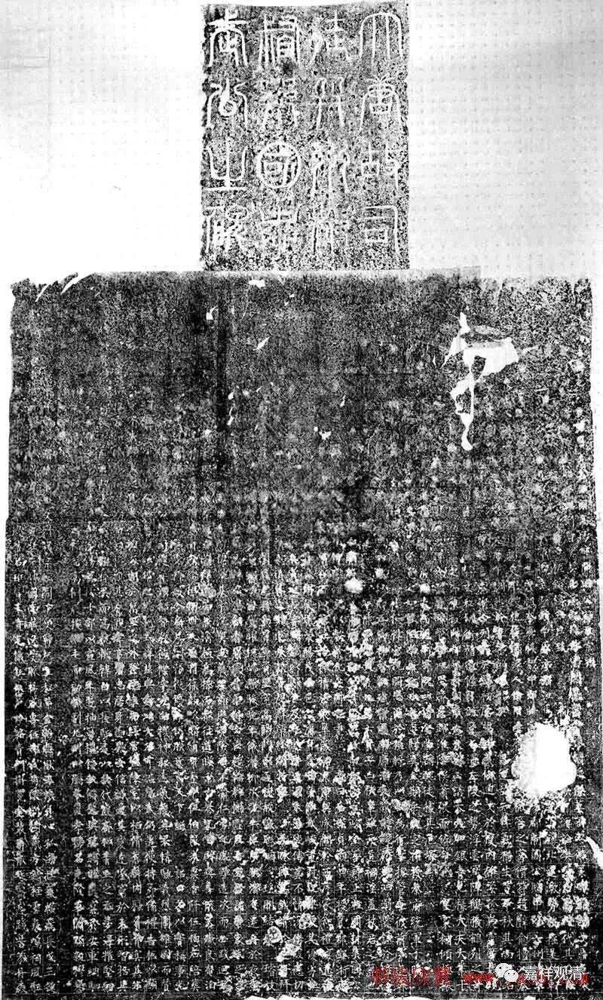
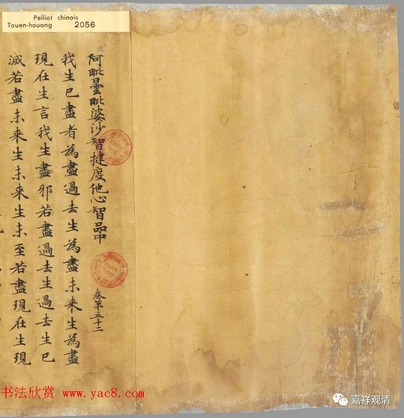
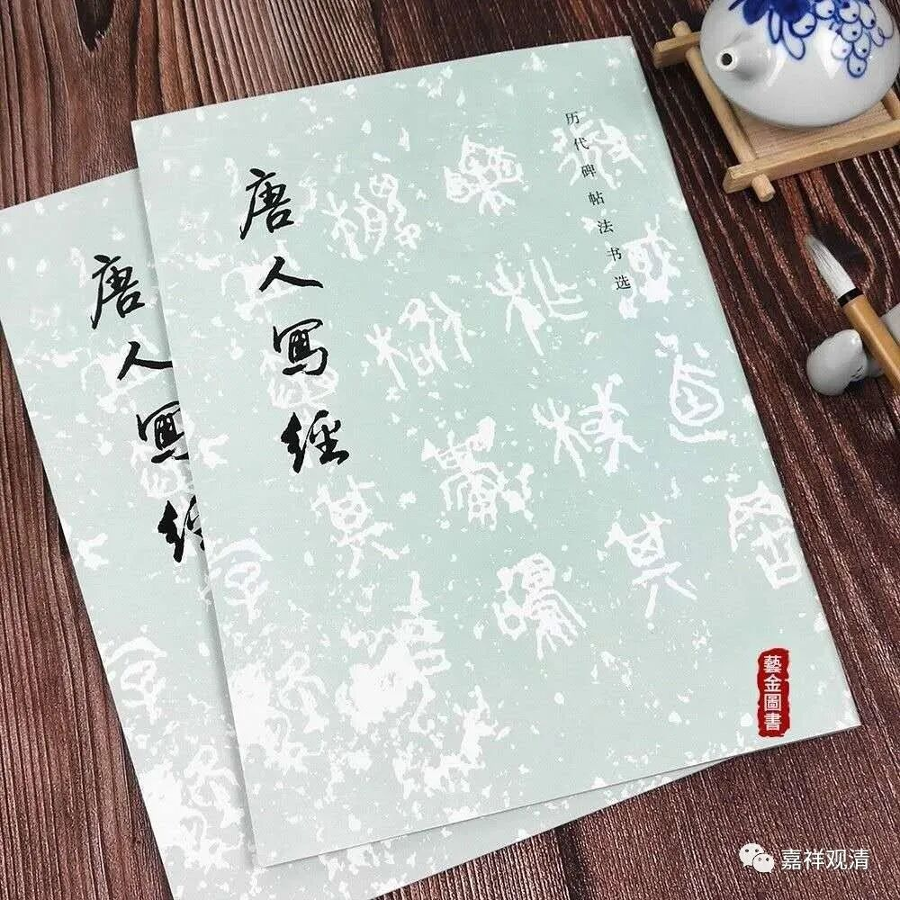
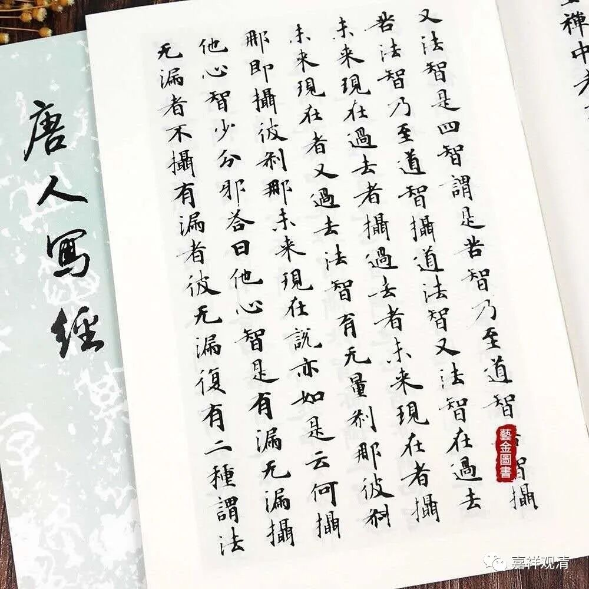
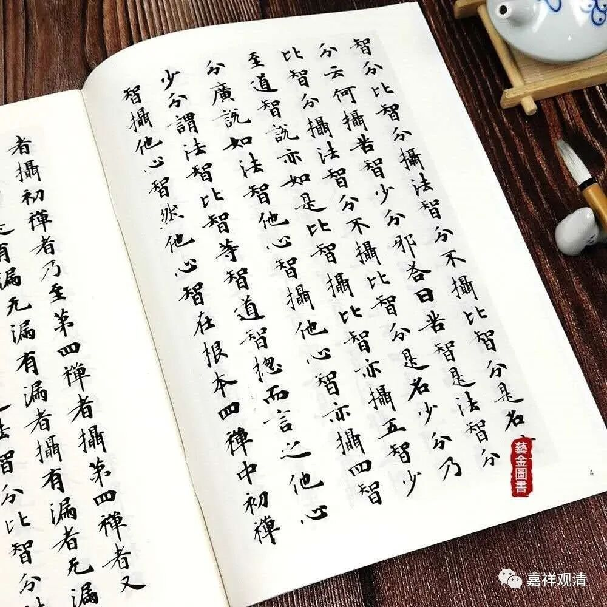
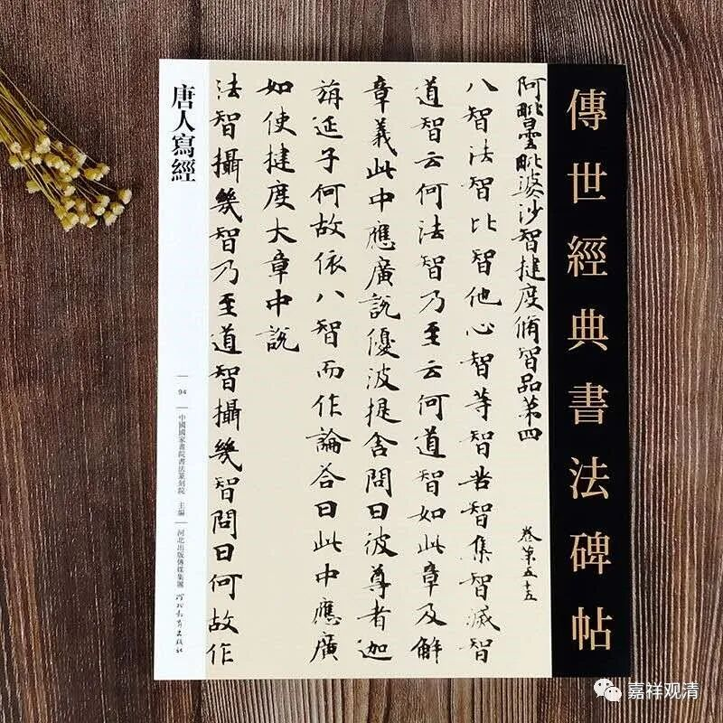
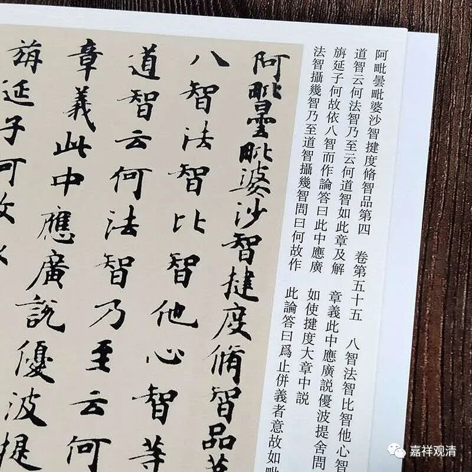
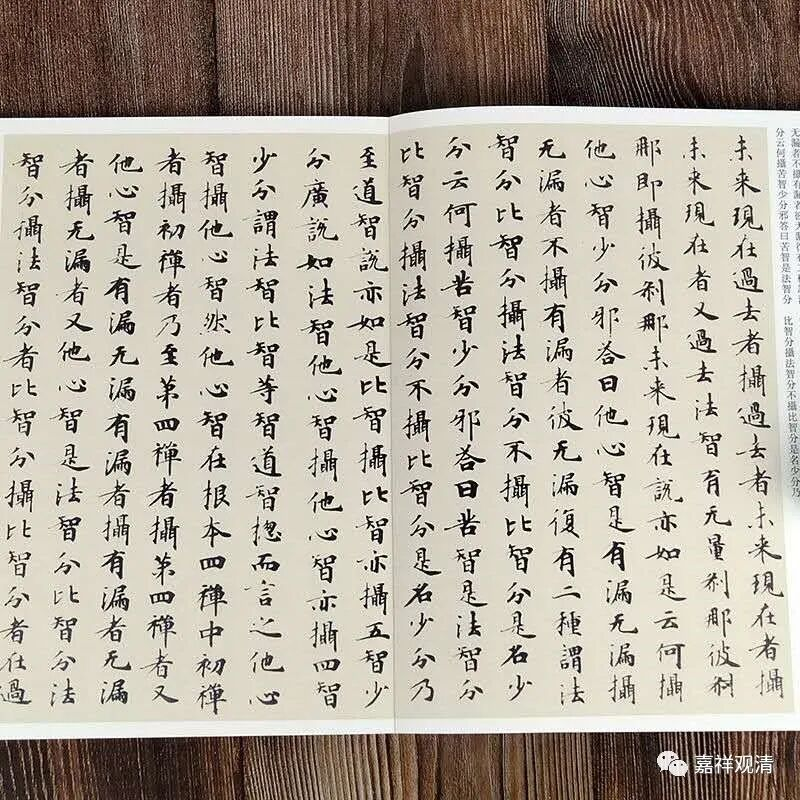

##  基大师的国公兄弟 

大乘基，就是俗称的 “窥基法师”，是玄奘法师晚年最重要的弟子。 

他出身高贵，父亲尉迟（有作 “蔚迟”）宗，唐左金吾將軍、松州都督、江由縣開國公，伯父就是著名的门神——尉迟敬德、尉迟恭（585－658年）。 

##  1971年出土的《尉迟敬德碑》 

尉迟恭晚年信道教、服食云母粉（也确实长寿，寿命七十四），他的侄子基大师却是从小信佛，十七岁出家。 

尉迟恭有个儿子，叫 尉迟宝琳（《隋唐演义》里面叫 “宝林”，应该是以前说书艺人不认字而记录有误），《旧唐书·尉迟敬德传》里提了他一句：“【尉迟敬德】子宝琳，嗣【鄂国公】，官至卫尉卿。”

这一件是伯希和带去法国的敦煌文献【伯 ·P2056】《阿毘昙毘婆沙论卷第五十二》，卷轴装，现藏于法国国家图书馆。《阿毘昙毘婆沙论》，即《大毗婆沙论》的旧译版本，玄奘法师新译为两百卷，旧译有一百卷，今存世六十卷。 

此卷《阿毘昙毘婆沙论卷第五十二》后面写了抄写缘起： 

“龙朔二年（公元662年）七月十五日右卫将军鄂国公尉迟宝琳与僧道爽及鄠县有缘知识等，敬于云际山寺洁净写一切尊经……”

这是说基大师的这位叔伯兄弟出资抄写 “一切经”（“一切尊经”，即后世《大藏经》的原型）在寺院（云际山寺）供奉。 

这一件写经作为书法出版过，有两个本子，就叫《唐人写经》，大家有兴趣可以买来看看，字不错，标准的写经体。 

