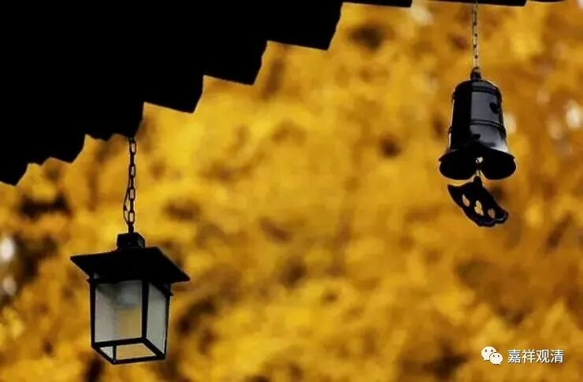

##  官不容针，私通车马 

书法篆刻里经常可以看到有一句 “疏可走马，密不透风”，意思是结构中疏密虚实的变化。一般说此语出自 邓石如（《论书》： “字画疏处可以走马，密处不使透风，常计白以当黑，奇趣乃出。”），也有说出自包世臣（《艺舟双楫》：“字画疏处可以走马，密处不使透风，常计白以当黑。”）。 

若由我们来说，这明显是禅宗的套话变来的。 

从佛教最初的文献《经集》里就谈到了证果以后的究竟的境界如何表达的问题，后来在佛教的典籍里经常就要谈到二谛——胜义谛、世俗谛。所谓胜义谛，自来皆说“言语道断，心行处灭”，禅宗的表达方式叫“向上一招，诸圣不传”——胜义离言说，而且“但有言说，都无实义”，那么如何来通达胜义呢？佛教的各流派也都要回答这个问题。（《维摩诘经》大谈“不二法门”的最后，维摩诘居士默然地不说话了，文殊菩萨赞叹道：“乃至无有语言文字，是真入不二法门”。） 

禅宗的回答比较诗意——“官不容针，私通车马”。 

官，就是官家，法律。法律层面丝毫不的苟且——“官不容针”。“私通车马”，就是明面上是“官不容针”，但“权变”上、私下里则不仅不是“不容针”，连马匹、车辆都过来了——这正是中国人的处事方式，有“经”有“权”。 

禅宗用一个实践的方式去解决清辨“二谛论”上的“打成两截”——虽然“向上一招，诸圣不传”，但祖师们却不免“老婆心切”（就是像老婆婆一样絮絮叨叨），“私通车马”。这正是一种“言说二谛”：胜义谛离言说，世俗谛则是通向胜义谛的言说。 

“官不容针，私通车马”在语录里比比皆是，这里举一例大家读一读吧——

《镇州临济慧照禅师语录》： 

**_沩山问仰山： “石火莫及，电光罔通，从上诸圣将什么为人？” _**

**_仰山云： “和尚意作么生？” _**

**_沩山云： “但有言说，都无实义。” _**

**_仰山云： “不然。” _**

**_沩山云： “子又作么生？” _**

**_仰山云： “官不容针，私通车马！” _**

沩山问仰山说：“胜义境界不通戏论（石火莫及，电光罔通），那以前的大师们又怎么教育学生呢？（从上诸圣将什么为人？）”

仰山回：“师父你怎么看？”

沩山云：“但有言说，都无实义。”

仰山回：“不然。”

沩山问：“你有什么说法？”

仰山道：“官不容针，私通车马。”

