##  我就这样成了工匠 

最近刻章，升级了……

先买了一些大的石料，准备刻 “千佛碑”，网上订了18 × 18 厘米、 16 × 16 厘米的，卖家痛苦地告诉我——没货了！于是定了两块 14 × 14 厘米的， look ——

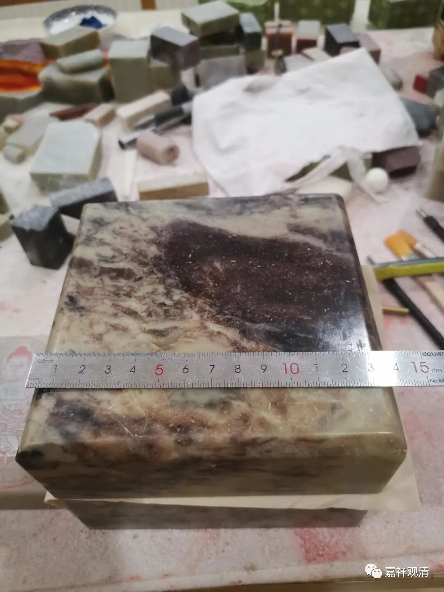

14× 14 的石料。其实 不是卖家图片上的青田石。也没问题啦。 

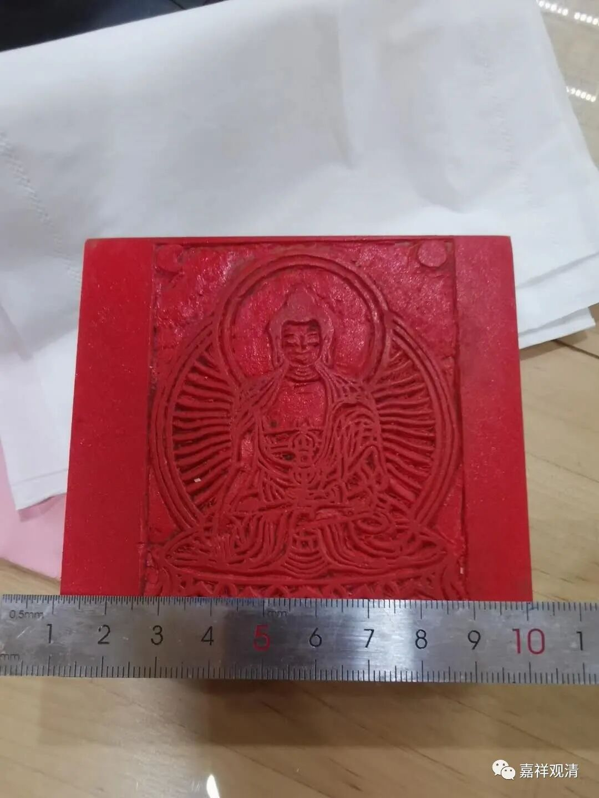

还定了9× 9 的。 后来用的时候发现，14× 14 的石头太重了！ 

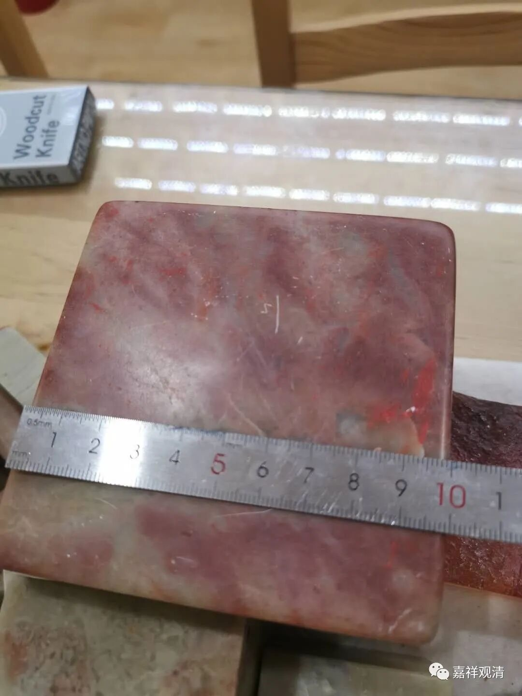

之前也买过10× 10 的石料，准备刻《心经》，后来用“分体式”完成了。 

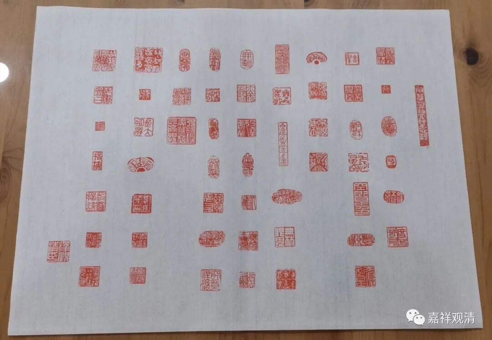

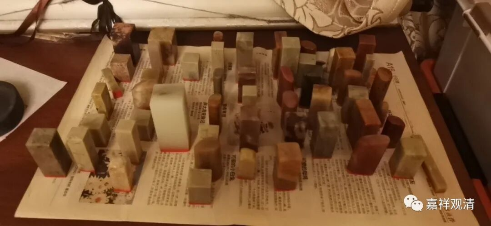

于是用9× 9 的料子刻了五百来尊佛像。 

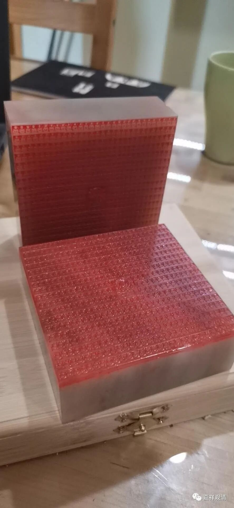

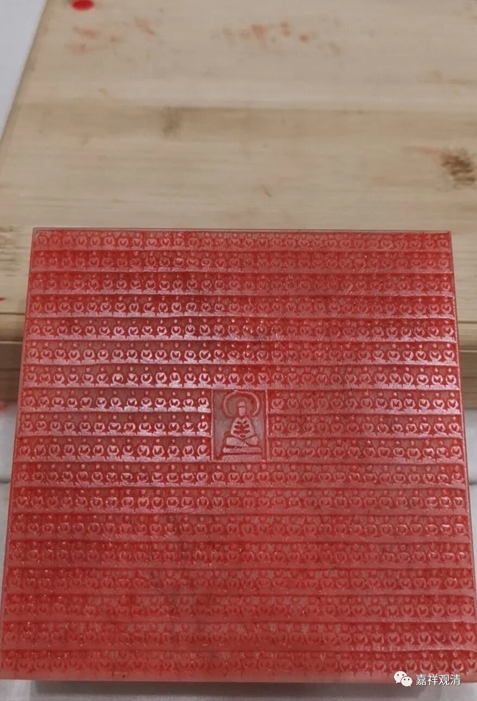

大家拿来印十万佛像。已经有二十五个十万完成了。 

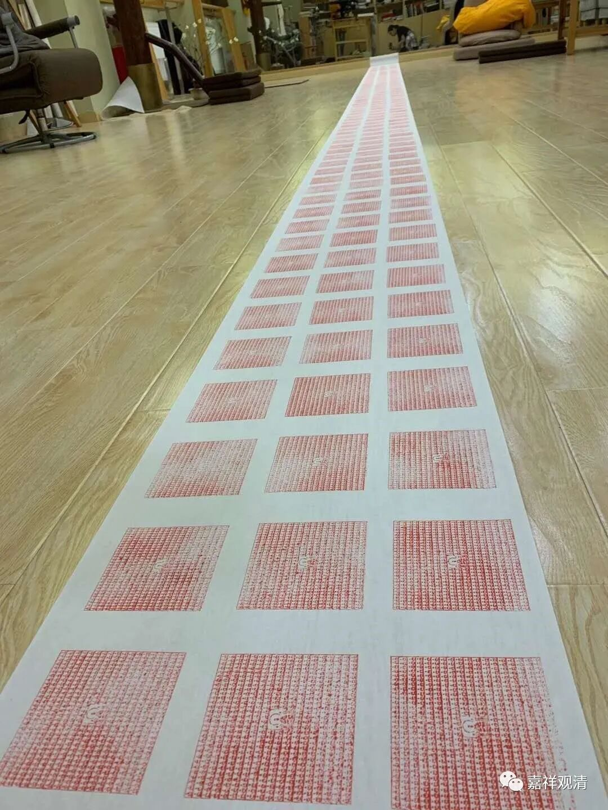

现在我准备刻满十万尊，应该要两百多方章子。 

突然心血来潮，把以前大家做十万加行的不动佛的橡皮章子用石头复制了一下——咦，效果不错呦。 

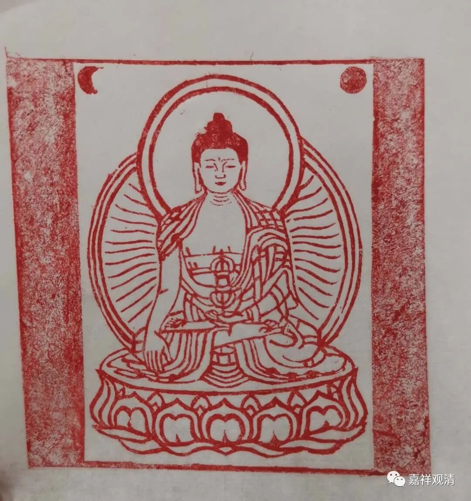

胆子突然壮了，刻了一枚绿度母像——这个真的有点难……但是，完成了！ 

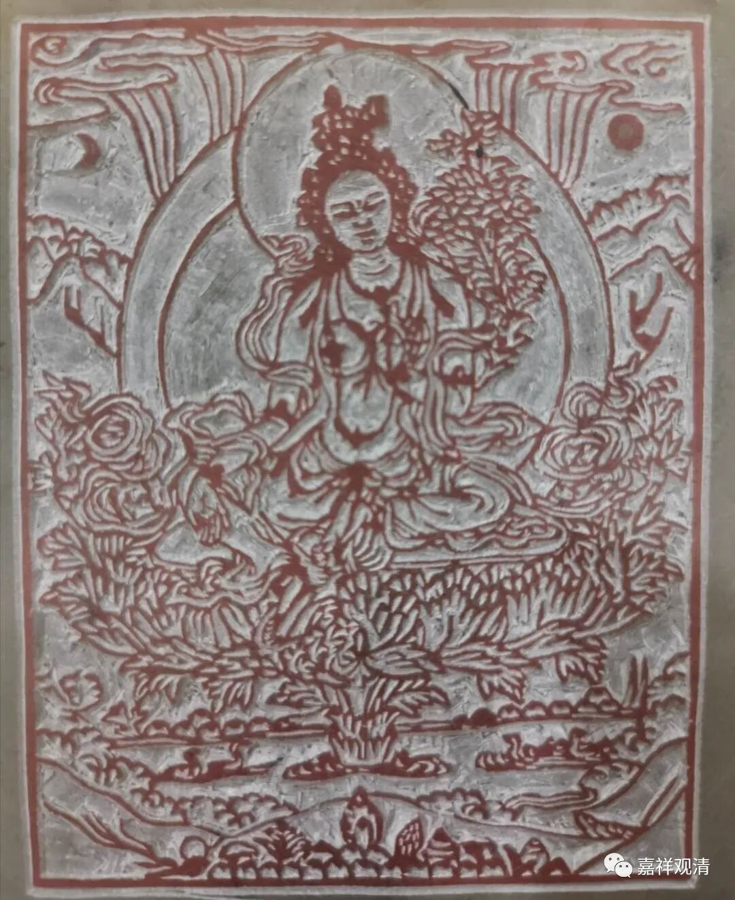

接下来刻了一尊宗大师，刻的时候没注意左右手（左右来回翻，脑子都拧了），宝剑和《般若经》左右反了，图就不放上来了。 

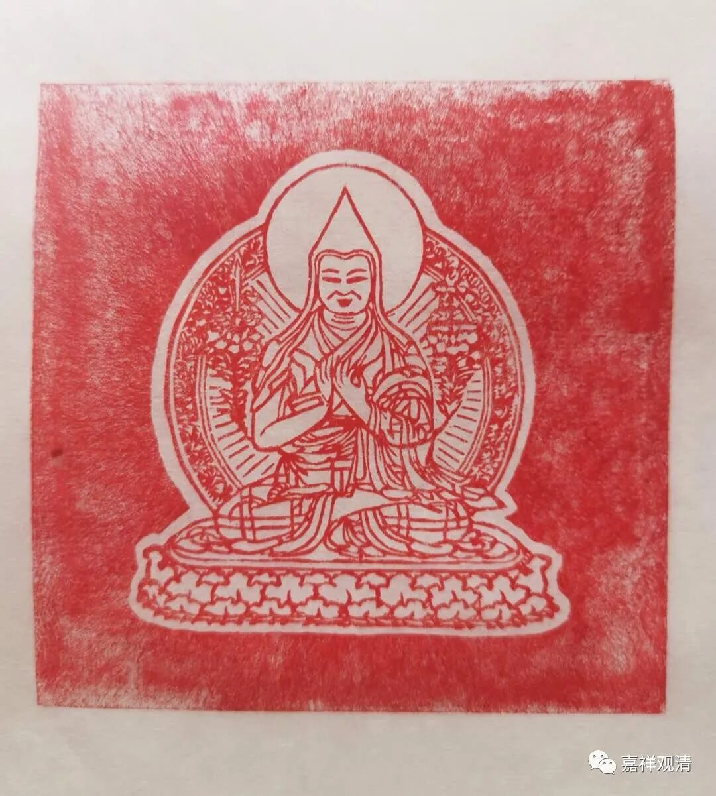

这是第二版。 

接下去是 

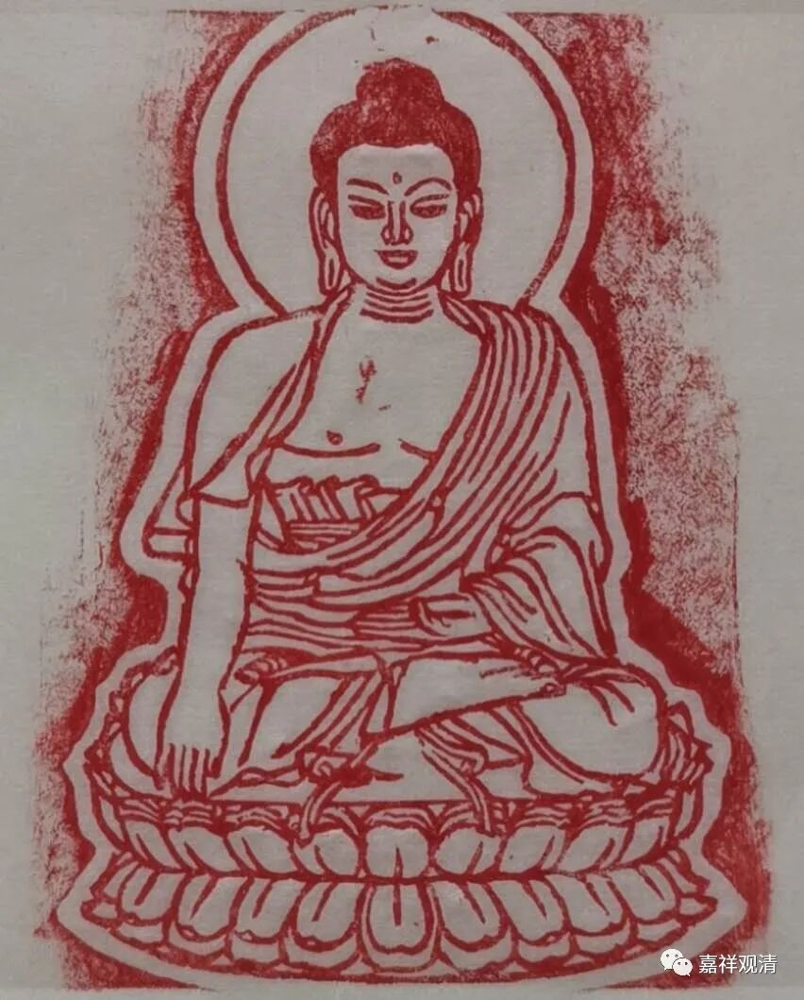

释迦佛 

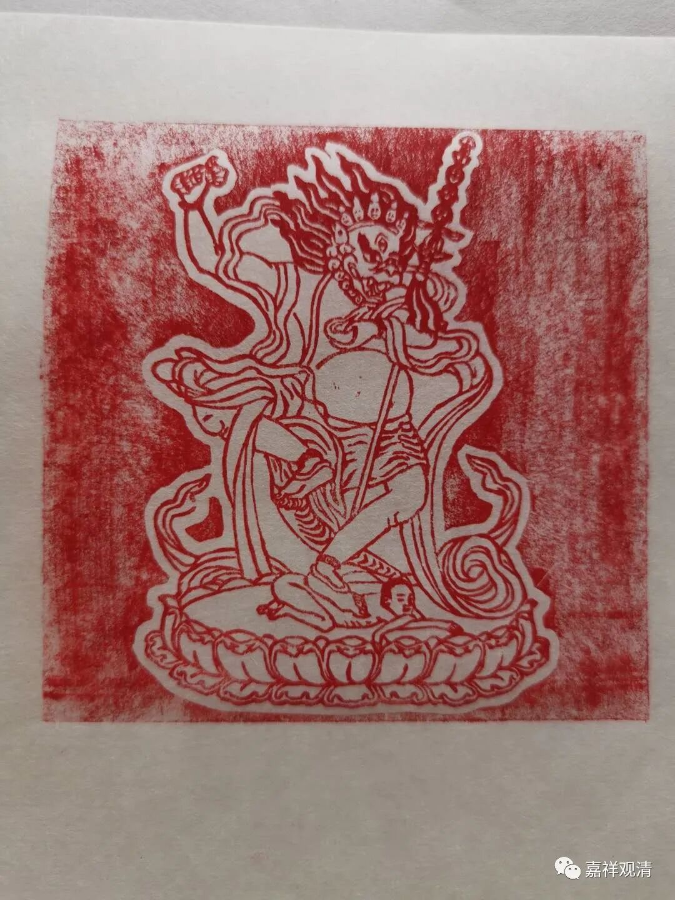

狮面母 

接下来准备做几个系列： 十万佛像、35佛、五方佛、三世佛、传承祖师、禅宗祖师……一点点做呗。 

