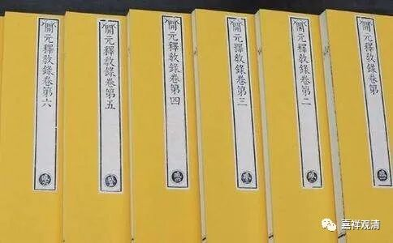
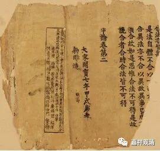
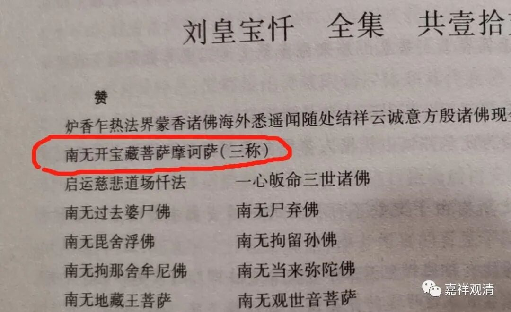

##  这就是惊喜！ 

##  ——走进《宝卷？的“开宝藏菩萨”

庙堂和乡野，相隔千里万里，但是，有时候会有一些莫名的联系，在你突然发现的时候，会有一种奇妙的惊喜。 

《开元释教录》（唐 · 智昇撰）是唐代的一部佛经目录，《开元释教录略出》收录佛教经典 5048 卷，此后， 5048 卷这个数字居然被民间牢牢记住了，敦煌有民间的伪《经录》也凑足了 5048 卷，《西游记》里玄奘取经目录也凑足了 5048 卷，我在天津还看到过一个民间印本《大藏经（目录）》也凑足了 5048 卷——这个我专门写过文章了。 

不仅如此，猪八戒的钉耙、沙僧的禅杖，都重5048斤……民间对《开元释教录略出》的 5048 这个数字的记忆太深了，都不知道这上（专门的佛教目录书）下（民间的伪经、小说）之间的纽带是什么……

开宝藏，是中国最早的刊刻大藏经，今天存世极少，不是专门研究的都不知道这个名字。 

但是，江南民间保留的手抄本《刘皇（王）宝忏》（可能原先为《刘王宝卷》或者《刘王宝传》，而与《梁皇宝忏》混淆了。皇、王，吴语地区音近。刘王、刘皇，就是刘猛将）居然开篇就是——

**南无开宝藏菩萨摩诃萨！**

《开宝藏》居然出现在这个地方！ 

——这就是惊喜！！！ 

