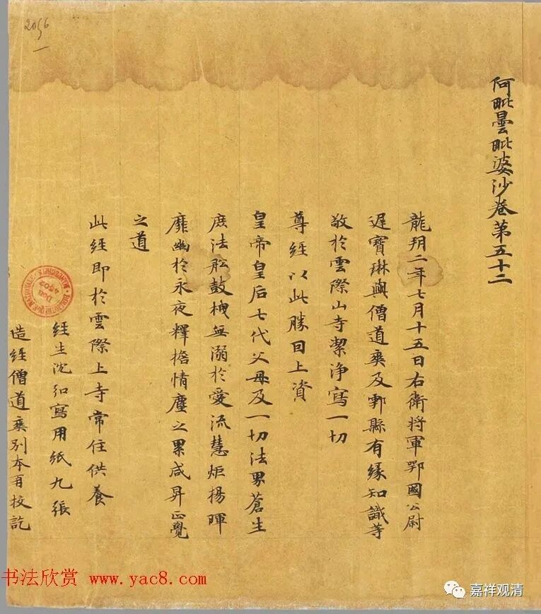

##  武则天的秘密 

##  ——敦煌写经题记里面包含的一段政治史 

唐·鄂国公尉迟宝琳出资抄写的《阿毗昙毗婆沙》之前已经提过几次了，今天我们再来聊聊这件文物。 

此件最后有题记： 

**“龙朔二年（公元662年）七月十五日右卫将军鄂国公尉迟宝琳与僧道爽及鄠县有缘知识等，敬于云际山寺洁净写一切尊经，以此胜因，上资皇帝、皇后、七代父母及一切法界苍生 ……”**

我们已经谈过 “云际寺”和“ 胜因 ”,再来谈谈“**皇帝、皇后**”。 

武则天在显庆五年（公元660）年开始掌权，次年改年号龙朔。龙朔二年（公元662年），武则天已经掌权，此时，武后与唐高宗李治的权力已经大致相等，而在诸官员中已经认定是基本事实了，所以尉迟宝琳出资抄写的《阿毗昙毗婆沙》题记中也把“皇帝、皇后”平等列入。而此前此后，都只有“皇帝”而无“皇后”。 

如隋代写经s·4614《大智度经论》题记： 

**“仰为皇帝、文武官僚、七世父母、过见（现）师尊及法界众生净写一切经论，愿共成佛。 ”**

有“皇帝”而无“皇后”。 

宋代毗卢藏（又称福州藏）《唐译华严经》卷八题记： 

**“……恭为今上皇帝祝延圣寿，文武官僚同资禄位，雕造毗卢大藏经印板一副……”**

同藏《杂譬喻经》题： 

**“……恭为今上皇帝祝延圣寿，谨施俸资雕造毗卢大藏经板泾字至图字一十函……”**

《华严经音义》卷上题记： 

**“……冯楫 ,恭为今上皇帝祝延圣寿，舍俸添镂经板叁十函补足毗卢大藏，永冀流通……”**

也都是有“皇帝”而无“皇后”。 

也就是说，尉迟宝琳出资抄写之《阿毗昙毗婆沙论》的这段题记还暗藏了唐代宫廷的一段秘密——武后时期国家顶层权力结构的调整 

