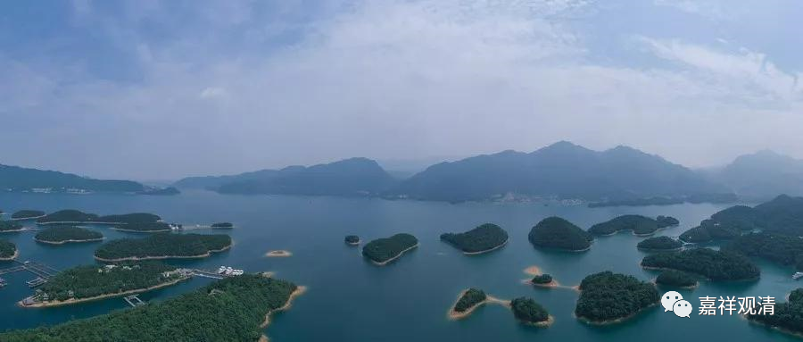

##  《微课佛教史》161·2 

上次我们已经讲过了四祖大师先是去了庐山，后来从庐山过江到了黄梅，在双峰山——就是四祖山，四祖寺的所在地。后来还有个地方叫五祖寺，在东山，是吧？四祖在双峰山开禅法的时候，人非常非常地多。那么四祖传法给五组的故事呢，有很多版本，很有趣，我们一个个地讲吧。 

有一个版本说，四祖去黄梅县 ——四祖、五祖那地方都属于黄梅，在 今天的湖北，也是革命老区。 “往黄梅县，路逢一小儿，骨相奇秀，异乎常童”， （还有一个地方说是 “有异僧” ），说四祖见到了小时候的五祖弘忍，就夸他 “减佛七相”，这是什么意思呢？就是佛祖是三十二相八十种好，五祖弘忍呢，三十二减七，有二十五相。这个就很厉害了啊！当然这都是后面的说法，是吧？说他“骨相奇秀”。 

然后道信禅师就问他： “子何姓？”你姓啥？答曰：（禅宗的机锋又来了）“姓即有，不是常姓。”明白意思吗？姓有吗？有。是常吗？不是常。 也可以理解为，不是一般的姓。 

继续问： “是何姓？”那姓什么呢？答曰：“是佛性。”他的意思就是， 我的性（姓）不一般，是佛性。 

师曰： “汝无姓耶？”你是无姓吗 ，你没爹吗？答曰： “性空。”

问什么性（姓），答 “ 佛性 ” ，佛性是无性。都是双关语，很禅机。道信禅师觉得回答不错，就到他家去，应该是请求他父母布施这个孩子，孩子的家里也觉得很正常，就布施了，后来道信禅师就给五祖弘忍传法了，这是一个版本的故事。 

后来到了晚期，又出来一个故事，因为 “ 汝无姓耶 …… 性空 ”这一段引发歧义，就变出另一个故事来……“无姓（性）”，就是没爹，“姓（性）空”，也是没爹，于是，这个版本 就出现了处女生子（圣母玛利亚和耶稣） ……

说道信禅师有一次碰到一个老和尚，这个老和尚的水平好像也不错。老和尚想要求法，道信禅师说：“不行，你太老了。”什么意思呢？就是我传给你法以后，你也快要死了，是吧？“如果可能的话，你换个身子再来，到时候再传法给你。”

于是这个老和尚就离开了，在路上看到一个小姑娘，应该是十几岁吧。老和尚就问：“能不能借你的房子住一住啊？”那个小姑娘就同意了。我估计小姑娘的年纪应该在十三、四岁，反正还没结婚，因为在那个时候如果年纪太大还没结婚，是不太可能的。后来老和尚就直接圆寂了。 

这个小姑娘在河边洗完衣服，回来了，然后怀孕了！这个问题就大了。如果要把故事的中间部分补足的话，就是小姑娘被赶出了家门，可能是一个人离开了，后来再把孩子生下来了。这个孩子一生下来就是 “骨相奇秀”，是吧？四祖看到了这个孩子呢，就去讨，这个孩子的妈妈也同意了……然后再 补充到上面那个故事里去 ……

看看，有趣吧，自己理解错了，就生造出一个新的传说——历史就是这样“层垒”地造出来的。 

