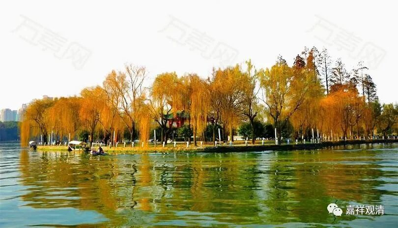

##  微课堂佛教史191·1 

我学武术的时候，武术老师是绝对正宗的。每次教完一套拳、一套功法，老师就给我写一张纸条，内容是什么呢？这张纸条上面就是某年某月某日，谁谁谁传功，或者传某某某拳法啊。当然不是教拳的一天给啊，最后这一天，他给我写一个这个，然后呢还把他是在哪里学到的，然后再把这个套路的那些招式，第一式，第二式等等，从头到底写了一遍。 

哦……跟这个《坛经》里面的说法是一模一样的啊。“**年月日时，姓名、递相付嘱。**”你看，我看看哦，我待会儿是否拍一张给你们看看啊，把他名字划掉给你们看看啊，“年月日时，姓名、递相付嘱”都有，表示有传承。 

（照片从略。群里面我已经发过了……） 

呵呵，我不知道，这个是谁影响谁啊？是民间影响了《坛经》（禅宗）呢？还是禅宗的说法影响到后来的武术门派？从这个角度而言，走在江湖中的这些武术门派被《坛经》影响的可能性，我觉得是很大的；另一方面来说，《坛经》是受到中国传统文化影响，我觉得也是有的。 

武术的这些门派说起来都会比较晚，哪怕形意拳往岳飞身上靠而上溯到南宋……实际上这些拳术真正形成的时间点都是比较晚的，主体大概都在明清时代，大部分都得在清代了。这个时候，这些东西在江湖上流传开来。另外一点是，江湖人对《坛经》知道的确实是比较多的啊，在民间宗教的背景知识里，禅宗是很重要的一块！ 

后面又讲了：“**但得法者，只劝修行，诤是胜负之心，与佛道违背**。”意思就是说，得法以后你就去修，不要去跟别人辩论。这个背景多半又是跟菏泽神会的故事是有关的。 

那么后面呢，就开始提到了慧能大师后期的几位重要弟子啊，前面先提到了神秀大师。这里面做了一些姿态，说大家都是一样的，法都是一样的，“都是东山法门，人有南北”。很有趣啊！他前面跟弘忍大师说的是“人有南北，法难道有南北吗？”这次又回来了，说“**人有南北**”，就是南宗北宗。说“**见有迟疾**”，见解有迟疾，见解有快的有慢的，人有利钝，这个时候称为“顿渐”。前后文里的意思是：人分南北，南宗之见疾，北宗之见迟。 

