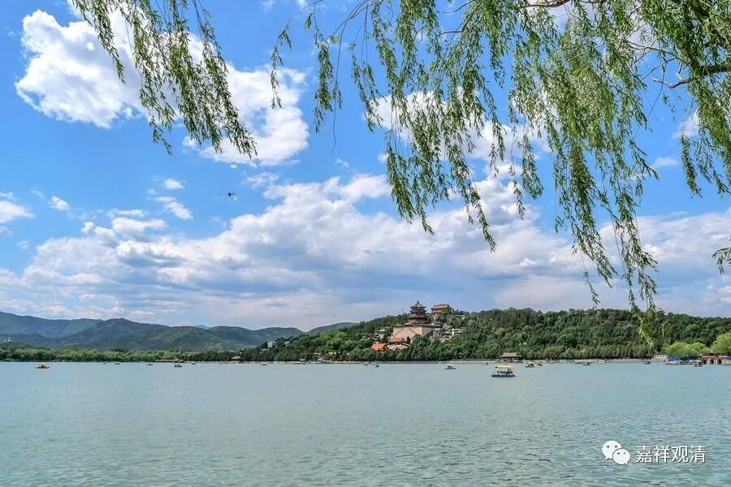

##  微课堂佛教史198·1 

那么，释迦牟尼佛座下第一代禅宗祖师就是摩诃迦叶尊者，他就是初代。第二代就是阿难尊者。第三代呢，好像是末田底迦尊者（有些地方位序和我们讲的不一样）。第四代是商那和修尊者，其实这里讲的是第十一商那和修尊者，因为前面释迦牟尼佛是第七嘛。第五代是优波毱多尊者。 

前面这五位呢，基本上所有的宗派都是一样的，都是这个次序的传承。就相当于释迦牟尼佛圆寂以后，这五位大师就一代一代地传承下来。按照以前的说法，在他们的时代释迦牟尼佛的教法还没有改变。这五位次序 传承，在律学里称为叫“异世五师”，相应的还有“同时五师”。 

第五代以后，就开始出现了佛教的分派。这里接下去就是提多迦尊者，是第十三，（从释迦佛算下来的说法就是第六。）然后佛陀难提尊者第十四，佛陀密多尊者第十五。大家可以看到，这里开始出现有部的人物了 （伏笔哦……） ，佛陀密多尊者就觉友（ 也可以译为“ 觉亲”）。然后胁比丘尊者，他是一位倾向于大乘的人物，有些地方把他和马鸣菩萨并列的。当然，他应该算是小乘系统的吧。然后富那夜奢尊者第十七，马鸣菩萨第十八，他可以被称为是大乘的先驱，然后毗罗长者（有些地方 写作“ 迦毗摩罗”尊者）第十九。 

后面有趣了，开始出现龙树菩萨第二十，禅宗里面龙树菩萨也是祖师之一。后面则更有趣，迦那提婆尊者第二十一，这是谁呢？迦那提婆尊者就是圣天菩萨，迦那就是一只眼睛，提婆就是天 ，圣天又被称为叫“独眼提婆”，他有一只眼睛因为事故而盲了 。罗睺罗尊者第二十二……这个“龙树——提婆——罗睺 罗” 是中观派里面的说法，这三位也是初期中观派的祖师。其实提婆和罗睺罗是不是师承关系，还要另说的，但罗睺罗尊者的确是早期的中观师。 

有一种说法是说罗睺罗尊者就是提婆的弟子，这是汉传保留下来的说法。藏传佛教说在龙树菩萨之前还有个罗睺罗贤，说龙树菩萨也是罗睺罗贤的弟子 （说龙树还有个师父叫“萨乐和”） ，然后又说提婆也有一个弟子叫罗睺罗贤……这可能是藏传佛教或者后期的历史传承当中的问题——中观派师承里，早期的传说和后期的传说有差异。 

然后是僧伽难提尊者第二十三，这个僧伽难提很有趣，到底跟我们上次所讲的“那提”有没有关系？ 难说啊…… 然后是伽耶舍多尊者第二十四，鸠摩罗多尊者第二十五。这里有趣吧？鸠摩罗多尊者是谁呢？是经部的。前面的伽耶舍多尊者是谁呢？是有部的。所以这里，在禅宗的传承谱系里，出现了中观派的，出现了有部的，又出现了经部的 ，有趣吧……（我可啥都没说啊……） 

