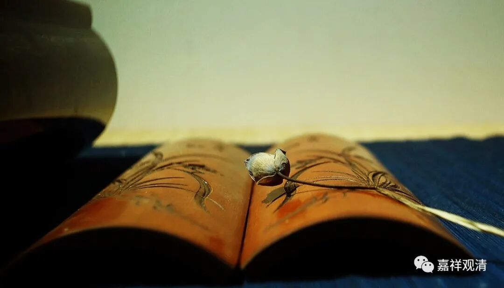

##  《微课堂佛教史》227·1 

好，我们继续今天的唯物史观——禅宗历史。 

现在已经讲到了洪州禅的马祖道一禅师，他的门下最重要的三位弟子分别是南泉普愿禅师、百丈怀海禅师和西堂智藏禅师。 

我不记得有没有和大家讲过，就是禅宗书当中的禅师名字都是用四个字的，对吧？但是在后期的一些《灯录》当中经常是三个字的名字，比如南泉普愿禅师，可以叫南泉愿禅师。通常前面两个字主要是地名或者寺院的名字，比如说百丈怀海禅师，百丈指的就是百丈山，他出家的名字叫怀海。那么，马祖道一禅师是属于比较特别的，包括“金和尚”也是，这是相对来说比较特别的。还有时候呢，同一位禅师可能会有几个名字，因为他可能在几个地方待过，所以寺院的名称会有所不同。 (也有的时候也会用他的字，和名不同。) 也有个别的会用俗家的名字，比如马祖道一禅师等等。上次我写过一位上海的禅师的名字，叫解三通，是吧？他是在嘉兴的，俗姓解，应该念xiè，是吧？《水浒传》里面解珍、解宝就是这个解。最早我自己看禅宗故事的时候，还以为禅宗的这些禅师都是日本人呢，后来才知道不是。 

那么，马祖道一禅师门下厉害的人非常多，其中对后世影响最大的就是刚才所讲的这三位禅师，当时被称为马祖道一禅师门下的三位大士——“三大士”，一直都有这个称法。在这三位禅师当中，对后世影响最大的是百丈怀海禅师，可以说是他创立了丛林制度，就是后来的禅宗寺院制度，这个事情我已经讲过很多次了。 

百丈怀海禅师是福建人，出家是在潮阳，就是在潮州附近。后来他去到百丈山，是在江西。他出家的时候的师父，也是南岳怀让禅师的一个弟子，他后来就到了南岳怀让禅师门下的另外一个弟子那里学习，但是算是他的师叔，后来就变成他的师父——马祖道一禅师。去到马祖道一禅师门下之前，百丈淮海禅师先是学律的，又学了不少经典，所以传记里面说他对经律论“莫不赅赡”，都是非常的熟悉。 

所以我也一直提到，禅宗里面真正厉害的人物，其实在经论方面都是很擅长的，至少得是在一般的文化知识方面实在平均水平线以上的。其实这有几方面的原因：一方面他得看书，得知道出处，是吧？另外一方面，他也要和士大夫们进行交往的，这是必须的。我指的必须，并不是说所有人都必须的。如果你要住持山林的话，那你必须要和士大夫有交往。 

其实和我们今天的情况是一样的，如果你想要做一个大和尚的话，就必须和当地的一些名流有所交往，包括政协也好，或者当地的美协或者书画协会等等也好。总之，你得和当地的一些名流交往。像我这种和当地名流没有什么交往的住持，基本上我们的寺院也没什么希望发展了，将来在历史上名垂青史也就没什么希望了。不管是主动的，还是被动的，寺院要做大的话，你必须要和当地的士大夫阶层要有所往来。 

