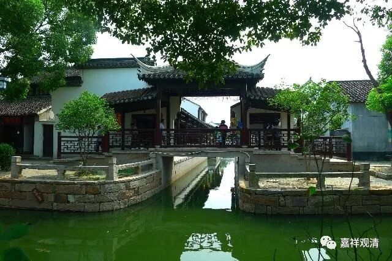

##  《微课堂佛教史》229·1 

好，今天继续科学地讲佛教史。 

昨天讲了百丈怀海禅师，他为禅宗所作出的很重要的一点贡献就是，他开创了《百丈清规》，即丛林的规矩，从此以后就出现了禅宗能够和律寺进行分庭抗礼的局面。当然，也不是说禅宗要主动地分庭抗礼，而是从此以后，佛教在寺院和经济这两方面的中国化已经完成了——说 “已经完成”可能有点过分了，可以说是“定型” 了，就是佛教寺院的中国化已经定型，基本上就形成了“天下名山僧占多”的格局。 

百丈怀海禅师的门下有两位最重要的弟子，我们先来介绍其中的一位——黄檗希运禅师，他的门下有一位弟子叫临济义玄禅师，所以怎么说呢？很重要！呵呵，这句也是废话了。 

黄檗希运禅师的这个“黄檗”指的是黄檗山，也在江西，所以说洪州禅都是和江西有关的。黄檗希运禅师先在江西建造了寺院，后来当朝宰相裴休（这个时候还没有升任宰相，算是将来的宰相）在南昌——洪州任职，非常推崇黄檗希运禅师，还帮忙建造了两个寺院。后来裴休又去到我们今天的宣城，就是造宣纸的那个地方，以前叫宛陵。裴休还帮黄檗希运禅师写了 一些文章，相当于帮忙推出他的朋友或者师父。 

到了宋代这样的情况就更加显著了，禅宗大寺院的方丈基本上都要有官家来任命，而且怎么任命的呢？需要丛林或者政府官员来举荐。那么黄檗希运禅师的时代已经是唐末了，到了这个时候这种情况（朝廷中高级官员举荐高僧任大丛林的方丈）已经初见端倪。因为依靠着一些地方实权派的支持，黄檗希运禅师就在江西和安徽都发展了禅宗主要的弘法道场。 

我们也可以看到，从这一时期直到明代的初年，僧人或者说寺院的方丈都仍旧是一种游走 的形式——可能游 走这个词不一定准确，就是说这些僧人或者寺院的方丈是到处走动的，并不是固定在某一个寺院的。其实这个时候寺院也不是固定某一个宗派系统的，最多只有大致的关联性，但寺院本身未必捆绑宗派。（ 其实像日本佛教宗派那种“大本山”制度，在中国可以说基本上没有正式形成过。到了今天才有那么点接近的意思。 ） 

