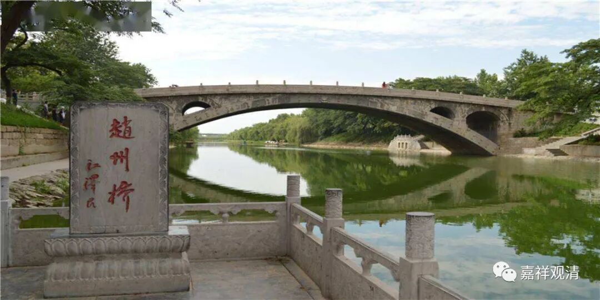

##  《微课佛教史》247·2 

赵州从谂禅师，他在赵州应该是晚年的时候，在河北赵州桥附近的观音院。 

赵州从谂禅师最著名的一个公案就是“吃茶去”。今天学佛的人当中很多都是喝茶的，还有很多卖茶叶的地方都挂着“禅茶一味”，这个最早就是出自赵州禅师——“吃茶去”，谁来了都是“吃茶去”。明天我也去写一幅“吃茶去”，看看有谁要，哈哈。 

 赵州从谂禅师的寿命非常长，一百二十岁。他很早就出家了，好像是九岁，反正是很早就出家了。因为他的年纪很大，最后活到一百二十岁，所以丛林当中就称他为“赵州古佛”，意思是他的年纪非常大。而且丛林当中还有一句话——“赵州八十犹行脚”，就是说他八十岁了还在外面到处走，到处参禅，所以叫“八十犹行脚”。 

赵州从谂禅师甚至还说过一句话：“九十年以前，我曾经参访了马祖道一禅师门下的八十多员大善知识。”呵呵，那个就是他很年轻的时候了，说“九十年以前”这句话，至少他是一百岁以后说的吧？所以丛林当中以此来说明什么呢？就是经过一段时间的磨砺之后，是需要出去行脚的，需要出去各处参访。 

赵州从谂禅师他活了一百二十岁，“八十犹行脚”。他参访的这些人当中，除了马祖道一禅师门下的那些大善知识以外，甚至还有一些很年轻的、后辈的禅师他也去参访，比如说夹山善会禅师。夹山善会禅师的师父是船子德诚禅师或者叫华亭德诚禅师，华亭德诚禅师的师父是药山惟俨禅师。如果要排辈分的话，好像药山惟俨禅师和赵州从谂禅师是同一辈的。赵州从谂禅师甚至到夹山善会禅师那里去参访，对他来说，夹山善会禅师就完全是个孙子辈的小年轻了。 

夹山善会禅师，我不知道将来会不会谈到，关于他的故事我也会稍微提一提的。 好像我之前在公众号里面也写到过， 夹山善 会禅师 的师父是船子德诚 禅师 ，很多 地方都 说船子德诚 禅师是 跳河死 的 ，这个 其实 是不成立的。 船子德诚 禅师所 在 的 华亭 是在哪里呢？ 这个地方就在今天上海金山 区 的 西 林寺，实际上 是 在 以前的 西林 禅 寺边上 。 那 条 河 是 很小 的 ， 水流也不急， 而且又是在上海，这里 的 河能宽到什么 程度 呢 ， 是吧？ 再宽也不太容易 把 “ 船子 ” 德诚禅师给 淹死啊 ——撑船的还不会水吗？ 

