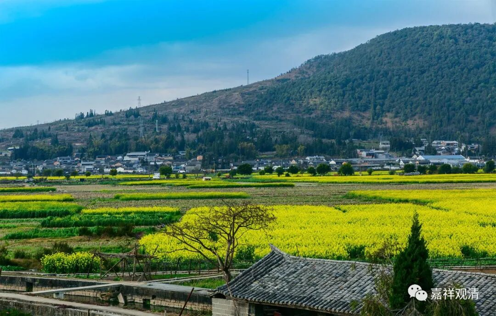

##  《微课佛教史》265·2 

在李翱向药山禅师问学的时候，禅宗里面的记载就直接 是 问答了 。但是 按照 道理 来说， 应该 是宾主 落座，然后再 如何如何，再问 “ 如何是道”。这个 问题也确实属于李翱一直“念兹在兹”的东西，是他的生命的问题，这和他后面 写 《复性书》都有点关系。于是他问： “ 如何是道 ？ ”

什么是道？是一个关于形而上的问题——形而上谓之道。（中国文人骨子里还是喜欢道家或者玄学的这些东西 。） 李翱这是在问药山惟俨禅师，而药山禅师又是读过书的人，他是完全可以有现成答案回应的 （就像之前的“贵耳而贱目”） 。比如《庄子》里面早就讲 了 ： “道在屎尿中。” 所以 ， 李翱等于是又把答案送给药山禅师了 。 

药山禅师是读过书的，但他没有回答这句 “ 道在 屎尿中” ，因为这是《庄子》里面讲的，直接捡一个《庄子》里面的答案，李翱肯定不满意 。 公案里面讲药山 惟俨禅师 说的 是 什么呢？ “ 云在青天水在瓶 。”

我们 现在看起来 ， 这句话 应该 是 后来 总结的，应该是在给他讲解什么是道的时候说的， “ 云在青天水在瓶” 。那么，“ 道在 屎尿 中 ” ， “ 云在青天水在瓶 ”， 都是水。在天上就变成云，在瓶里面就是水，作用和特征似乎不同，内在的本质是一样的，所以叫 “ 云在青天水在瓶 ” 。它的意思和 “ 道在 屎尿 中 ” 一样，或者说至少我认为可以这么理解。 

那么 ， 所谓的（最终版的） “ 云在青天水在瓶”这句话 ， 应该是后人整理的，它出自李翱后来写的一首诗： 

“练得身形似鹤形， 

千株松下两函经。 

我来问道无余说， 

云在青天水在瓶 。 ”

因为有了李翱的这首诗，所以后来公案里面就把它简化成 “ 云在青天水在瓶 ”这句话了 ， 就 直接把李翱这个文字放进去了 。 

我们也可以 看得出来，药山惟俨禅师之所以被李翱所推崇，或者说最终拿下李翱，让他成为禅宗的一个 大护法 ，很重要的一点是 因为 药山禅师的学识 。 所以你们千万不要认为药山禅师是没有文化的，或者认为他劝大家不要去学习 的……他 绝对不是这个意思 。 

李翱后面写的《复性书》和宋明理学也特别有关系，它里面有一段： “人 之昏也久矣，将复其性者，必有渐也，敢问其方。 ”怎么去复性呢？“ 曰：弗虑弗思，情则不生，情既不生，乃为正思。正思者，无虑无思也 。” 这不就是禅宗的 “ 无念为本 ”吗？“ 弗虑弗思 ” 不就是 “ 无念无 住”吗？ 这不就是前面药山禅师讲的那个 “ 思量 个 不思量 底” 吗？所以 ， 李翱在药山惟俨禅师门下肯定是学习了不少的 内容 ，也有一些禅修方面的修养。 

我们前面也讲过了，李翱后来也帮忙了 龙潭崇信禅师 ， 或者说推出了龙潭崇信禅师 。再 后来德山宣鉴禅师在德山常德待下来，和李翱应该也有点关系 。 后人也经常说 ， 陆王之 学的 主体或者来源都是出自李翱的《复性书》，可能都有点关系吧 。 

好，今天药山惟俨禅师先讲到这里，谢谢大家！ 

