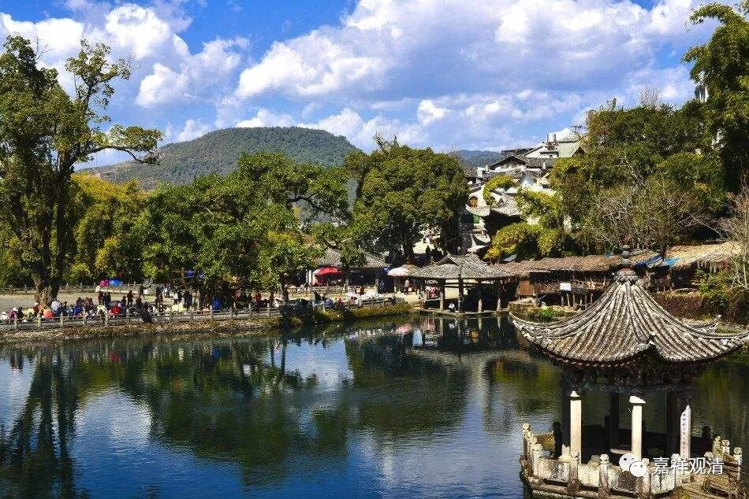

##  《微课堂佛教史》266·1 

现在我们继续禅宗史。 

今天要谈到一位非常重要的人物，他重要到什么程度呢？（其实对于一般人也不见得那么重要）就是在他的身上，禅宗的后期出现了非常重要的大 争议。这个争议是怎么出来的呢？就是由于禅宗后期的宗派之争。禅宗后来出现了很多的宗派，有五大宗派，被称为“五家七宗”。大家为了帮自己的宗派说话，或者说某些宗派里面一些无聊的人要争地位，去认祖宗，去“是自非他” 。其实这种争地位真的一点意义都没有。 

那我现在就把这个人的名字说出来了，他就是天皇道悟禅师。他的法号是道悟，就是道悟禅师，而天皇呢，指的是天皇寺 （我一开始也搞错……） 。在禅宗的后期，天皇道悟禅师是非常重要的前辈祖师，在他的门下开出了法眼宗和云门宗，而且还有德山禅师，所以天皇道悟禅师在禅宗传承史里面是非常非常重要的。 

那么，如此重要的一位人物，后人就来抢祖师了。 

（这个真的是非常无聊的一件事情，也可以由此看到后期的禅宗是多么的丢人啊。当然，我们说的这个丢人，不是指禅宗整个宗派丢人，而是说其中某些没有文化的人，用这些没有意义的事情去造假。大家要知道，只要时间长久了，总会有聪明人能识破这些造假的。真的是没有意义啊！） 

我们现在来谈谈这位道悟禅师。 

禅宗史讲到现在，我们发现好像是马祖道一禅师门下相对来说纯一点点，而石头希迁禅师门下基本上都是两头走的，是吧？那么，天皇道悟禅师门下也有这种两头走的现象。在嗣法的传承上，天皇道悟禅师嗣的是石头希迁禅师这一支（中国的禅宗发展到后来有点类似于宗法制度，这个“嗣”就是继承的意思），而他本人则向很多老师都学习过，我会慢慢谈的。 

