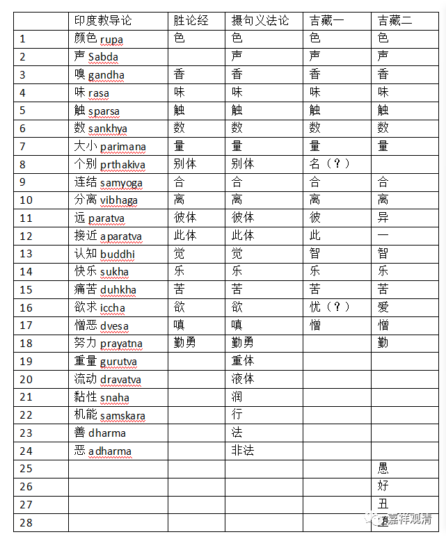

##  胜论宗“德”句义诸说的比较 

现在我把摩诃提瓦的《印度教导论》、 姚卫群的《印度宗教哲学概论》、《古印度流派哲学经典》和吉藏的《百论疏》《中论疏》提到的胜论“德”句义做一个简单的比较。 

先做一个表格： 

印度教导论  |  胜论经  |  摄句义法论  |  吉藏一  |  吉藏二   
---|---|---|---|---  
1  |  颜色 rupa  |  色  |  色  |  色  |  色   
2  |  声 Sabda  |  声  |  声  |  声   
3  |  嗅 gandha  |  香  |  香  |  香  |  香   
4  |  味 rasa  |  味  |  味  |  味  |  味   
5  |  触 sparsa  |  触  |  触  |  触  |  触   
6  |  数 sankhya  |  数  |  数  |  数  |  数   
7  |  大小 parimana  |  量  |  量  |  量  |  量   
8  |  个别 prthakiva  |  别体  |  别体  |  名（？）   
9  |  连结 samyoga  |  合  |  合  |  合  |  合   
10  |  分离 vibhaga  |  离  |  离  |  离  |  离   
11  |  远 paratva  |  彼体  |  彼体  |  彼  |  异   
12  |  接近 aparatva  |  此体  |  此体  |  此  |  一   
13  |  认知 buddhi  |  觉  |  觉  |  智  |  智   
14  |  快乐 sukha  |  乐  |  乐  |  乐  |  乐   
15  |  痛苦 duhkha  |  苦  |  苦  |  苦  |  苦   
16  |  欲求 iccha  |  欲  |  欲  |  忧（？）  |  爱   
17  |  憎恶 dvesa  |  嗔  |  嗔  |  憎  |  憎   
18  |  努力 prayatna  |  勤勇  |  勤勇  |  勤   
19  |  重量 gurutva  |  重体   
20  |  流动 dravatva  |  液体   
21  |  黏性 snaha  |  润   
22  |  机能 samskara  |  行   
23  |  善 dharma  |  法   
24  |  恶 adharma  |  非法   
25  |  愚   
26  |  好   
27  |  丑   
28  |  堕   
  

我们对比可以看到： 

1 、《印度教导论》和《摄句义法论》的“二十四种说”是完全一致的，这是后期的通说； 

2 、《胜论经》与吉藏的“十七种说”，吉藏多一“声”而少“勤勇”（这有可能是吉藏记忆错误吗？胜论的“声”比起“色、香、味、触”要略输半筹——当然后期的二十四种说里地位一致了。）； 

3 、《摄句义法论》的“二十四种说”和吉藏的“二十一种说”相较于《胜论经》的十七种说，多出的内容并不一样。 

4、吉藏“二十一种说”的“堕”会不会是“惰”？ 

5、吉藏所引胜论德句义的两种说法出处是哪里。《百论疏》提到了《俱舍论》，或许来自真谛的《俱舍疏》？ 

