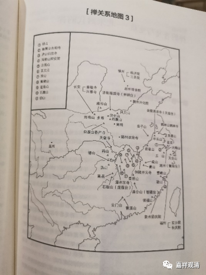

##  《微课堂佛教史》339·1 

石头希迁禅师门下还有一位弟子叫“我子天然”，是吧？就是丹霞天然禅师。还有就是天皇道悟禅师，在天皇道悟禅师下面是龙潭崇信禅师，就是“龙亦不见，潭亦不现”，记得吗？龙潭崇信禅师的下面是德山宣鉴禅师，就是我们讲过的，他背着他注解《金刚经》的《青龙疏钞》去见龙潭崇信禅师，最后还把自己写的这部著作给烧掉了。 

图中的连接线稍微有点问题，雪峰义存禅师和岩头全奯禅师这两位应该是平行的，他们都是德山宣鉴禅师的弟子。岩头全奯禅师的这个“奯”是异体字，写出来应该是“大正藏”合在一起，这里用了“豁”这个字。德山宣鉴禅师门下最重要的弟子是雪峰义存禅师，我们现在就讲到了雪峰义存禅师。 

雪峰义存禅师往下就开出了云门宗和法眼宗，一个弟子就是云门文偃禅师，我们还没谈到，另一个弟子就是玄沙师备禅师。玄沙师备禅师往后是罗汉桂琛禅师，再往后是法眼文益禅师，法眼宗就是从法眼文益禅师这里开出来的。 

那么我们可以看到，石头希迁禅师这里开出了三大系 \---- 曹洞宗、云门宗和法眼宗，前面的马祖道一禅师下面开出了两系 \---- 沩 仰宗和临济宗。 

好，我们再看“禅关系地图 3 ”。 

我们从上往下看。首先是镇州，这个地方也叫真州，也叫正定，也叫真定，就是在石家庄北面一点。也就是常山，常山赵子龙就是在这个地方。这里有什么呢？临济院，就是临济义玄禅师的寺院，现在这个寺院还在。这个寺院在历史上比较重要，但它不是那种大型的寺院，属于自己建造的小寺院，不是皇家寺院，也不是那种府县层级的大寺院。 

然后往下是赵州观音院，就是赵州从谂禅师在的那个地方，在石家庄的南面一点。往下是魏州兴化院，就是兴化存奖禅师。往左下，风穴山，就是风穴延沼 禅师， 是吧？丹霞山，丹霞天然禅师。伏牛山，伏牛自在禅师。南阳，南阳慧忠禅师。钟南山旁边，圭峰宗密禅师，这个圭峰是在西安的西南面不远的地方。北边一点就是麻谷山，麻谷宝彻禅师。长安这里有章敬寺，就是我们前面讲的章敬怀晖禅师，对吧？他当时被朝廷封为国师的，所以禅宗百丈淮海禅师这一系能够支撑起来 和他在中央也有关系。 

