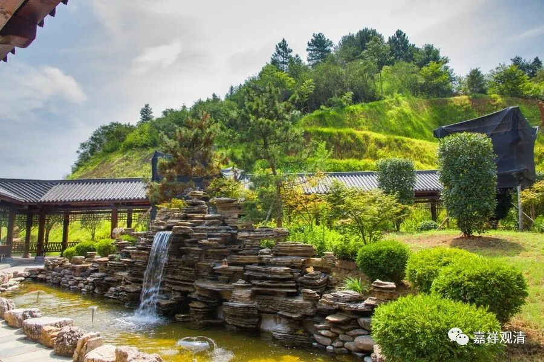

##  《微课佛教史》358·2 

其中云门系或者说是雪峰一系的人是极其多的，提到的话就是一批人，等于是一个高僧群居于云门文偃禅师门下，所以当时称 之为“ 云门天子，临济将军”，我觉得可能是与此有关的。所以有时候佛教里面的一些文献，我们用图表化或者数字化的形式可能会展示得更加清楚。 

我最近也在带一个学生写佛教的历史地理，就是关于南北朝时期的三论宗的历史和人文地理方面的研究。我们也是按照这个方法，看某个地方高僧出现的频率，比如在这个地方，一百年当中出了四十六个高僧，而那个地方则出了三十几个高僧。用这种方法是可以找到一些东西的，其实这些量化研究方法用在这些地方效果是挺好的。 

我今天还有点事，再稍微讲一点吧。在这些图当中，我们可以看到其中大部分的禅师，我们好像都已经很熟了。但是还有一些名字我们还没有讲到，因为他们都是接下来要讲的宋代的一些禅师。 

比如说，第二张图当中的黄龙慧南禅师，我们还没提到。 他的分值有 45分，是吧？因为他是临济门下两大系之一。临济门下的另一系杨岐方会禅师在这里就没有被统计到，这里只有黄龙慧南禅师，但是我们现在还没有讲到。 

再比如宝峰克文禅师，他是圆悟克勤禅师的同学，还有石霜楚圆禅师和首山省念禅师，这些都是现在还没有提到的，都是宋代的一些著名禅师。 

绝大部分《正法眼藏》当中关注的禅师，我们基本上都提到了，好像只有一两个没讲。但是有一两个没讲到，我觉得也很正常，好像南泉普愿禅师就没讲。前面讲到三圣慧然禅师，他的分数也很高。 

五祖法演禅师也是一样，他也是要到后面才谈到的，因为他在传承史上很关键，是圆悟克勤禅师的师父……如果我没记错的话。 

这些都是出现频率非常高的人。其中云门系出现的频率是相当之高，也可以说，在同时代能够和云门系相抗衡的也就是临济宗了。问题是，圆悟克勤禅师他不是云门系的，而属于临济宗，但看来他对云门系真的很感兴趣，或者说云门系的这批人好像很合圆悟克勤禅师的胃口。 

好吧，今天就不多讲了。罗汉桂琛禅师我们还没有讲，等明天再讲。先到这里，谢谢大家！ 

